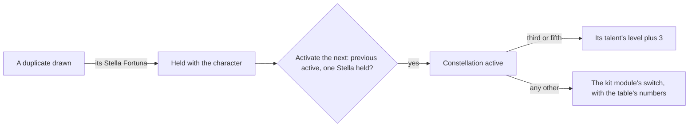

# Constellations

Each character has six constellations, sequential upgrades that change what their kit does. They are activated on the character screen's Constellation tab with the character's Stella Fortuna, which a duplicate drawn from a wish brings ([wish](/docs/genshin/wish)). What each one changes acts through the [character kits](/docs/proposals/genshin/character-kits), so this page waits on them, and the levels the third and fifth add are read by the [talents](/docs/proposals/genshin/talents).

## Decisions

- **Six, in order, one Stella Fortuna each.** A character's constellations are activated one after another, each spending one Stella Fortuna of that character. `AvatarTalentExcelConfigData` holds each one: the item it spends (`mainCostItemId`), the one before it (`prevTalent`), its numbers (`paramList`), and its name and description by text id.
- **The third and fifth raise a talent by three.** Which talent each raises is read from the constellation's own config (`BinOutput/Talent/AvatarTalents`), whose one action naming the skill and its three levels survives the dump's scrambling, and is held against the description naming the same talent. Every other constellation is a switch the character's kit module reads, its numbers the table's `paramList`.
- **A duplicate's Stella Fortuna is the character's own, six at most.** The wish names it beside the Starglitter it returns; it is kept with the character, counted until spent, and no other character's can stand in for it. A seventh copy brings no Stella Fortuna but the wish's larger Starglitter return, and a five-star's also a Masterless Stella Fortuna, the wallet's, which levels 95 and 100 spend on the [character screen](/docs/proposals/genshin/character-screen).
- **The Traveler's come another way.** The Traveler has no constellations until they resonate with an element, and then one set for each element. Theirs are unlocked by Archon Quests, Souvenir Shops, Adventure Rank rewards for Anemo, Statue of The Seven levels for Electro, Dendro, Hydro and Cryo, and Natlan's tribe reputation for Pyro, as the wiki lists them; each comes with the page that builds its source.
- **Aloy's cannot be activated**, as in the game.

## How it works

## Scope and order

**Today:** a duplicate's Stella Fortuna is named by the wish and kept nowhere, and a character holds no constellation.

**This adds, in order:**

1. **A character's constellations and Stella Fortuna**, kept with the character.
2. **Activation**, by the table's order and cost, with the run reading the constellation table and the third and fifth's talents.
3. **Each constellation's effect**, written in its character's kit module as the module is.
4. **The Traveler's**, each with the page that builds its source.

## Data and measures

- **Read from the game's tables:** `AvatarTalentExcelConfigData` and each character's constellation config, in the run that writes the kits; names and descriptions from the text map.
- **Measured:** nothing; the Constellation tab's look is the [character screen](/docs/proposals/genshin/character-screen)'s.

## Key files

| File                                                          | Role after the change                                        |
| :------------------------------------------------------------ | :----------------------------------------------------------- |
| `packages/genshin-world/src/models/character/Character.ts`    | Gains the constellations active and the Stella Fortuna held  |
| `packages/genshin-world/src/services/wish/getWishReturn.ts`   | Gains the seventh five-star copy's Masterless Stella Fortuna |
| `packages/genshin-world/src/models/inventory/Currency.ts`     | Gains the Masterless Stella Fortuna                          |
| `packages/genshin-world/src/services/wish/makeWishes.ts`      | Hands a duplicate's Stella Fortuna to the character it names |
| `scripts/src/services/genshinAssets/stats/writeStatTables.ts` | Writes the constellation table with the kits                 |

## Sources

- [Constellation](https://genshin-impact.fandom.com/wiki/Constellation), Genshin Impact Wiki: six levels per character, the third and fifth raising a combat talent by three, one Stella Fortuna each, the Traveler's sources by element, and Aloy's that cannot be activated.
- [Stella Fortuna](https://genshin-impact.fandom.com/wiki/Stella_Fortuna), Genshin Impact Wiki: a duplicate from a wish as the source of a character's own Stella Fortuna, six at most, and a seventh copy's larger Starglitter.
- [Masterless Stella Fortuna](https://genshin-impact.fandom.com/wiki/Masterless_Stella_Fortuna), Genshin Impact Wiki: one for a five-star drawn at its full constellations, spent past level 90.
- [AnimeGameData](https://gitlab.com/Dimbreath/AnimeGameData), the community's per-patch dump: the constellation table, and the constellation configs' readable talent action.
