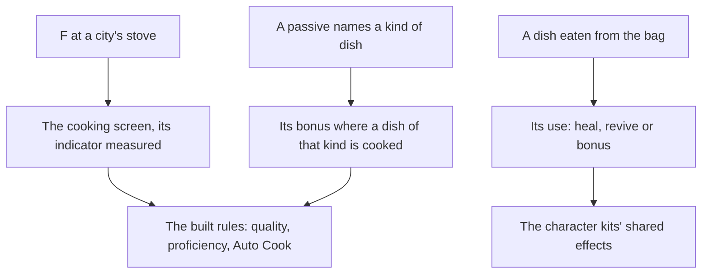

# Cooking

Food is how a party heals, revives and fights stronger in the game, and every dish is cooked from ingredients first gathered, hunted or bought. The dishes cooked by hand to proficiency, Auto Cook, the specialties, processing and campfires are built, as the [cooking](/docs/genshin/cooking) page records. What remains is the stove where a city cooks, the cooking screen, what a dish does once it is eaten, and the passives that bonus a kind of dish. Eating goes through the [inventory](/docs/proposals/genshin/inventory)'s using.

## Decisions

- **A city's stove always cooks.** A stove stands in a city and cooks whenever it is used, where a campfire cooks only while lit. Its place comes from the scene's streaming records, as the [crafting](/docs/genshin/crafting) bench's would, and Mondstadt's stove is the first placed.
- **The cooking screen's indicator is measured.** The indicator's speed and how a recipe's zone parameters lay its zones out come off a recording of the cooking screen, not from the table. Until it is read, the built zones stay provisional.
- **Food's effects act through the kits.** A dish's heal, revive or bonus is its item's use, read from the material table, and a bonus lasts as its description says, applied through the [character kits](/docs/proposals/genshin/character-kits)' shared effects.
- **A passive bonuses its kind of dish.** A few characters' passives bonus their kind of dish, matched by the dish's food type as the table gives it (heal, function, attack or defense), and applied where the dish is cooked. The passives are read from the [talents](/docs/proposals/genshin/talents) once they are built.

## How it works

## Scope and order

**Today:** the [cooking page](/docs/genshin/cooking) holds what is built, and nothing makes a dish in the world, which has no stove and no screen.

**This adds, in order:**

1. **The stove and the cooking screen**, at Mondstadt's streaming records, with the indicator measured.
2. **Eating a dish**, its use applied through the kits' shared effects.
3. **Passives bonusing a kind of dish**, once the talents page reads the passives.

## Data and measures

- **Read from the game's tables:** a dish's use from its item row in `MaterialExcelConfigData`, and the passives that name a kind of dish from the talents' tables.
- **Measured:** the indicator's speed and the zone layout off a recording of the cooking screen, provisional until then. Processing is built with its units one after another at the table's seconds each, and a recording owed on the [roadmap](/docs/genshin/roadmap) confirms that rule rather than settling an unbuilt one.
- **Not yet read:** the source that teaches most processings, which the table does not name, so they stay closed.

## Key files

| File                                                     | Role after the change    |
| :------------------------------------------------------- | :----------------------- |
| `packages/genshin-world/src/models/screen/ScreenKind.ts` | Gains the cooking screen |

## Sources

- [Cooking](https://genshin-impact.fandom.com/wiki/Cooking), Genshin Impact Wiki: stoves and campfires, the special dishes, and eating a dish's effects. Unreachable from this build, so its claims wait on this page's recordings owed.
- [AnimeGameData](https://github.com/DimbreathBot/AnimeGameData), the community's per-patch dump: the dish item rows and the passives' tables the remaining parts are read from.
