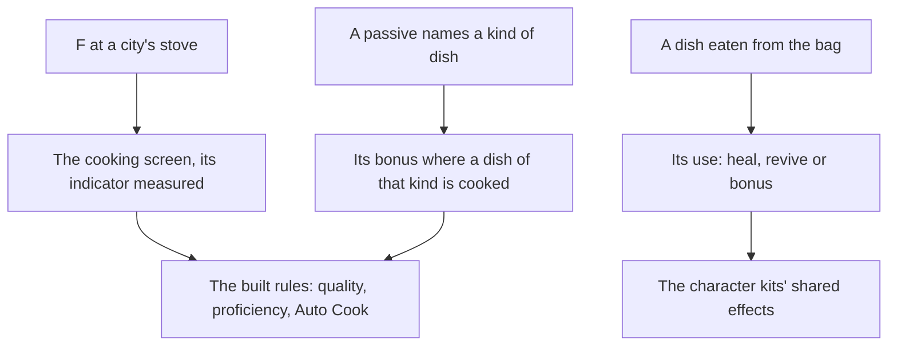

# Cooking

Food is how a party heals, revives and fights stronger in the game, and every dish is cooked from ingredients first gathered, hunted or bought. The dishes cooked by hand to proficiency, Auto Cook, the specialties, processing and campfires are built, as the [cooking](/docs/genshin/cooking) page records. What remains is the stove where a city cooks, the cooking screen, what a dish does once it is eaten, and the passives that bonus a kind of dish. Eating goes through the [inventory](/docs/proposals/genshin/inventory)'s using.

## Decisions

- **A city's stove always cooks.** A stove stands in a city and cooks whenever it is used, where a campfire cooks only while lit. Its place comes from the scene's streaming records, as the [crafting](/docs/genshin/crafting) bench's would, and Mondstadt's stove is the first placed.
- **The cooking screen's indicator is measured.** The indicator's speed and how a recipe's zone parameters lay its zones out come off a recording of the cooking screen, not from the table. Until it is read, the built zones stay provisional.
- **Food's effects act through the kits.** A dish's heal, revive or bonus is its item's use, read from the material table, and a bonus lasts as its description says, applied through the [character kits](/docs/proposals/genshin/character-kits)' shared effects.
- **A passive bonuses its kind of dish.** A few characters' passives bonus their kind of dish, matched by the dish's food type as the table gives it (heal, function, attack or defense), and applied where the dish is cooked.
- **The cooking talents are keyed by the cook's avatar id, from the wiki.** `Category:Cooking Talents`, read through the persona's reader, holds ten, each a utility passive unlocked from the start, so no talent table is joined. On a Delicious dish cooked by hand, the game's perfect cooking: a double at 12% on `COOK_FOOD_HEAL` for Jean 10000003, Barbara 10000014 and Diona 10000039, on `COOK_FOOD_ATTACK` for Xiangling 10000023, on `COOK_FOOD_DEFENSE` for Noelle 10000034 and Xinyan 10000044, and on `COOK_FOOD_FUNCTION` for Yun Jin 10000064 and Nilou 10000070; and one more Suspicious dish of the recipe at 18% on any food type for Hu Tao 10000046 and Ayato 10000066. A double adds one more of the dish made, a character's special dish included. Auto Cook makes every dish Delicious, so each of its dishes draws the talent once, as each already draws the special dish.

## How it works

## Scope and order

**Today:** the [cooking page](/docs/genshin/cooking) holds what is built, and nothing makes a dish in the world, which has no stove and no screen.

**This adds, in order:**

1. **The cooking talents.**
   - `CookingRecipe` (`packages/genshin-world/src/models/cooking/CookingRecipe.ts`) gains `foodType: CookingFoodType`, a new enum in `models/cooking/CookingFoodType.ts` of the table's four values, written by `toCookingRecipe` from the row's `foodType`; `pnpm -C scripts genshin:assets cooking` rewrites the existing `generated/cooking/recipes.json`, which gains the field and nothing else.
   - `packages/genshin-world/src/services/cooking/CharacterIdCookingTalentMap.ts`: the ten talents of the Decisions, each `{ chance, effect, foodTypes }`, the effect a new `CookingTalentEffect` (`DoubleProduct`, `SuspiciousDish`).
   - `cookRecipeByHand` draws once more from `random` on a Delicious dish, and `autoCookRecipe` once per dish, each adding the cook's talent's one dish to the bag where the draw is under its chance; the room check counts the added dishes.
   - Tests: `cookRecipeByHand.test.ts` gains Xiangling's attack dish doubled at a draw of 0.05 and not at 0.5, Hu Tao's Suspicious dish added, and a heal dish Xiangling cooks left single; `autoCookRecipe.test.ts` gains a batch whose draws double some dishes; `toCookingRecipe.test.ts` gains the field.
2. **The cooking screen, built now from the public clip.** `pnpm -C scripts genshin:parity clip https://www.youtube.com/watch?v=fEbf_tOV1t4 --from 0 --to 154 --name cooking-sticky-honey-roast` (Cooking Sticky Honey Roast, 154 seconds); from its frames at one a second (`genshin:parity frames <the path clip prints> 1`) the builder takes the recipe list, the cook select and the indicator's bar with `genshin:parity frame yt-fEbf_tOV1t4-cooking-sticky-honey-roast.mp4 --at <second> --name cooking-screen`. Then `ScreenKind.Cooking`, `packages/genshin-interface/src/components/CookingScreen/` and its world wrapper `packages/genshin-world/src/components/Cooking/Screen/`, each with its fixture, driving `cookRecipeByHand` and `autoCookRecipe`. Its comparison is queued for the user's eyes, and the owed `cooking-zones.mkv` re-measures the indicator later; the built zones stay provisional and gate nothing.
3. **The stove's place.** Waits on the scene group export the other machine is making, which places Mondstadt's stove; the screen is reached through its fixture until then.
4. **Eating a dish**, its use applied through the kits' shared effects, through the [inventory](/docs/proposals/genshin/inventory)'s using of food, which that unit builds first.

## Data and measures

- **Read from the game's tables:** a dish's use from its item row in `MaterialExcelConfigData`, and each recipe's `foodType` from `CookRecipeExcelConfigData`.
- **Read from the wiki:** the cooking talents, settled under Decisions.
- **Measured:** the indicator's speed and the zone layout off a recording of the cooking screen, provisional until then. Processing is built with its units one after another at the table's seconds each, and a recording owed on the [roadmap](/docs/genshin/roadmap) confirms that rule rather than settling an unbuilt one.
- **Not yet read:** the source that teaches most processings, which the table does not name, so they stay closed.

## Key files

| File                                                     | Role after the change    |
| :------------------------------------------------------- | :----------------------- |
| `packages/genshin-world/src/models/screen/ScreenKind.ts` | Gains the cooking screen |

## Sources

- [Cooking](https://genshin-impact.fandom.com/wiki/Cooking), Genshin Impact Wiki: stoves and campfires, the special dishes, and eating a dish's effects. Unreachable from this build, so its claims wait on this page's recordings owed.
- [AnimeGameData](https://github.com/DimbreathBot/AnimeGameData), the community's per-patch dump: the dish item rows and the passives' tables the remaining parts are read from.
