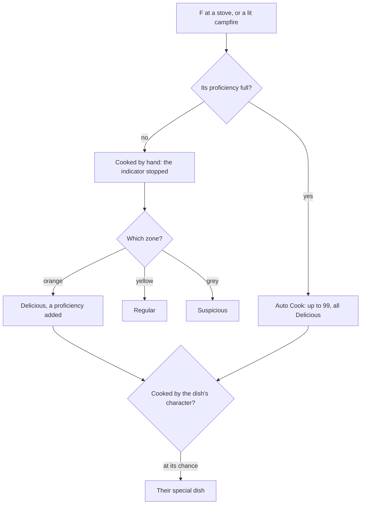

# Cooking

Food is how a party heals, revives and fights stronger in the game, and every dish is cooked from ingredients first gathered, hunted or bought. Cooking happens at a city's stove or a campfire in the wild, and processing beside it turns raw ingredients into flour, butter, cream and the like. It spends what [gathering](/docs/proposals/genshin/gathering) and [wildlife](/docs/proposals/genshin/wildlife) give, so it waits on them, and the dishes it makes are eaten through the [inventory](/docs/proposals/genshin/inventory)'s using.

## Decisions

- **Every recipe is the game's own.** `CookRecipeExcelConfigData` holds each dish: its ingredients, its method, its kind of food, its three results by quality, its maximum proficiency, and its cooking zones (`qteParam`) with the weights of each quality's result. Names, descriptions and effects are its items' own, by text id.
- **Cooked by hand first.** Cooking a dish by hand runs the game's timer: the indicator stopped in the orange zone makes a Delicious dish and adds a proficiency, in the yellow a Regular dish, and in the grey a Suspicious one. Leaving the minigame spends nothing.
- **Proficiency unlocks Auto Cook.** A dish's proficiency fills one Delicious dish at a time to its maximum, which grows with the dish's rarity. Once full, Auto Cook makes up to 99 at once, always Delicious, and cannot be stopped once started.
- **A character's specialty.** Cooking with the character a dish names may make their special dish in its place, at the chance `CookBonusExcelConfigData` gives for the quality cooked. A few characters' passives bonus their kind of dish, and Raiden Shogun cannot cook at all, as the game refuses her.
- **Stoves and campfires.** A city's stove always cooks; a campfire in the wild cooks only while lit, which Pyro lights, and Anemo, Cryo, Electro, Geo, Hydro or rain in the open puts out, through [combat](/docs/genshin/combat)'s elements and the world's [weather](/docs/genshin/weather).
- **Processing over real time.** `CompoundExcelConfigData` gives each processed ingredient's inputs, outputs and time. Up to 99 of each are queued at once, kept with the time they started so they finish while the page is closed, never cancelled once begun.
- **Food's effects act through the kits.** A dish's heal, revive or bonus is its item's use, read from the material table, and a bonus lasts as its description says, applied through the [character kits](/docs/proposals/genshin/character-kits)' shared effects.

## How it works

## Scope and order

**Today:** the bag files food among its tabs, and nothing makes it.

**This adds, in order:**

1. **Recipes, cooking by hand and proficiency**, at Mondstadt's stove.
2. **Auto Cook.**
3. **Processing.**
4. **Campfires**, lit and put out.
5. **Specialties and talents**, once the characters' passives are read.

## Data and measures

- **Read from the game's tables:** `CookRecipeExcelConfigData`, `CookBonusExcelConfigData`, `CompoundExcelConfigData` and the dishes' and ingredients' rows of `MaterialExcelConfigData`.
- **Measured:** the indicator's speed and how the recipe's zone parameters lay its zones out, off a recording of the cooking screen, provisional until then.

## Key files

| File                                                                | Role after the change                       |
| :------------------------------------------------------------------ | :------------------------------------------ |
| `packages/genshin-world/src/services/inventory/addInventoryItem.ts` | The dishes and ingredients made, in the bag |
| `packages/genshin-world/src/models/inventory/ItemDefinition.ts`     | The dishes and ingredients the recipes read |
| `packages/genshin-world/src/models/screen/ScreenKind.ts`            | Gains the cooking and processing screens    |
| `packages/genshin-world/src/services/combat/aura/applyElement.ts`   | The elements that light and put out a fire  |

## Sources

- [Cooking](https://genshin-impact.fandom.com/wiki/Cooking), Genshin Impact Wiki: the timer's three zones, proficiency and Auto Cook up to 99 always Delicious, stoves and campfires lit by Pyro and put out by the other elements and rain, special dishes, character bonuses, and Raiden Shogun's refusal.
- [Processing](https://genshin-impact.fandom.com/wiki/Processing), Genshin Impact Wiki: ingredients processed over time, 99 of each at once, never cancelled.
- [AnimeGameData](https://gitlab.com/Dimbreath/AnimeGameData), the community's per-patch dump: the recipe, cooking bonus and processing tables.
