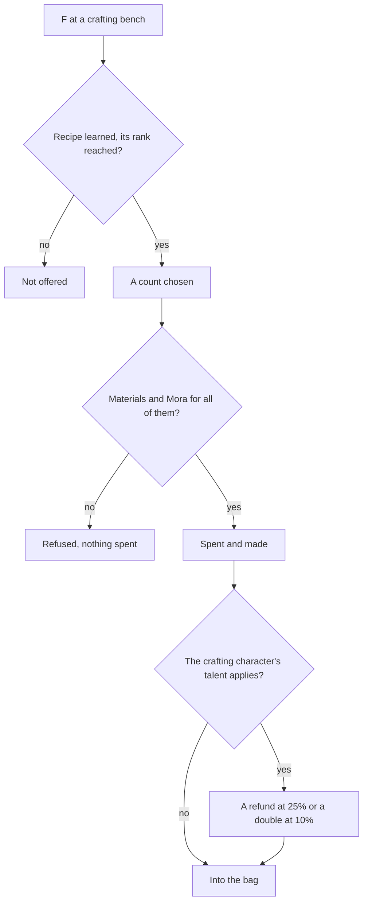

# Crafting

The crafting bench, which the game calls alchemy, turns materials into better ones: three of a tier into one of the next, potions and essential oils from ingredients, bait for fishing, gadgets from their instructions, and Condensed Resin from Original Resin. Most of what levels a character, a talent or a weapon passes through it at some tier. It spends from the [inventory](/docs/genshin/inventory)'s bag and wallet, and it waits on the [Original Resin](/docs/proposals/genshin/original-resin) that Condensed Resin is made from.

## Decisions

- **Every recipe is the game's own.** `CombineExcelConfigData` holds each one: its materials, its Mora (`scoinCost`), its result and how many, the Adventure Rank it needs (`playerLevel`), its kind and tab, and, for a few, a result drawn by weight from several. Nothing about a recipe is typed by hand.
- **Three make one of the tier above.** Ascension and talent materials are crafted from three of the same material a tier below, as the recipes hold them.
- **Recipes are learned.** Most recipes are open from the start; a potion's, a gadget's, a bait's or Condensed Resin's opens once its instructions are used, which reputation, quests and shops give. A recipe learned is kept with the player's progress.
- **Condensed Resin** is crafted from 60 Original Resin, five held at most, as [Original Resin](/docs/proposals/genshin/original-resin) decides.
- **A character's crafting talent.** The character chosen to craft may carry a passive that refunds one material at 25% or doubles the result at 10% for its kind of recipe, as the wiki lists them, drawn from the world's seeded random source and read from the character's passive.
- **Crafted many at once.** A recipe is crafted as many times as the bag can pay for, checked whole before anything is spent.
- **The bench is where the game puts one.** Each crafting bench stands where the city's streaming records place it, or where the [spawned places](/docs/proposals/genshin/spawned-places) fit it if they do not, and is used through the [interaction](/docs/proposals/genshin/interaction) prompts.

## How it works

## Scope and order

**Today:** the bag and wallet hold what the world gives; nothing turns one item into another.

**This adds, in order:**

1. **The bench and the tier recipes**, in Mondstadt.
2. **Learning recipes**, from their instructions.
3. **Condensed Resin, potions, bait and gadgets.**
4. **Characters' crafting talents**, once their passives are read.

## Data and measures

- **Read from the game's tables:** `CombineExcelConfigData` and the items' rows of `MaterialExcelConfigData`, their names and descriptions by text id.
- **Read from the wiki:** which characters' passives bonus which kinds of recipe.

## Key files

| File                                                                | Role after the change             |
| :------------------------------------------------------------------ | :-------------------------------- |
| `packages/genshin-world/src/services/inventory/addInventoryItem.ts` | What a recipe makes, into the bag |
| `packages/genshin-world/src/models/inventory/Wallet.ts`             | The Mora a recipe spends          |
| `packages/genshin-world/src/models/inventory/ItemDefinition.ts`     | The items recipes read and make   |
| `packages/genshin-world/src/models/screen/ScreenKind.ts`            | Gains the crafting bench's screen |

## Sources

- [Crafting](https://genshin-impact.fandom.com/wiki/Crafting), Genshin Impact Wiki: the bench and what it crafts, three of a tier for one of the next, gadgets from their instructions, and the characters' refund and double talents.
- [Condensed Resin](https://genshin-impact.fandom.com/wiki/Condensed_Resin), Genshin Impact Wiki: crafted from 60 resin, its recipe from Liyue's Reputation or the blacksmith.
- [AnimeGameData](https://github.com/DimbreathBot/AnimeGameData), the community's per-patch dump: the combine table with each recipe's materials, Mora, result and rank.
