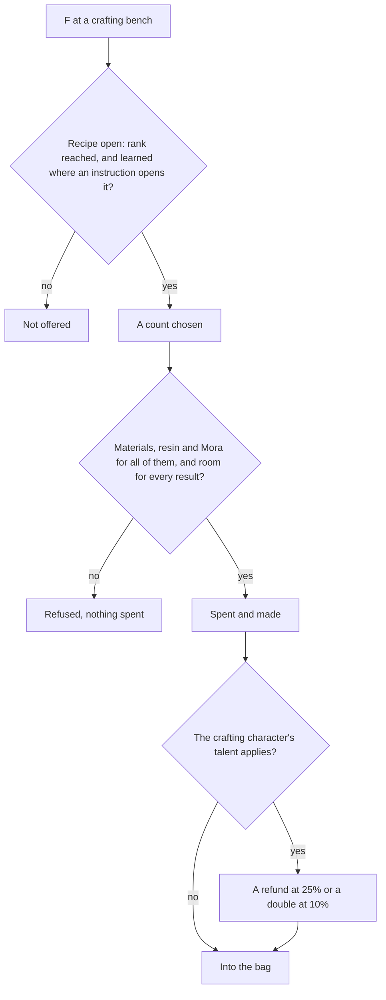

# Crafting

The crafting bench, which the game calls alchemy, turns materials into better ones: three of a tier into one of the next, potions and baits from ingredients, gadgets from their instructions, and Condensed Resin from Original Resin. Most of what levels a character, a talent or a weapon passes through it at some tier. Its recipes, their rules and the instructions that open them are [built](/docs/genshin/crafting). What is left is the bench's place in the world and its screen, the gadgets, and the talents. It spends from the [inventory](/docs/genshin/inventory)'s bag and wallet, and takes Condensed Resin's resin from the [Original Resin](/docs/genshin/original-resin) wallet.

## Decisions

- **Every recipe is the game's own.** `CombineExcelConfigData` holds each one: its materials, its Mora (`scoinCost`), its result and how many, the Adventure Rank it needs (`playerLevel`), and its kind. Nothing about a recipe is typed by hand. The kinds the bench crafts are the tiers, potions, baits and Condensed Resin, as the [crafting](/docs/genshin/crafting) page lists them.
- **Three make one of the tier above.** Ascension and talent materials are crafted from three of the same material a tier below, as the recipes hold them. A tier row that does not take exactly three of one material is an error, not a recipe.
- **Recipes are learned, where the table hides them.** The [crafting page](/docs/genshin/crafting) settles how each recipe opens. This covers the baits, Condensed Resin, and the Pure Water and Strength Tonic formulas. It supersedes the earlier wording that every potion waits on its instructions, because the table shows the Heatshield and Desiccant potions from the start, with no instruction to open them. Revised 2026-10-08 by the build that wrote the [crafting](/docs/genshin/crafting) page.
- **Condensed Resin** is crafted from 60 Original Resin, and one crystal core, as the [crafting page](/docs/genshin/crafting) counts them. Five are held at most, which is the item's own stack limit in the bag, as [Original Resin](/docs/proposals/genshin/original-resin) decides.
- **A character's crafting talent.** The character chosen to craft may carry a passive that refunds one material at 25% or doubles the result at 10% for its kind of recipe, as the wiki lists them, drawn from the world's seeded random source and read from the character's passive. Not built: it waits on the passives.
- **Crafted many at once.** A recipe is crafted as many times as the bag and wallet can pay for, checked whole before anything is spent, and refused whole where the bag has no room for every result. This is built.
- **The bench is where the game puts one.** Each crafting bench stands where the city's streaming records place it, or where the [spawned places](/docs/proposals/genshin/spawned-places) fit it if they do not, and is used through the [interaction](/docs/proposals/genshin/interaction) prompts. The official map marks no crafting bench, so the spawned places cannot place one; the streaming records must, which the scene's extraction reads and which is not read yet.
- **Left to other pages.** The [crafting page](/docs/genshin/crafting) lists what it leaves out. The essential oils and the Xiao Lantern are quest items for the [quests](/docs/proposals/genshin/quests) page to settle.
- **A gadget's instructions are unsourced.** The table holds each gadget's recipe hidden with no instruction item to open it. Until a source names the instructions, the gadgets are not offered. The wiki was not reachable from the build that wrote the [crafting](/docs/genshin/crafting) page, so its gadget instructions are still to be read there.

## How it works

## Scope and order

**Built:** the recipes of the tiers, potions, baits and Condensed Resin, their rules, and the instructions that open them, as the [crafting](/docs/genshin/crafting) page records.

**Still to build, in order:**

1. **The bench's place**, read from the city's streaming records for Mondstadt, or fitted from the spawned places where the records do not place it, and its prompt through the interaction page.
2. **The bench's screen**: its recipes by tab, the count, and the craft, with each result named once its items' names are game text keys.
3. **Gadgets**, once a source names their instructions.
4. **Characters' crafting talents**, once their passives are read.

## Data and measures

- **Read from the wiki, not yet read:** which characters' passives bonus which kinds of recipe, and the gadgets' instructions.
- **Not measured.** Crafting takes no time in the game and has no timed state, so no compute-queue item is owed.

## Key files

| File                                                              | Role after the change                                |
| :---------------------------------------------------------------- | :--------------------------------------------------- |
| `packages/genshin-world/src/models/screen/ScreenKind.ts`          | Gains the crafting bench's screen                    |
| `scripts/src/services/genshinAssets/world/readWorldPlacements.ts` | Reads the bench's streaming placements for Mondstadt |

## Sources

- [Crafting](https://genshin-impact.fandom.com/wiki/Crafting), Genshin Impact Wiki: the bench and what it crafts, three of a tier for one of the next, gadgets from their instructions, and the characters' refund and double talents.
- [Condensed Resin](https://genshin-impact.fandom.com/wiki/Condensed_Resin), Genshin Impact Wiki: crafted from 60 resin, its recipe from Liyue's Reputation or the blacksmith.
- [AnimeGameData](https://github.com/DimbreathBot/AnimeGameData), the community's per-patch dump: the combine table with each recipe's materials, Mora, result and rank, and the material table whose instructions name the recipes they open.
