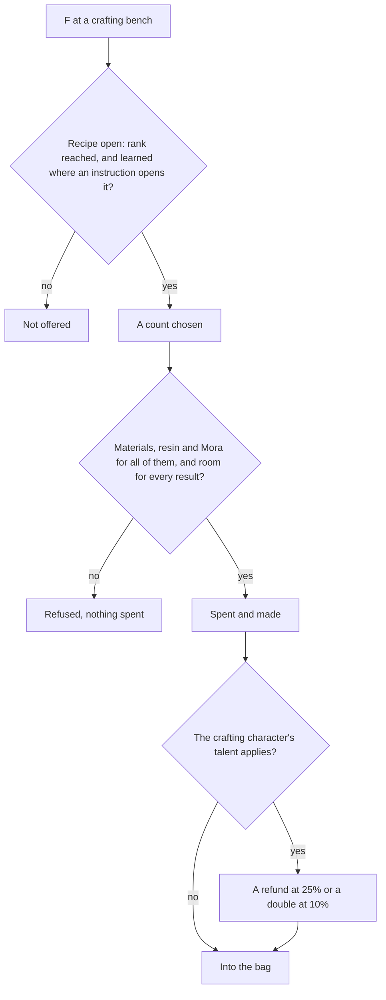

# Crafting

The crafting bench, which the game calls alchemy, turns materials into better ones: three of a tier into one of the next, potions and baits from ingredients, gadgets from their instructions, and Condensed Resin from Original Resin. Most of what levels a character, a talent or a weapon passes through it at some tier. Its recipes, their rules and the instructions that open them are [built](/docs/genshin/crafting). What is left is the bench's place in the world and its screen, the gadgets, and the talents. It spends from the [inventory](/docs/genshin/inventory)'s bag and wallet, and takes Condensed Resin's resin from the [Original Resin](/docs/genshin/original-resin) wallet.

## Decisions

- **Every recipe is the game's own.** `CombineExcelConfigData` holds each one: its materials, its Mora (`scoinCost`), its result and how many, the Adventure Rank it needs (`playerLevel`), and its kind. Nothing about a recipe is typed by hand. The kinds the bench crafts are the tiers, potions, baits and Condensed Resin, as the [crafting](/docs/genshin/crafting) page lists them.
- **Three make one of the tier above.** Ascension and talent materials are crafted from three of the same material a tier below, as the recipes hold them. A tier row that does not take exactly three of one material is an error, not a recipe.
- **Recipes are learned, where the table hides them.** The [crafting page](/docs/genshin/crafting) settles how each recipe opens. This covers the baits, Condensed Resin, and the Pure Water and Strength Tonic formulas. It supersedes the earlier wording that every potion waits on its instructions, because the table shows the Heatshield and Desiccant potions from the start, with no instruction to open them. Revised 2026-10-08 by the build that wrote the [crafting](/docs/genshin/crafting) page.
- **Condensed Resin** is crafted from 60 Original Resin, and one crystal core, as the [crafting page](/docs/genshin/crafting) counts them. Five are held at most, which is the item's own stack limit in the bag, as [Original Resin](/docs/proposals/genshin/original-resin) decides.
- **A character's crafting talent.** The wiki's Crafting Talents category holds thirteen talents, one per character, read from each talent page's infobox. Each is one of four effects, applied to the crafter's craft through the world's seeded random source: a double product at 10% (Eula, Sucrose, Layla, Albedo, Ayaka, Alhaitham, Wriothesley, on their kind of recipe), a refund of one material at 25% (Xingqiu, Mona, Dori), a refund of one material at 20% for potions (Lisa), or one extra regional talent material at 25% for a talent book (Yae Miko) or 10% (Prune). The effects are settled.
- **A crafting talent is keyed by its character's avatar id, with no proud skill join.** Each talent is one character's utility passive, unlocked from the start, so the character alone says whether it applies. The wiki's talent pages (read through the persona's reader, `Category:Crafting Talents`) and `generated/stats/characters.json` give each: double at 10% on Character Talent Materials for Eula 10000051 and Layla 10000074; on Weapon Ascension Materials for Albedo 10000038, Ayaka 10000002, Alhaitham 10000078 and Wriothesley 10000086; on Character and Weapon Enhancement Materials for Sucrose 10000043; a refund at 25% on Character Talent Materials for Xingqiu 10000025, on Weapon Ascension Materials for Mona 10000041 and on Character and Weapon Enhancement Materials for Dori 10000068; a refund at 20% on potions for Lisa 10000006; and one regional Character Talent Material of the base material's rarity at 25% for Yae Miko 10000058 and 10% for Prune 10000132.
- **A recipe's tab is the combine table's `combineType`.** 1 is Character and Weapon Enhancement Materials (the common drops' tiers, `112xxx`), 2 Weapon Ascension Materials (`114xxx`), 3 Character Talent Materials (`1043xx`), 5 Character Ascension Materials, 4 and 12 potions and 10 baits, so a talent names the combine types it applies to and `CraftingRecipeKind` stays as built.
- **A talent's bonus is drawn per craft.** Each of a count's crafts draws once from the world's seeded random source: a double adds one more result, and a refund gives back one of the recipe's first listed material. The crafter is chosen as the cook is, by the avatar id passed to the craft; a character with no talent crafts plainly.
- **Crafted many at once.** A recipe is crafted as many times as the bag and wallet can pay for, checked whole before anything is spent, and refused whole where the bag has no room for every result. This is built.
- **The bench is where the game puts one.** Each crafting bench stands where the city's streaming records place it, or where the [spawned places](/docs/proposals/genshin/spawned-places) fit it if they do not, and is used through the [interaction](/docs/proposals/genshin/interaction) prompts. The official map marks no crafting bench, so the spawned places cannot place one; the streaming records must, which the scene's extraction reads and which is not read yet.
- **Left to other pages.** The [crafting page](/docs/genshin/crafting) lists what it leaves out. The essential oils and the Xiao Lantern are quest items for the [quests](/docs/proposals/genshin/quests) page to settle.
- **A gadget's instructions come from the wiki.** The table holds each gadget's recipe hidden with no instruction item to open it. The wiki's Gadgets pages answer through the persona reader, which is how the instructions are read; their reputation and Frostbearing Tree sources are the wiki's too. Until they are read, the gadgets are not offered.

## How it works

## Scope and order

**Built:** the recipes of the tiers, potions, baits and Condensed Resin, their rules, the instructions that open them, and the characters' crafting talents' doubles and refunds, as the [crafting](/docs/genshin/crafting) page records.

**Still to build, in order:**

1. **The bench's screen, built now from the public clip.** `pnpm -C scripts genshin:parity clip https://www.youtube.com/watch?v=qQILsaJKlsI --name crafting-table --from 0 --to 105` (Crafting Table, 105 seconds), then `genshin:parity frames <the path clip prints> 1`, of which the builder keeps the clearest frame of the recipe list by tab, the count and the craft with `genshin:parity frame yt-qQILsaJKlsI-crafting-table.mp4 --at <second> --name crafting-screen`. Then `ScreenKind.Crafting`, `packages/genshin-interface/src/components/CraftingScreen/` and its world wrapper `packages/genshin-world/src/components/Crafting/Screen/`, each with its fixture, each result named from the names chunk its recipe's `nameTextId` cites, the crafter chosen on it and `rollCraftingTalent`'s items added to the bag. Its comparison is queued for the user's eyes; until the bench stands it is reached through its fixture.
2. **The bench's place.** Waits on the other machine's scene group export, since the official map marks no bench and the wiki places Mondstadt's in the Market District. Its prompt then goes through the interaction page.
3. **Yae Miko's and Prune's regional material.** Each region's three talent book series are read from the wiki's Character Talent Material page through the persona's reader and typed as a map of each series' base item id by region; the extra is drawn from the crafted book's region's other two series at the base material's rarity.
4. **Gadgets**, their instructions read from the wiki's gadget pages, as the Decisions settle.

## Data and measures

- **Read from the wiki:** the crafting talents (built into the Decisions above), the regions' talent book series and the gadgets' instructions, from the wiki's gadget pages.
- **Not measured.** Crafting takes no time in the game and has no timed state, so no compute-queue item is owed.

## Key files

| File                                                              | Role after the change                                |
| :---------------------------------------------------------------- | :--------------------------------------------------- |
| `packages/genshin-world/src/models/screen/ScreenKind.ts`          | Gains the crafting bench's screen                    |
| `scripts/src/services/genshinAssets/world/readWorldPlacements.ts` | Reads the bench's streaming placements for Mondstadt |

## Sources

- [Crafting](https://genshin-impact.fandom.com/wiki/Crafting), Genshin Impact Wiki: the bench and what it crafts, three of a tier for one of the next, gadgets from their instructions, and the characters' refund and double talents.
- [Condensed Resin](https://genshin-impact.fandom.com/wiki/Condensed_Resin), Genshin Impact Wiki: crafted from 60 resin, its recipe from Liyue's Reputation or the blacksmith.
- [AnimeGameData](https://github.com/DimbreathBot/AnimeGameData), the community's per-patch dump: the combine table with each recipe's materials, Mora, result and rank, and the material table whose instructions name the recipes they open.
