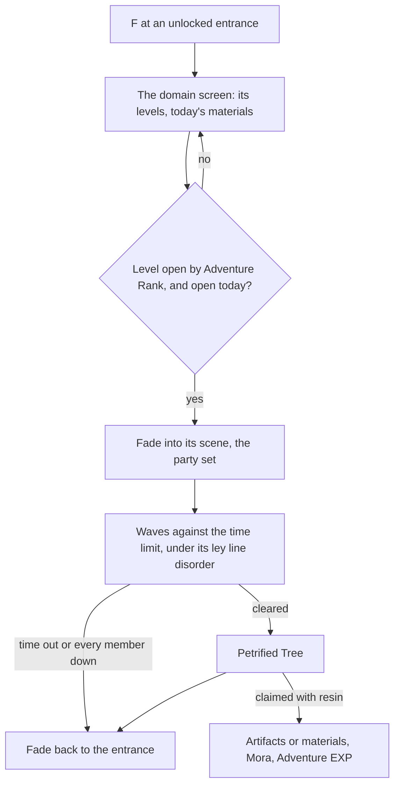

# Domains

A domain is an instance behind a temple-like entrance: a challenge in a scene of its own, cleared for a reward. Challenge domains give artifacts, talent materials and weapon ascension materials, the materials every growth page here spends; one-time domains reward their first clear; the trounce domains, where the weekly bosses wait, are the bosses' page, which enters them as this page enters any. A domain's reward is claimed with [Original Resin](/docs/proposals/genshin/original-resin), the domains open by [Adventure Rank](/docs/proposals/genshin/adventure-rank), and they are fought with the [character kits](/docs/proposals/genshin/character-kits), so this page waits on all three.

The opening rules, each kind by its Adventure Rank and by the day of the week, are built and read on [the domains page](/docs/genshin/domains). What is left here is the world's side of a domain and its challenge.

## Decisions

- **An entrance is a landmark, and a waypoint once unlocked.** Each permanent domain's entrance is placed from the game's streaming records like any landmark, a `LandmarkKind` of its own, and joins the jumps once unlocked, as the game teleports to it ([map unlocking](/docs/proposals/genshin/map-unlocking)). No `LandmarkKind` is added until the fit that places it exists.
- **A domain is a scene of its own.** Its interior is the game's own dungeon scene, laid out from that scene's data and derived as a region is ([scene derivation](/docs/genshin/scene-derivation)). F at the entrance opens the domain's screen, and entering fades to the scene as a jump fades to its landmark; leaving, or the challenge failing, fades back to the entrance.
- **Levels by Adventure Rank.** A challenge domain has several levels, each opened at its Adventure Rank, with its recommended level, its enemies' level and its ley line disorder, read from `DungeonExcelConfigData` (`limitLevel`, `levelRevise`, `previewMonsterList`) and its entry table. The player chooses one before entering.
- **The challenge is the domain's.** Its enemies come in the waves its scene sets, against its time limit, and a ley line disorder changes the fight as its description says, written as a module over the kits' shared effects. Clearing it raises the Petrified Tree at the end.
- **The days each kind sets.** A Domain of Mastery's talent materials and a Domain of Forgery's weapon materials are each open on two set days and every Sunday, the days turning at the game's daily reset. The rule is built ([domains page](/docs/genshin/domains)); the two set days are read from `DailyDungeonConfigData`, whose weekday fields are named by matching them against the wiki's schedule, as the scene points' fields are named. The dump does not hold that table yet, so no caller passes the days.
- **The reward is the resin claim.** The Petrified Tree is claimed as [Original Resin](/docs/proposals/genshin/original-resin) claims any blossom, its artifacts rolled by the [artifact enhancement](/docs/proposals/genshin/artifact-enhancement) page's rules. Its price is built as a domain blossom's.
- **One-time domains reward their first clear.** Their Adventure EXP, Primogems and any recipe are given once, by their reward table row, and they stay open with nothing more to give.

## How it works

## Scope and order

**Today:** the opening rules are built, as the [domains page](/docs/genshin/domains) records. Nothing enters a domain, and nothing gives a domain's materials.

**This adds, in order:**

1. **The entrance and its screen**, with the domain landmark kind.
2. **Entering a domain's scene and leaving it**, on the jump's fade.
3. **The challenge**, its waves, time limit and failure, with the first domain of Mastery carried.
4. **The days' schedule and the levels by rank.** The days' rule is built; the table's days and the levels wait on the dump's dungeon tables.
5. **Ley line disorders**, each a module.
6. **One-time domains.**

## Data and measures

- **Read from the game's tables:** `DungeonExcelConfigData`, `DungeonEntryExcelConfigData`, `DailyDungeonConfigData` and the domains' reward rows; each domain scene's layout from its own scene data, as a region's is read. None of the first three is in the dump yet.
- **Read from the wiki:** each domain's rolled drops by level, and the weekday schedule the daily table's fields are matched against, both of which the wiki's refusal to serve the fetch left unread.
- **Measured:** the fade into and out of a domain, off a recording, as the jump's fade is. The clip is on the [roadmap](/docs/genshin/roadmap)'s Recordings owed list.

## Key files

| File                                                           | Role after the change                                |
| :------------------------------------------------------------- | :--------------------------------------------------- |
| `packages/genshin-world/src/models/world/LandmarkKind.ts`      | Gains the domain entrance                            |
| `scripts/src/services/genshinAssets/fit/fitRegionLandmarks.ts` | Fits the domain entrances from the streaming records |
| `packages/genshin-world/src/services/map/constants.ts`         | `JUMP_LANDMARK_KINDS` gains the domain entrance      |
| `packages/genshin-world/src/components/World/Screen/Index.vue` | Enters a domain's scene and returns to the world     |
| `packages/genshin-world/src/models/enemy/EnemyCamp.ts`         | A domain's waves, as camps of its scene              |

## Sources

- [Domains](https://genshin-impact.fandom.com/wiki/Domains), Genshin Impact Wiki: entrances acting as waypoints, Blessing, Forgery and Mastery and the ranks or quests that open them, three days a week each with Sunday common, one-time domains, and the Petrified Tree claimed with resin. Not yet read: the wiki refused the fetch.
- [AnimeGameData](https://gitlab.com/Dimbreath/AnimeGameData), the community's per-patch dump: the dungeon, dungeon entry and daily dungeon tables, the last with its weekday fields scrambled.
