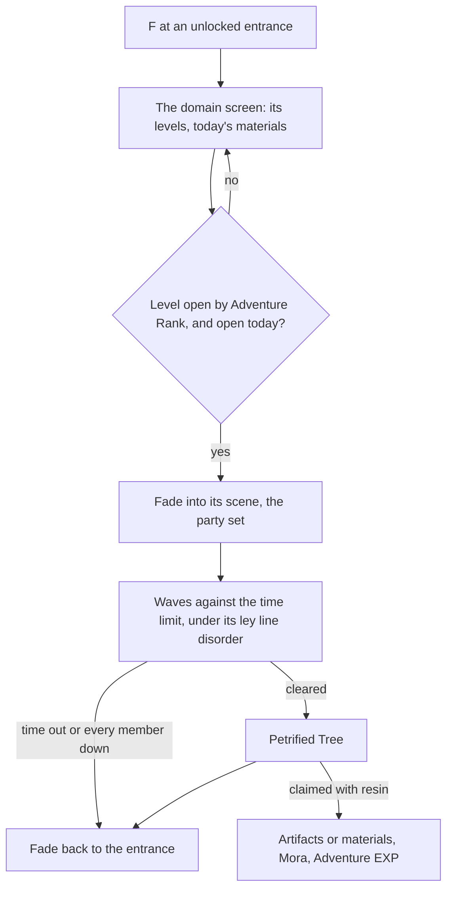

# Domains

A domain is the kind of instance the [domains](/docs/genshin/domains) page defines: a challenge in a scene of its own, cleared for a reward. Challenge domains give artifacts, talent materials and weapon ascension materials, the materials every growth page here spends; one-time domains reward their first clear; the trounce domains, where the weekly bosses wait, are the bosses' page, which enters them as this page enters any. A domain's reward is claimed with [Original Resin](/docs/proposals/genshin/original-resin), the domains open by [Adventure Rank](/docs/proposals/genshin/adventure-rank), and they are fought with the [character kits](/docs/proposals/genshin/character-kits), so this page waits on all three.

The opening rules, each kind by its Adventure Rank and by the day of the week, are built and read on [the domains page](/docs/genshin/domains). What is left here is the world's side of a domain and its challenge.

## Decisions

- **An entrance is a landmark, and a waypoint once unlocked.** Each permanent domain's entrance is a `LandmarkKind` of its own, and joins the jumps once unlocked, as the game teleports to it ([map unlocking](/docs/proposals/genshin/map-unlocking)). No `LandmarkKind` is added until the reader that places it exists.
- **An entrance's place is its scene point.** `DungeonEntryExcelConfigData` names each entrance's scene and its point (`dungeonEntryId`), and the scene's points (`BinOutput/Scene/Point/scene3_point.json`, held) hold that point, in a `$type` of its own, at `NPCCBOFKBCO`, with its area at `HDMEDFBJMPK`, the fields the transport points use: entry row 1's point 48 is a Domain of Blessing's, at about (2498, 264, -1558) in area 106. So no streaming record and no map fit is needed. The entry's `type` gives the kind: `DUNGEN_ENTRY_TYPE_RELIQUARY` is Blessing, `DUNGEN_ENTRY_TYPE_WEAPON_PROMOTE` Forgery and `DUNGEN_ENTRY_TYPE_AVATAR_TALENT` Mastery; the other types are one-time, trounce and event entrances, left for their own items.
- **The opening ranks are the wiki's.** The wiki's Domain page gives Blessing at Adventure Rank 22, Forgery at 16 and Mastery at 27, each also opened by finishing an Archon quest, so `DomainOpenRankMap`'s ranks stand and stop being provisional; the quests' earlier opening waits on the quests being carried.
- **A domain is a scene of its own.** Its interior is the game's own dungeon scene, laid out from that scene's data and derived as a region is ([scene derivation](/docs/genshin/scene-derivation)). F at the entrance opens the domain's screen, and entering fades to the scene as a jump fades to its landmark; leaving, or the challenge failing, fades back to the entrance.
- **Levels by Adventure Rank.** A challenge domain has several levels, each opened at its Adventure Rank, with its recommended level, its enemies' level and its ley line disorder, read from `DungeonExcelConfigData` (`limitLevel`, `levelRevise`, `previewMonsterList`) and its entry table. The player chooses one before entering.
- **The challenge is the domain's.** Its enemies come in the waves its scene sets, against its time limit, and a ley line disorder changes the fight as its description says, written as a module over the kits' shared effects. Clearing it raises the Petrified Tree at the end.
- **The days each kind sets.** A Domain of Mastery's talent materials and a Domain of Forgery's weapon materials are each open on two set days and every Sunday, the days turning at the game's daily reset. The rule is built ([domains page](/docs/genshin/domains)); the two set days are read from `DailyDungeonConfigData`, whose weekday fields are named by matching them against the wiki's schedule, as the scene points' fields are named. Each of its rows is one domain, and each of its obfuscated fields lists the dungeon ids open on one day. A field is named by naming its ids through `DungeonExcelConfigData` and finding the wiki's day whose materials they give. Three pairs of fields hold the same single id in every row (the set days' pairs), and the fields holding every id of their row are Sunday's. The dump does not hold the table, AnimeGameData's master does, so it is fetched with the dungeon tables.
- **The reward is the resin claim.** The Petrified Tree is claimed as [Original Resin](/docs/proposals/genshin/original-resin) claims any blossom, its artifacts rolled by the [artifact enhancement](/docs/proposals/genshin/artifact-enhancement) page's rules. Its price is built as a domain blossom's.
- **One-time domains reward their first clear.** Their Adventure EXP, Primogems and any recipe are given once, by their reward table row, and they stay open with nothing more to give.

## How it works



## Scope and order

**Today:** the opening rules are built, as the [domains page](/docs/genshin/domains) records. Nothing enters a domain, and nothing gives a domain's materials.

**This adds, in order:**

```text
scripts/src/services/genshinAssets/domains/
├── toDomainEntrance.test.ts
└── writeDomainEntrances.ts
```

1. **The entrances, read from the scene points.** Add `DungeonExcelConfigData`, `DungeonEntryExcelConfigData` and `DailyDungeonConfigData` to `DUMP_TABLE_NAMES` in `scripts/src/services/genshinText/constants.ts` and run `pnpm -C scripts genshin:text fetch`. Then `writeDomainEntrances.ts`, behind a `genshin:assets domains` subcommand on the pattern of `forgingCommand`, reads every entry row of scene 3 whose type names a `DomainKind`, takes its point from `scene3_point.json` (a row whose point is missing is counted and left out), assigns it its region from the area table as `fit/fitRegionCapitals.ts` does, and writes it into that region's `packages/genshin-world/src/data/regions/<region>.json` landmarks as a `LandmarkKind.DomainEntrance` with its domain kind and the entry's id, its place carried round the Windrise origin (`readWorldOrigin`) as `chests/buildChestPlaces.ts` carries its points. `LandmarkKind` gains `DomainEntrance`, which no kit draws yet. The proof is `toDomainEntrance.test.ts`: a dumped entry row and its point become the landmark at the point's x and z less the origin with the kind its type names, and a row of `DUNGEON_ENTRY_TYPE_NORMAL` gives none.
2. **The entrance's kit and its screen**: a stand-in kit drawn at each entrance, then the screen F opens, listing its levels and today's materials over the built opening rules.
3. **The days' schedule and the levels by rank**, read from the tables item 1 fetches. The days' rule is built.
4. **Entering a domain's scene and leaving it**, on the jump's fade.
5. **The challenge**, its waves, time limit and failure, with the first domain of Mastery carried. A domain's scene is laid out from its own scene data, which waits on the scene export the other machine is making.
6. **Ley line disorders**, each a module.
7. **One-time domains.**

## Data and measures

- **Read from the game's tables:** `DungeonExcelConfigData`, `DungeonEntryExcelConfigData`, `DailyDungeonConfigData` and the domains' reward rows; each domain scene's layout from its own scene data, as a region's is read. The first three are on AnimeGameData's master and are fetched into the dump by item 1.
- **Read from the wiki:** each domain's rolled drops by level, and the weekday schedule the daily table's fields are matched against. The wiki answers its API through the persona's reader (`readWikiPageText`), so neither waits on a source.
- **Measured:** the fade into and out of a domain, off a recording, as the jump's fade is. The clip is listed on the [roadmap](/docs/genshin/roadmap).

## Key files

| File                                                            | Role after the change                                |
| :-------------------------------------------------------------- | :--------------------------------------------------- |
| `packages/genshin-world/src/models/world/LandmarkKind.ts`       | Gains the domain entrance                            |
| `scripts/src/services/genshinAssets/fit/fitRegionLandmarks.ts`  | Fits the domain entrances from the streaming records |
| `packages/genshin-world/src/services/map/constants.ts`          | `JUMP_LANDMARK_KINDS` gains the domain entrance      |
| `packages/genshin-world/src/components/World/Session/Index.vue` | Enters a domain's scene and returns to the world     |
| `packages/genshin-world/src/models/enemy/EnemyCamp.ts`          | A domain's waves, as camps of its scene              |

## Sources

- [Domains](https://genshin-impact.fandom.com/wiki/Domains), Genshin Impact Wiki: entrances acting as waypoints, Blessing, Forgery and Mastery and the ranks or quests that open them, three days a week each with Sunday common, one-time domains, and the Petrified Tree claimed with resin. Not yet read: the wiki refused the fetch.
- [AnimeGameData](https://github.com/DimbreathBot/AnimeGameData), the community's per-patch dump: the dungeon, dungeon entry and daily dungeon tables, the last with its weekday fields scrambled.
