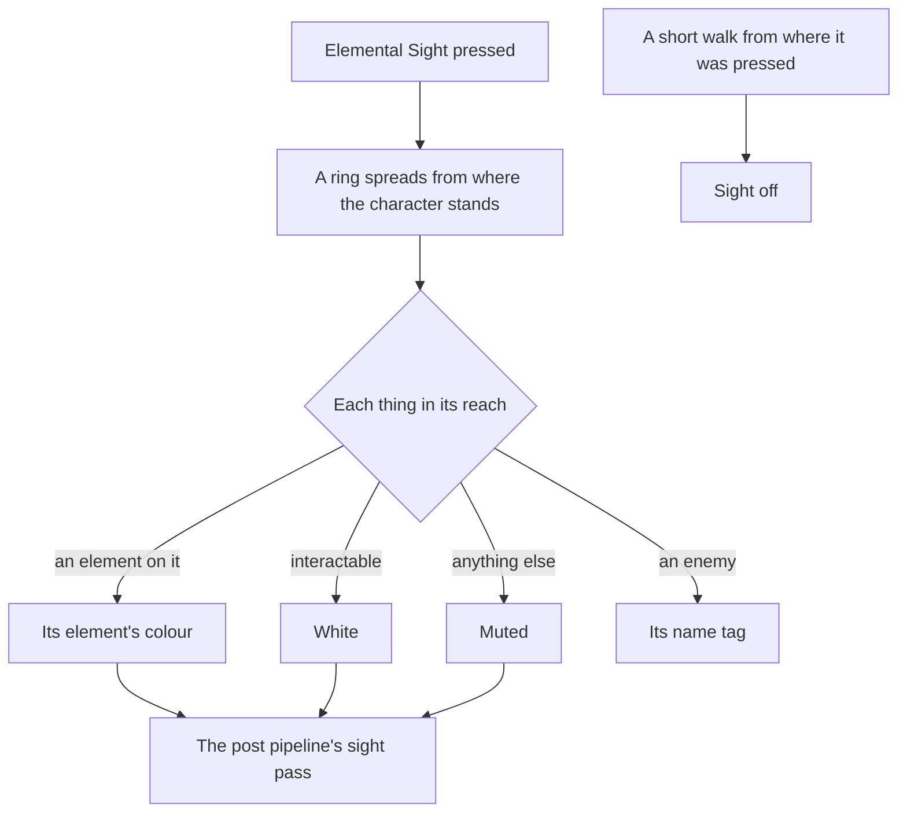

# Elemental Sight

Elemental Sight is how the game shows what can be acted on. Pressed, it spreads a range out from the character, mutes everything else, and lights what matters: interactable things, enemies and the elements on them, and trails that lead somewhere. The [controls](/docs/genshin/controls) already read its binding, the middle mouse button or a pad's left bumper with the left of its pad, with nothing behind it. It waits on nothing else, and the bounties' and the Seelie's trails are drawn by it once their pages place them.

## Decisions

- **A range spreads, then holds.** Toggled on, a white ring spreads outward from where the character stands, and what lies inside its reach is lit. It covers only the reach from where it was toggled.
- **The world mutes and what matters lights.** Inside the range, things that cannot be acted on take a dark, muted colour; interactable things show white; a thing or an enemy with an element on it shows that element's colour, from its aura in [combat](/docs/genshin/combat)'s `ElementalState` or its innate element in its own data, an enemy's in its kind's traits, as the wiki's table of colours gives them. Enemies show their name tags. A few interactables the game leaves unlit, such as notice boards and bushes, are left unlit.
- **Trails lead somewhere.** A [reputation](/docs/proposals/genshin/reputation) bounty's target, a Seelie's court ([puzzles](/docs/proposals/genshin/puzzles)) and a quest's or a hidden objective's clue leave an elemental trail that the sight draws from where the player stands toward its end.
- **It ends after a short walk.** Moving a short distance from where it was toggled turns it off, as the game turns it off, and it must be pressed again.
- **One post pass, never a material per thing.** The mute and the highlight are a pass of the engine's post pipeline over a mask the world writes for what is lit, so no material of the world's changes for it.

## How it works

## Scope and order

**Today:** the binding is read, and nothing answers it.

**This adds, in order:**

1. **The range, the mute and the white highlight** of the interaction prompts' things.
2. **Elements' colours and enemies' names**, read from their elemental state.
3. **Trails**, each with the page that leaves one.

## Data and measures

- **Read from the wiki:** which kinds of thing are lit and in which colour.
- **Measured:** the range's reach, how fast it spreads, how far a walk ends it, and the mute's and the highlight's colours, off a recording of the English PC client toggling it, provisional until then.

## Key files

| File                                                                           | Role after the change                   |
| :----------------------------------------------------------------------------- | :-------------------------------------- |
| `packages/genshin-engine/src/input/InputActionBindingMap.ts`                   | The binding the sight answers           |
| `packages/genshin-world/src/composables/usePostPipeline.ts`                    | Gains the mute and highlight pass       |
| `packages/genshin-world/src/services/interaction/computeInteractionPrompts.ts` | The interactable things it lights white |
| `packages/genshin-world/src/models/combat/ElementalState.ts`                   | The aura a lit thing or enemy shows     |
| `packages/genshin-world/src/models/enemy/EnemyKindTraits.ts`                   | An enemy's innate element               |

## Sources

- [Elemental Sight](https://genshin-impact.fandom.com/wiki/Elemental_Sight), Genshin Impact Wiki: its bindings, the spreading range and its limited reach, the muted world, interactables in white and elements in their colours, enemy name tags, the trails of bounties, Seelie and quests, the unlit exceptions, and its end after a short move.
