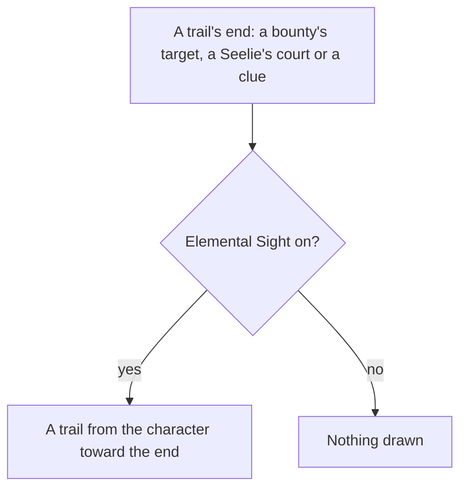

# Elemental Sight

The range, the mute, the white and element-coloured highlights, and the enemies' colours and names are built, as [Elemental Sight](/docs/genshin/elemental-sight) describes. What is left is the trails, which the pages that place their ends draw the sight toward.

## Decisions

- **Trails lead somewhere.** A [reputation](/docs/proposals/genshin/reputation) bounty's target, a Seelie's court ([puzzles](/docs/proposals/genshin/puzzles)) and a quest's or a hidden objective's clue leave an elemental trail that the sight draws from where the player stands toward its end.
- **Each trail comes with the page that leaves it.** A trail is drawn when the page that places its end is built, so none is drawn for an end nothing places yet.
- **The Seelies' trails come first.** Their ends are the nearest to place: the official map's Seelie Court label (147) holds thirty courts beside the Seelies [puzzles](/docs/genshin/puzzles) already places, while a bounty's target and a quest's clue stand in scene groups the other machine is still exporting. So the trail is built with the Seelies, once the puzzles unit stands a Seelie in the world with its court.
- **A trail is a ground ribbon, white, cut at the reach.** It runs on the ground from where the sight was turned on toward its end, sampled every `SIGHT_TRAIL_STEP` metres on the world's height, and is drawn in the sight's lit scene as the stand-ins are, so the mute leaves it bright. White is the colour of what no element affects ([Elemental Sight](/docs/genshin/elemental-sight)). Its width and fade are provisional constants until the owed `elemental-sight.mkv` measures them.

## How it works

## Scope and order

**Today:** no trail is drawn, since none of the three pages that leave one is built. The carried quests are in the world, but their go-to steps place no target yet, so a quest leaves no clue.

**This adds, each with its page:**

1. **Puzzles' Seelies**, once [Puzzles](/docs/proposals/genshin/puzzles) stands each Seelie in the world with its court. `packages/genshin-world/src/services/elementalSight/computeSightTrail.ts` takes the sight's origin, an end on the ground and the world's height function, and returns the trail's points every `SIGHT_TRAIL_STEP` metres from the origin toward the end, cut at the sight's reach, with `SIGHT_TRAIL_STEP`, `SIGHT_TRAIL_WIDTH` and `SIGHT_TRAIL_FADE` in the folder's `constants.ts` marked provisional. `components/World/SightTrails/Index.vue` draws each trail as a ribbon mesh in the sight's lit scene, and `components/World/Windrise/Index.vue` hands it the courts of the Seelies still resting while the sight is on. The proof is `computeSightTrail.test.ts`: an end inside the reach gives points from the origin to the end at the step, on the height function's ground; an end past the reach stops at the reach; an end at the origin gives none.
2. **Reputation's bounties**, once [Reputation](/docs/proposals/genshin/reputation) places each bounty's target, which waits on the scene group export the other machine is making.
3. **Quests' clues**, once the [quests](/docs/proposals/genshin/quests) page places the go-to triggers its carried quests name, which waits on the same export.

## Data and measures

- **Read from the wiki:** which ends leave a trail, and that the sight leads toward them.
- **Measured:** the trail's width and how it fades toward its end, off the recording owed in the roadmap beside the sight's own measures, each provisional until it lands.

## Key files

| File                                                            | Role after the change                          |
| :-------------------------------------------------------------- | :--------------------------------------------- |
| `packages/genshin-world/src/components/World/Session/Index.vue` | Where the trails' ends are handed to the sight |
| `packages/genshin-world/src/components/Quest/Beam/Index.vue`    | The beam a quest's target already rises over   |

## Sources

- [Elemental Sight](https://genshin-impact.fandom.com/wiki/Elemental_Sight), Genshin Impact Wiki: the trails of bounties, Seelie and quests, and the sight's end after a short move.
