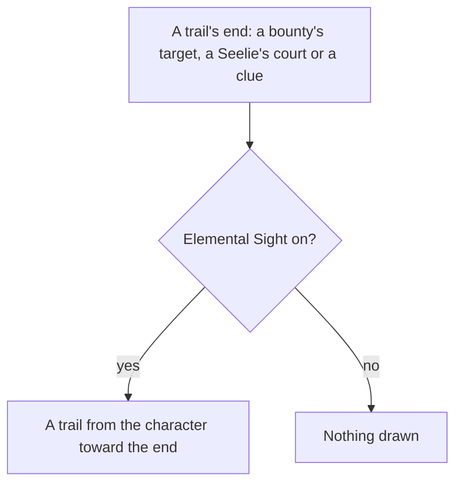

# Elemental Sight

The range, the mute, the white and element-coloured highlights, and the enemies' colours and names are built, as [Elemental Sight](/docs/genshin/elemental-sight) describes. What is left is the trails, which the pages that place their ends draw the sight toward.

## Decisions

- **Trails lead somewhere.** A [reputation](/docs/proposals/genshin/reputation) bounty's target, a Seelie's court ([puzzles](/docs/proposals/genshin/puzzles)) and a quest's or a hidden objective's clue leave an elemental trail that the sight draws from where the player stands toward its end.
- **Each trail comes with the page that leaves it.** A trail is drawn when the page that places its end is built, so none is drawn for an end nothing places yet.

## How it works

## Scope and order

**Today:** no trail is drawn, since none of the three pages that leave one is built. The carried quests are in the world, but their go-to steps place no target yet, so a quest leaves no clue.

**This adds, each with its page:**

1. **Reputation's bounties**, once [Reputation](/docs/proposals/genshin/reputation) places each bounty's target.
2. **Puzzles' Seelies**, once [Puzzles](/docs/proposals/genshin/puzzles) places each Seelie's court.
3. **Quests' clues**, once the [quests](/docs/proposals/genshin/quests) page places the go-to triggers its carried quests name.

## Data and measures

- **Read from the wiki:** which ends leave a trail, and that the sight leads toward them.
- **Measured:** the trail's width and how it fades toward its end, off the recording owed in the roadmap beside the sight's own measures, provisional until then.

## Key files

| File                                                            | Role after the change                          |
| :-------------------------------------------------------------- | :--------------------------------------------- |
| `packages/genshin-world/src/components/World/Session/Index.vue` | Where the trails' ends are handed to the sight |
| `packages/genshin-world/src/components/Quest/Beam/Index.vue`    | The beam a quest's target already rises over   |

## Sources

- [Elemental Sight](https://genshin-impact.fandom.com/wiki/Elemental_Sight), Genshin Impact Wiki: the trails of bounties, Seelie and quests, and the sight's end after a short move.
