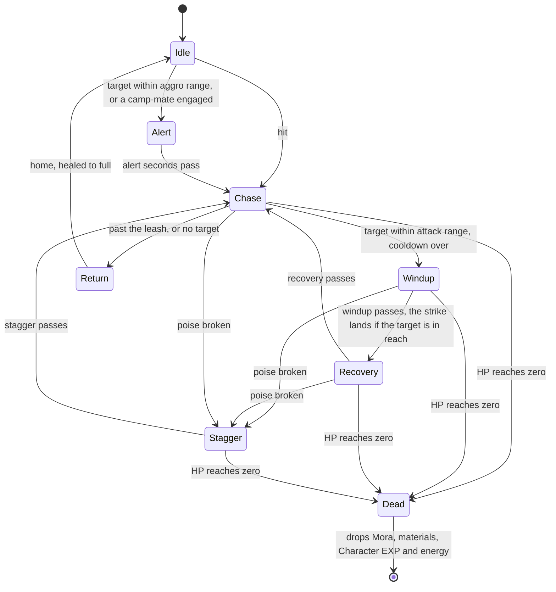

# Enemies

The world today holds landmarks and nothing that moves on its own. The game's open world is full of enemies: hilichurl camps on the hills, slimes in the grass, Abyss Mages by the ruins. Each one notices the player, fights, gives up when led too far from home, and comes back a while after it is beaten. This page puts them in the world. It builds every rule the wiki documents, and draws each enemy as a stand-in shape until its model is built.

## Decisions

- **Enemies are the world's rules, not the engine's.** A hilichurl's stats, its camp and its timers are the game's, so they live in `genshin-world`, beside the regions that place them. The engine gains nothing: an enemy is moved by the world's fixed-step loop and stood on the ground the region reads.
- **A kind is the game's own monster, by its own id.** The game files every enemy in one monster table, keyed by a numeric id, so a kind is named by that id, as [game text](/docs/genshin/game-text) names a string by the game's text id. A kind records what the wiki tabulates:
  - its family, the archive's grouping: Elemental Lifeforms (slimes and specters among them), Hilichurls, The Abyss, Fatui, Automatons, Other Human Factions (Treasure Hoarders, Nobushi, Eremites), Mystical Beasts, and Enemies of Note for the bosses
  - its type: common, elite, normal boss or weekly boss
  - its base HP, ATK and DEF, and the level curve each is scaled by
  - its resistance to each element and to physical damage, 10% for most
- **The tables are read from the community's dump of the game's data, never typed.** A script reads the dump's monster, level-curve and codex tables and writes the kinds the regions place, with every curve they name. Until it runs, the tables hold one entry, the Hilichurl Fighter, and its curves' first ten levels, so the logic runs. What the dump does not hold is authored beside it from the wiki: a kind's poise type, the element of its energy drops, its energy drops and its drop family.
- **Stats follow the wiki's formulas.** Max HP is base HP times the HP curve at the enemy's level, and ATK is base ATK times the ATK curve. DEF is base DEF, 500 for most enemies, times one plus a hundredth of the level. Co-op multipliers are left out, since the world is single-player.
- **Poise is the game's poise types.** Every enemy has a hidden poise bar. Its length, refill speed, endurance and reset time are set by its poise type: the Hilichurls' is Minion, with 60 poise, refilling at 5 a second, endurance 1.2 and a 5 second reset. A hit drains poise by its poise damage times the endurance. A bar that reaches zero is broken: the hit that breaks it, and every hit until the reset time passes, staggers the enemy and cancels its attack.
- **The AI is a state machine stepped on the fixed-step loop.** It is deterministic: it reads the enemy, its target and the step's seconds, and moves the enemy to its next state, so it runs the same in a test as in the world. Its states are idle (standing, or walking its patrol route), alert, chase, attack windup, attack recovery, stagger, return and dead. Each state's ranges, speeds and seconds are provisional constants until a recording or the enemy's clips measure them.
- **A camp wakes together.** Enemies placed together are one camp. When any member is engaged, whether it noticed the target or was hit, every idle member is alerted, as a whole hilichurl camp turns on the player at once.
- **Leashed to home, healed on return.** An enemy led farther from its spawn than its leash distance gives up and walks home. It takes no damage on the way, as the game shows "Immune" over a returning enemy, and arrives healed to full with its poise restored.
- **Respawn on the game's timers, applied on reload.** A common enemy comes back 12 hours after it is defeated. A camp with an elite in it comes back whole at the daily reset, at 04:00. A normal boss comes back as soon as its reward is claimed. The world has no server, so the daily reset is 04:00 in the reader's own time zone. A spawn is checked when its region's data loads, so an enemy never reappears in view. Defeats are kept for the life of the page, until there is a saved game to keep them in.
- **Drops as the wiki's tables give them.** A defeated enemy drops Mora, Character EXP and its family's materials, by its level's band of five levels. A common enemy's Mora is a random amount in its band's range, and an elite's is fixed. The second tier of materials starts dropping at level 40, and the third at 60. Energy drops at the kind's HP thresholds, each threshold once per enemy even if it is healed back over it, and again when the enemy dies. Enemies give no Adventure EXP: the game awards it only for claiming a boss's reward.
- **Combat computes the numbers; enemies take them.** The damage a hit deals and its poise damage come from combat's formula, and the energy dropped goes to combat's energy. An enemy's strike is handed to combat to land on the active character. Until combat and the party can do that, the enemy's side ends at those seams.
- **A capsule stands in for each enemy.** Every enemy is drawn as one capsule, tinted by its state so the AI's states can be seen. All the capsules are one instanced draw. The model is out of scope.
- **The camera stands in for the player.** The AI chases a target on the ground. Until the [character controller](/docs/proposals/genshin/character-controller) puts a character there, the target is the point under the camera, while the camera flies near the ground.
- **No enemy flees.** The game's enemies fight until they are beaten or leashed; only its wildlife flees, and wildlife is not part of this page.

## How it works



The enemies of every region in reach are made when its data arrives, skipping each spawn whose respawn time has not come. Each fixed step moves every enemy through this machine, then alerts the idle members of any camp with an engaged member. A hit from combat drains its HP and poise, drops the energy of each threshold it crosses, and engages it. An enemy whose death passes drops its loot and is recorded as defeated, so it stays gone until its region is next loaded after its respawn time.

## Scope and order

**Today:** nothing in the world moves on its own, and nothing has HP.

**This adds, in order:**

1. **The kinds and their curves**: the models, the provisional Hilichurl Fighter, the authored traits, the stats' formulas, and the script that writes the tables from the dump.
2. **The AI**: the state machine, its poise, and the camps.
3. **Spawns and respawn**: camps placed in region data, the respawn rules, and the drops.
4. **The stand-in**: the capsules drawn in the world, chasing the camera.

## What this does not propose

- **An enemy's model, its animation and its attacks' shapes.** A real hilichurl comes with the [characters](/docs/proposals/genshin/characters) pipeline. Until then an attack is one strike at the end of its windup.
- **HP bars and level labels over enemies**, which are the [HUD](/docs/proposals/genshin/hud)'s.
- **Bosses' rewards**: the Trounce Blossom, Original Resin and the Adventure EXP a claim awards. Weekly bosses live in domains.
- **Elemental auras and reactions on enemies**, which are combat's.
- **Co-op scaling**, since the world is single-player.

## Key files

| File                                                                  | Role after the change                                    |
| :-------------------------------------------------------------------- | :------------------------------------------------------- |
| `packages/genshin-world/src/models/world/RegionData.ts`               | Gains the region's enemy camps                           |
| `packages/genshin-world/src/data/regions/mondstadt.json`              | Places a hilichurl camp by Windrise                      |
| `packages/genshin-world/src/components/World/Windrise/Index.vue`      | Mounts the enemies in the world group                    |
| `scripts/src/services/genshinAssets/commands/genshinAssetsCommand.ts` | Gains `enemies`, writing the kinds' tables from the dump |

New files:

```text
packages/genshin-world/src/models/enemy/
packages/genshin-world/src/services/enemy/
packages/genshin-world/src/data/enemies/kinds.json
packages/genshin-world/src/data/enemies/levelCurves.json
packages/genshin-world/src/components/World/Enemies/Index.vue
scripts/src/services/genshinAssets/commands/enemiesCommand.ts
```

## Sources

- [Enemy](https://genshin-impact.fandom.com/wiki/Enemy), Genshin Impact Wiki: the four types and the archive's families.
- [Enemy/Level Scaling](https://genshin-impact.fandom.com/wiki/Enemy/Level_Scaling), Genshin Impact Wiki: max HP and ATK as base value times a level multiplier, three HP curves and two ATK curves, base DEF of 500 and DEF's multiplier of one plus a hundredth of the level.
- [Interruption Resistance/Poise](https://genshin-impact.fandom.com/wiki/Interruption_Resistance/Poise), Genshin Impact Wiki: the poise bar, its refill and reset, and each poise type's length, refill speed, endurance and reset time.
- [Energy/Data](https://genshin-impact.fandom.com/wiki/Energy/Data), Genshin Impact Wiki: each enemy's energy drops at its HP thresholds and on death, each threshold once per enemy.
- [Reset](https://genshin-impact.fandom.com/wiki/Reset), Genshin Impact Wiki: common enemies back 12 hours after defeat unless in an elite's group, elites and their groups at the daily reset at 04:00, and normal bosses once their reward is claimed.
- [Module:Drops Table/data](https://genshin-impact.fandom.com/wiki/Module:Drops_Table/data), Genshin Impact Wiki: Mora and Character EXP by level band for common and elite enemies, each family's materials, and the tiers' rates by band.
- [Adventure EXP](https://genshin-impact.fandom.com/wiki/Adventure_EXP), Genshin Impact Wiki: Adventure EXP from bosses' rewards, and none from defeating enemies.
- [AnimeGameData](https://gitlab.com/Dimbreath/AnimeGameData), the community's dump of the game's data: `MonsterExcelConfigData`, `MonsterCurveExcelConfigData` and `AnimalCodexExcelConfigData`, the monster, level-curve and archive tables the kinds are read from.
