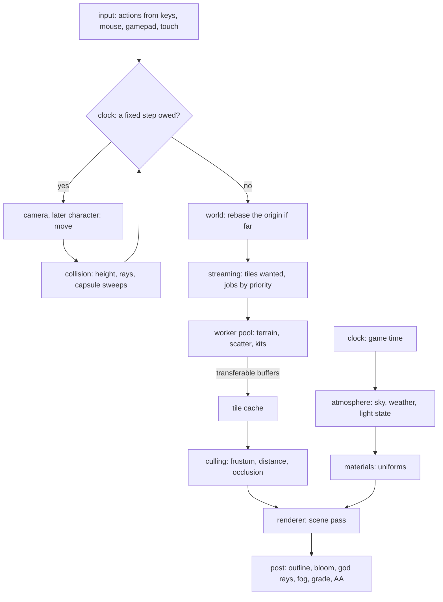

# Engine architecture

This page belongs to the [Genshin](/docs/proposals/genshin) program. Every later page (terrain, water, vegetation, each region, and the character and combat after them) is a module plugged into the structure described here. The structure comes first because the program is long. A world built as one scene component would couple its terrain to its camera and its sky to its grass, and it would be rewritten by the third region. Instead, each system is a module with one job, a typed interface and its own tests. The modules meet only through the interfaces listed below.

## Decisions

- **The engine is a published workspace package; the app only mounts it.** `genshin-engine`, public on npm like `keyframe-store` and `vue-phaserjs`, holds the engine as plain TypeScript and TSL node graphs, with no Vue and no store. The app's TresJS components are thin: they create the engine's modules, hand them the canvas, and bind the HUD to their state. The engine is therefore tested without a DOM, and nothing in the app reaches past a module's interface.
- **One module, one job.**

  | Module       | Its job                                                                                    |
  | :----------- | :----------------------------------------------------------------------------------------- |
  | `renderer`   | builds `WebGPURenderer`, owns the render pipeline and the quality tier                     |
  | `clock`      | game time for the sky, and the fixed simulation step                                       |
  | `world`      | the catalogue, the continent transform, loading regions by reach, and the floating origin  |
  | `streaming`  | which tiles are wanted where, jobs to a worker pool by priority, and a cache with eviction |
  | `terrain`    | height tiles, the CDLOD mesh and the ground material                                       |
  | `collision`  | queries against the world: height at a point, rays, capsule sweeps, the water surface      |
  | `culling`    | which instances and objects are drawn: frustum, distance, then occlusion                   |
  | `atmosphere` | the sky, the weather and the light state they produce                                      |
  | `wind`       | the shared wind field                                                                      |
  | `materials`  | the toon material family and the uniforms it reads                                         |
  | `post`       | the outline, bloom, god rays, fog, grade and anti-aliasing chain                           |
  | `vegetation` | grass, trees and scatter                                                                   |
  | `water`      | surfaces, rivers, waterfalls and the world under water                                     |
  | `kits`       | the parametric generators each region adds                                                 |
  | `input`      | keys, mouse, gamepad and touch turned into actions                                         |
  | `camera`     | the free camera now, the follow camera with a spring arm later                             |

- **Collision is a query service, not a physics engine.** Genshin's movement (running, climbing, gliding, swimming) is kinematic: a controller asks the world where it may go. `collision` answers exactly:
  - the ground's height and normal from the terrain's own tiles
  - rays and capsule sweeps against landmark meshes through a bounding volume hierarchy built once per landmark
  - the water surface's height from the water's data

  The camera's spring arm, picking and the phase-three character controller are all its callers. A rigid-body engine is not added, since nothing in the world is a stack of falling boxes, and its solver would fight the kinematic movement the game's feel depends on.

- **Culling in tiers, each added when a scene needs it.**
  1. Frustum and distance tests on terrain tiles and object batches, from the first build.
  2. Per-instance culling of grass, scatter and trees on the GPU, where a compute pass writes the survivors into an indirect draw, so a field of blades never passes through JavaScript.
  3. Occlusion for cities, first through three's occlusion queries on large landmarks, then a hierarchical depth pyramid built from the last frame that the instance pass also tests against.
- **A frame runs in a fixed order.** Input is read. The simulation advances in fixed steps from an accumulator: camera, then later the character, colliding through `collision`. `world` rebases the origin if the camera has moved far. `streaming` updates what is wanted from the camera's new position. `atmosphere` updates the light state from the clock and the weather. The frame renders through `post`. Nothing reads state that a later stage of the same frame writes.
- **State flows one way.** Modules expose read-only state and commands. The light state and the wind are uniforms that materials read. Region data flows from `world` to `terrain`, `vegetation`, `water` and `kits`. No module imports a sibling's internals, and a dependency that points back up the order is a design error.
- **It runs in the reader's browser, so it is minimal first.** Every module is judged by what it costs a mid-range laptop's integrated GPU and a phone:
  - a frame allocates nothing
  - draws are tens, never thousands, through instancing, batching and indirect draws
  - generation happens off the main thread
  - the engine's code and each region's data load only when needed
  - quality tiers lower cost before the frame budget is missed

  Every generator and every per-frame selection is benched under the `bench` skill before it is built on, at two scales to prove its cost follows what is visible. A module whose bench grows with the continent is redesigned, not tuned.

- **Every generator is pure and seeded.** Tile heights, scatter and kit geometry are pure functions of region data, a tile key and a seed. They run the same in a worker, a test or a bench, and the same spot always generates the same world.

## How it works



## Scope

**Today:** the package is published with what the Windrise scene needs: `renderer`'s quality tiers, `materials`' ramp, the TSL node graphs of the toon material, rim, leaves and sky, the game's day under `clock`, the sky state and the sun's cascades under `atmosphere`, the frame after the scene under `post`, the CDLOD quadtree under `terrain` with its tile cache under `streaming`, the floating origin's shift under `world`, and the tree and statue `kits`. The `genshin-engine` skill states the rules above for every session.

**This adds:** every other module, each with the page that first needs it (`wind` and `vegetation` with vegetation, `water` with water, `input` and `camera` with exploring), and no empty module ahead of its page.

## Key files

| File                                   | Role after the change                                        |
| :------------------------------------- | :----------------------------------------------------------- |
| `apps/web/package.json`                | Depends on the engine package                                |
| `packages/genshin-engine/src/index.ts` | The package's entry, which the app imports every module from |

New files:

```text
packages/genshin-engine/
  src/renderer/  src/clock/  src/world/  src/streaming/  src/terrain/  src/collision/
  src/culling/   src/atmosphere/  src/wind/  src/materials/  src/post/  src/vegetation/
  src/water/     src/kits/  src/input/  src/camera/
  src/nodes/     ← every TSL node graph and the renderer built on them
```

## Sources

- [Fix your timestep!](https://gafferongames.com/post/fix_your_timestep/), Glenn Fiedler: simulation in fixed steps from an accumulator, the order the clock keeps.
- [KinematicCharacterController](https://rapier.rs/javascript3d/classes/KinematicCharacterController.html), Rapier: a kinematic controller that hits and slides against obstacles. It confirms that the movement Genshin needs is queries and sliding rather than a rigid-body solve, and it is weighed here and not taken.
- [three-mesh-bvh](https://github.com/gkjohnson/three-mesh-bvh), Garrett Johnson: the bounding volume hierarchy for rays and shape casts against landmark meshes.
- [GPU-driven: Hi-Z occlusion culling and indirect count](https://daslang.io/doc/reference/tutorials/vulkan/12_gpu_driven.html), daslang: a depth pyramid max-downsampled so each level holds the farthest occluder. The conservative test culls an instance only when its nearest point lies behind the farthest occluder over its screen footprint, and survivors are compacted by an atomic counter into an indirect draw. This is the third culling tier.
- [In three.js, have occlusion culling?](https://discourse.threejs.org/t/in-three-js-have-occlusion-culling/15076), three.js forum, and the [WebGPU occlusion example](https://threejs.org/examples/webgpu_occlusion.html): occlusion queries available in `WebGPURenderer`, the tier's first step.
