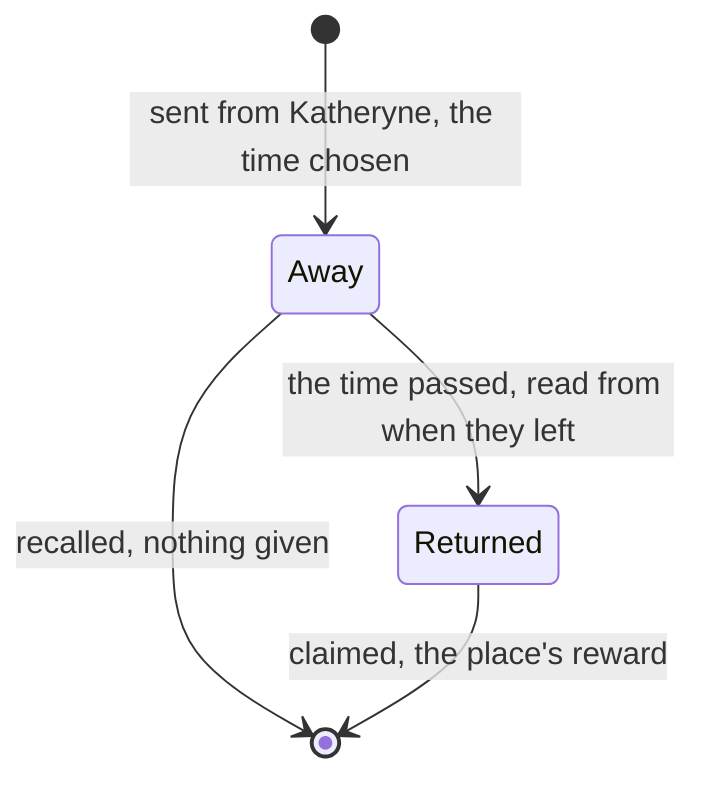

# Expeditions

An expedition sends characters out to gather while the player is away: a place chosen, a length of time, and the place's materials or Mora collected when they return. It is reached through Katheryne at any branch of the Adventurers' Guild, opens at [Adventure Rank](/docs/proposals/genshin/adventure-rank) 14, and its places open with the statues that cover them ([map unlocking](/docs/proposals/genshin/map-unlocking)), so this page waits on both.

## Decisions

- **Sent for 4, 8, 12 or 20 hours.** Any character but the Traveler can be sent, never one who is down, and they stay usable in the party while away, as the game sends them in name only.
- **Places, times and rewards are the game's.** `ExpeditionDataExcelConfigData` and the tables beside it give each place, its region, the times offered and what each time brings; the amounts vary a little from claim to claim, as the wiki says, drawn from the world's seeded random source. A place opens once the Statue of The Seven covering its area is resonated with.
- **Real time, while away.** An expedition is kept by when it left, so it finishes while the page is closed, as the game's timer runs offline.
- **Recalled for nothing.** Recalling a character before their time ends forfeits the reward.
- **More at once with rank.** Two characters may be out at first, and each rank's `expeditionLimitAdd` in the player level table raises it.
- **A character's expedition talent.** A passive that shortens an expedition or adds to its reward applies when its character is sent, as `ExpeditionBonusExcelConfigData` and the character's passive give it.

## How it works

## Scope and order

**Today:** nothing sends a character anywhere.

**This adds, in order:**

1. **Mondstadt's places**, sending, returning and claiming, with Katheryne.
2. **The limit by rank, and recall.**
3. **Each region's places**, as its statues are resonated with.
4. **Expedition talents.**

## Data and measures

- **Read from the game's tables:** `ExpeditionDataExcelConfigData`, `ExpeditionPathExcelConfigData`, `ExpeditionBonusExcelConfigData`, and the player level table's `expeditionLimitAdd`.
- **Read from the wiki:** how much a claim's amounts vary, where the tables give the expected amounts alone.

## Key files

| File                                                                | Role after the change                        |
| :------------------------------------------------------------------ | :------------------------------------------- |
| `packages/genshin-world/src/models/character/Character.ts`          | A character's expedition, if they are away   |
| `packages/genshin-world/src/services/inventory/addInventoryItem.ts` | An expedition's reward, into the bag         |
| `packages/genshin-world/src/models/world/Resident.ts`               | Katheryne, through whom expeditions are sent |
| `packages/genshin-world/src/models/screen/ScreenKind.ts`            | Gains the expeditions' screen                |

## Sources

- [Expedition](https://genshin-impact.fandom.com/wiki/Expedition), Genshin Impact Wiki: the unlock at rank 14 through Katheryne, any character but the Traveler for 4, 8, 12 or 20 hours, still usable while away, places opened by their statues, rewards by place varying slightly, the timer running offline, recall forfeiting the reward, and two at once rising with rank.
- [AnimeGameData](https://gitlab.com/Dimbreath/AnimeGameData), the community's per-patch dump: the expedition tables and the player level table's expedition limit.
