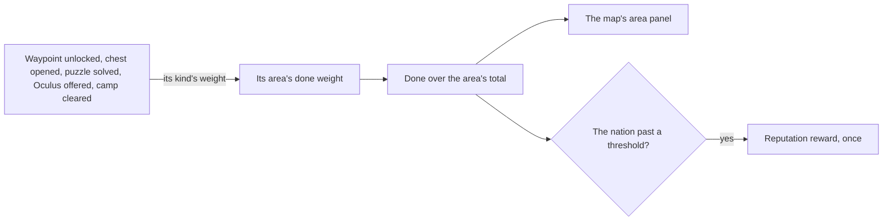

# Exploration progress

The game's map shows, for every area, how much of it a player has explored as a percentage, and a nation's exploration raises its Reputation at set thresholds. It is a count over what the other exploring pages do, so it waits on the [map unlocking](/docs/proposals/genshin/map-unlocking), [chests](/docs/proposals/genshin/chests), [puzzles](/docs/proposals/genshin/puzzles) and [Statues of The Seven](/docs/proposals/genshin/statues-of-the-seven) whose doings it counts.

## Decisions

- **A share of the area's total.** An area's progress is the weight of what has been done in it over its total, which `ExploreAreaTotalExpExcelConfigData` holds for every area, shown as a percentage on the map's area panel.
- **Each doing adds its kind's weight.** A waypoint unlocked, a chest opened, a puzzle solved, an Oculus offered and a camp cleared each add their kind's weight to the area they stand in. `WorldAreaExploreEventConfigData` lists such events with a weight of ten for only the first few areas, and the live game keeps the rest on its servers, so each kind's weight in every other area is read off a recording of the map's percentage stepping as one of each is done.
- **Counted once.** A doing counts once, kept with the player's progress, so a chest that never comes back and a waypoint unlocked once each add their weight a single time.
- **A nation's thresholds raise its Reputation.** A nation's exploration reaching each of `ReputationExploreExcelConfigData`'s thresholds gives its Reputation reward once ([reputation](/docs/proposals/genshin/reputation)).

## How it works

## Scope and order

**Today:** nothing counts what has been explored.

**This adds, in order:**

1. **The count and the percentage**, on the map's area panel, for Windrise's area first.
2. **Each kind's weight**, measured.
3. **The Reputation thresholds**, once Reputation is kept.

## Data and measures

- **Read from the game's tables:** `ExploreAreaTotalExpExcelConfigData`'s totals, `WorldAreaExploreEventConfigData`'s events where it lists them, and `ReputationExploreExcelConfigData`'s thresholds.
- **Measured:** each kind's weight, off a recording of the English PC client's map before and after one waypoint, one chest of each kind, one puzzle and one Oculus offered in an area, the step in its percentage times its total.

## Key files

| File                                                          | Role after the change                   |
| :------------------------------------------------------------ | :-------------------------------------- |
| `packages/genshin-world/src/components/Map/Overlay/Index.vue` | Shows an area's percentage on its panel |
| `packages/genshin-world/src/models/world/CatalogueArea.ts`    | The area a doing counts toward          |
| `packages/genshin-world/src/services/world/catalogue.ts`      | Finds the area a place stands in        |

## Sources

- [Reputation](https://genshin-impact.fandom.com/wiki/Reputation), Genshin Impact Wiki: world exploration progressed by puzzles, chests and offerings to the statues, and its share of a nation's Reputation.
- [AnimeGameData](https://gitlab.com/Dimbreath/AnimeGameData), the community's per-patch dump: every area's exploration total, the exploration events listed for the first areas alone, and the nations' exploration thresholds.
