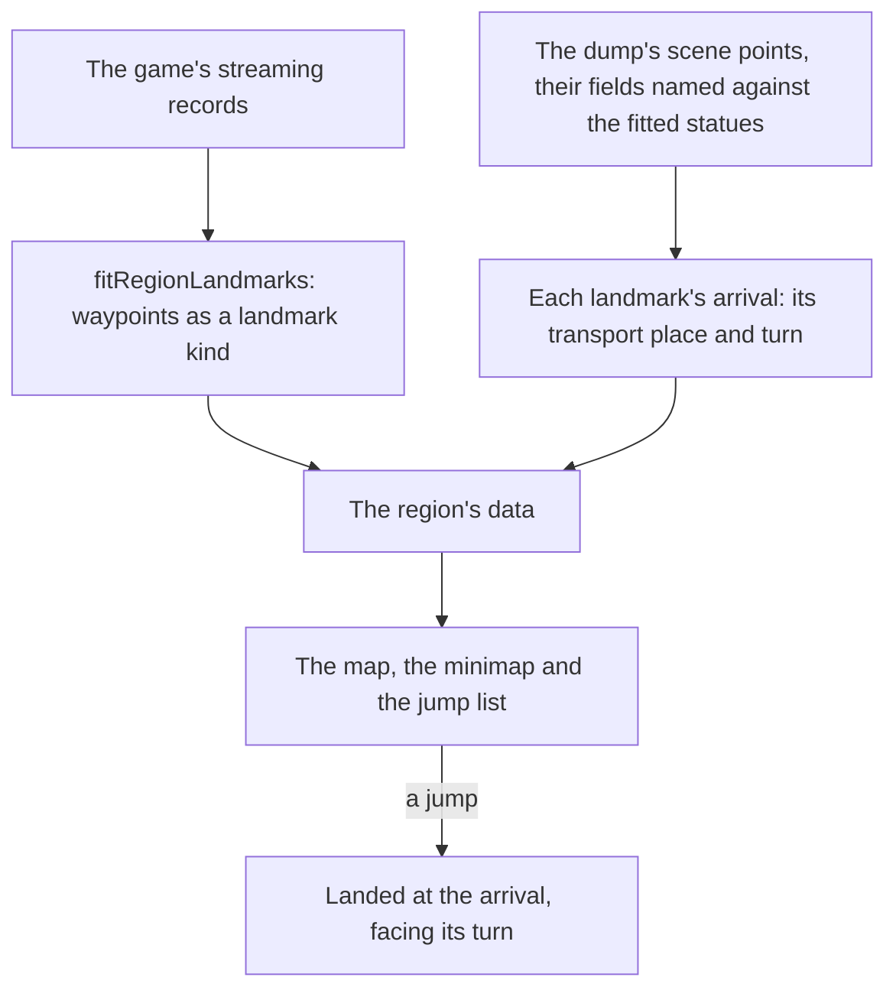

# Exploring

The world is explored today through its [map](/docs/genshin/map) on M, whose jump list and marks fade the [character](/docs/genshin/character-controller) to any Statue of The Seven, the HUD's [minimap](/docs/genshin/minimap), and the [touch controls](/docs/genshin/touch-controls) on a phone. What is left is where a jump may go, where exactly it lands, and how the map is read once the world holds more than a handful of places.

## Decisions

- **Waypoints are a landmark kind of their own.** The game's Teleport Waypoints are placed in its streaming records like any landmark, so `fitRegionLandmarks` fits them into each region's data as a `LandmarkKind` of their own, and they join `JUMP_LANDMARK_KINDS`. The map, the minimap and the jump list draw them with no change of their own, a waypoint named by its area as a statue is.
- **A waypoint is told from a statue by the official map's label.** The dump files both as one kind of transport point, but the official map labels each, and `genshin:assets points-fit` has already carried its statues and waypoints onto the scene's transport points by one similarity (`references/interactive-map/fit.json`, [spawned places](/docs/genshin/spawned-places)). So a transport point is a waypoint where the map's ground waypoint (`INTERACTIVE_MAP_WAYPOINT_LABEL_ID`, layer zero) pairs with it under `matchPairs` within `INTERACTIVE_MAP_FIT_BAR`. Its landmark id is `<region>-waypoint-<pointId>`, the point's own id, which the first-unlock rewards (`generated/transPoints/scene3.json`) are keyed by too. Its area is the catalogue area whose outline holds it, and `""` where none does. The world draws no waypoint mesh until a kit for it is built; the map, the minimap and the jump list need none.
- **A jump lands at the game's own transport point.** The game sets a transport place and turn for every statue and waypoint in its scene points (`BinOutput/Scene/Point/scene3_point.json` in the text dump), under obfuscated field names. Each field is named by matching a statue's entry against its fitted place, and the fit then writes each landmark's arrival into its region's data, in place of `JUMP_STANDOFF_DISTANCE`'s provisional stand-off.

## How it works



## Scope

**Today:** a jump lands a provisional distance in front of a Statue of The Seven, the only kind a jump goes to, and the map is panned by a drag and zoomed by the wheel or its slider.

**This adds:**

```text
scripts/src/services/genshinAssets/fit/fitRegionWaypoints.ts
```

1. **Mondstadt's Teleport Waypoints, next.**
   - `LandmarkKind` gains `TeleportWaypoint`, with a `WaypointLandmark.ts` and schema beside `StatueLandmark.ts` in `packages/genshin-world/src/models/world/` joining `Landmark`'s union, and `JUMP_LANDMARK_KINDS` gains it.
   - `readSceneTransportPoints` carries each point's id, its key in the dump's category.
   - A new `fitRegionWaypoints.ts`, a `waypoints` fit in `DerivedAssetFitMap`, reads `readFittedMapPoints()` and `readSceneTransportPoints()`, keeps the map's ground waypoints in the region's map area (`InteractiveMapRegionMap`), pairs them as the Decisions say, and writes each paired point as a landmark round the world's origin, carried as `fitRegionCapitals` carries the waypoints' median, into `packages/genshin-world/src/data/regions/<region>.json` beside its other landmarks, replacing the waypoints it wrote before. It runs for Mondstadt first.
   - The pure step from pairs to landmarks is `toWaypointLandmarks.ts`, and its test, `toWaypointLandmarks.test.ts`, carries one map waypoint by a known transform onto a transport point and reads back one landmark with that point's id, while a statue's label and a waypoint past the bar give none.
2. **The game's arrival points**, read from the scene points.

## Key files

| File                                                           | Role after the change                                |
| :------------------------------------------------------------- | :--------------------------------------------------- |
| `scripts/src/services/genshinAssets/fit/fitRegionLandmarks.ts` | Fits waypoints and every landmark's arrival          |
| `packages/genshin-world/src/models/world/LandmarkKind.ts`      | Gains the waypoint                                   |
| `packages/genshin-world/src/services/map/constants.ts`         | `JUMP_LANDMARK_KINDS` gains the waypoint             |
| `packages/genshin-world/src/services/map/computeJumpPose.ts`   | Reads a landmark's arrival in place of the stand-off |

## Sources

- [Teleport Waypoint](https://genshin-impact.fandom.com/wiki/Teleport_Waypoint), Genshin Impact Wiki: a waypoint chosen on the map as a fast-travel target, statues and domains counting as waypoints too.
- [Map](https://genshin-impact.fandom.com/wiki/Map), Genshin Impact Wiki: the map opened on M and a teleport chosen from it.
