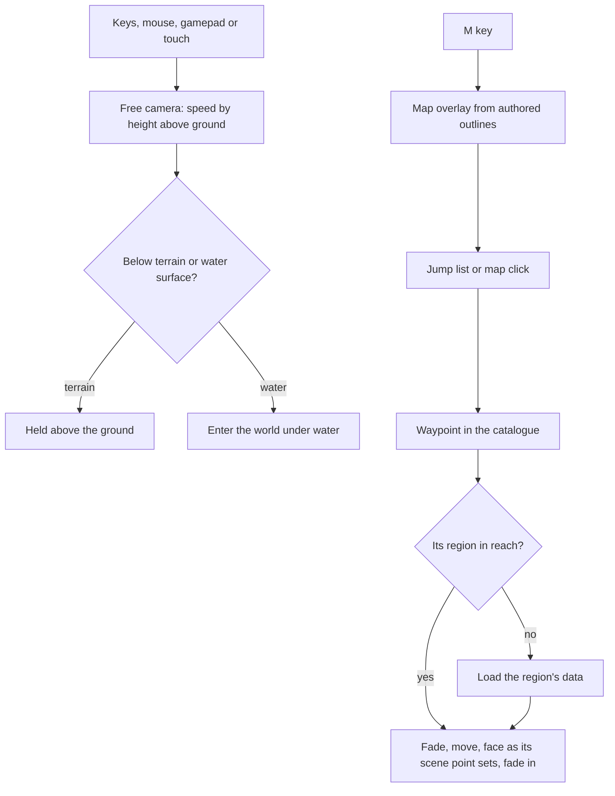

# Exploring

This page builds on the [world map](/docs/genshin/world-map), whose waypoints and outlines it presents. The world is built before anything can walk in it, and it still has to be seen at every scale: a close pass over Windrise's grass, a sweep along Liyue's karst, the whole of Inazuma from above. Exploring is the camera and the map that let a person do that. It is replaced, not extended, when the phase-three character controller arrives. After that the character walks and the free camera stays as a photo mode.

## Decisions

- **A free camera with a sense of place.** It flies with the usual keys and mouse look, a gamepad's two sticks, or two thumbs on touch. The speed rises with the height above the ground, so crossing a region takes seconds and a slow pass over grass stays slow. The camera never goes below the terrain or the water surface, except by diving into water, which enters the world under water.
- **Teleport like the game.** A jump list, grouped by region and area, holds every Teleport Waypoint and Statue of The Seven in the catalogue. Choosing one fades out, loads the target's region if it is not in reach, and fades in at the waypoint, at the place and facing the game's own scene point for it sets. Teleporting, rather than a flight across the map, is how a person goes between regions, as in the game.
- **The map is drawn from the catalogue.** M opens a top-down map of the continent. Region and area outlines are coloured by region, waypoints and statues are icons, the names are the catalogue's, and the camera is a pointer. The map is drawn from the catalogue's own outlines, never from the official map's imagery. Clicking a waypoint teleports to it.
- **The hour and weather are at hand.** A small control sets the clock and forces an area's weather, as the world screen's fixtures already hold an hour for each reference.
- **Three engine modules arrive with it.** The free camera is the engine's first input and first thing that moves under the simulation, so this page adds the modules its [architecture](/docs/genshin/engine-architecture) holds back until something needs them:
  - `input`: keys, mouse, gamepad and touch turned into actions, read once at the top of the frame.
  - `camera`: the free camera now, and the follow camera with a spring arm when a character arrives.
  - `collision`: queries against the world, starting with the two the free camera asks, the ground's height and normal at a point from the terrain's own tiles, and the water surface's height from the water's data.
- **The simulation runs in fixed steps.** The camera moves in fixed steps from an accumulator, so its motion is the same at any frame rate, and the steps run before the floating origin's shift and the streaming read its position, as the frame's order requires.
- **Collision is a query service, not a physics engine.** Genshin's movement (running, climbing, gliding, swimming) is kinematic: a controller asks the world where it may go. `collision` grows with its callers, rays and capsule sweeps against landmark meshes through a bounding volume hierarchy built once per landmark when the camera's spring arm and the character need them. A rigid-body engine is not added, since nothing in the world is a stack of falling boxes, and its solver would fight the kinematic movement the game's feel depends on.
- **Everything is reachable without the world.** The jump list and the map are DOM with keyboard focus and screen-reader names, so the world is never the only way to reach them. A person who cannot fly the camera can still go everywhere.

## Settled for the first build

What the world holds today decides each shape the decisions above leave open.

- **The jump list lists the catalogue's landmarks.** A region's data holds landmarks alone (`RegionData`'s `landmarks`, a Statue of The Seven and a tree in Mondstadt), and no source holds a Teleport Waypoint yet, so the list holds every landmark, grouped by its region and its `areaId`'s area in `catalogue.json`, and a teleport lands at the landmark's `position` facing its `rotation`. Waypoints join it as a `LandmarkKind` of their own once `fitRegionLandmarks` fits them from the game's placements, with no change to the list.
- **The control sets the hour alone.** It writes the world screen's `heldMinutes`, which `Windrise/Index.vue` already lays on the game clock; forcing an area's weather waits on [weather](/docs/proposals/genshin/weather), which no module draws yet.
- **The ground is the region's own height function.** `collision` answers the ground's height at a point from the `(x, z) => number` the region's terrain is built from (`getWindriseHeight`, through `createGaussianHillsHeight`), called on the main thread, never read back from a worker's tile, and its normal from that function's central differences a tenth of a metre apart. The water surface is the scene's water level, `water.json`'s `level`, one height a scene.
- **The engine's three modules, and the loop.** `input`: `createInput(target)` listens on the window for keys, pointer movement while locked, and the first gamepad, and `readInput()` returns once a frame a move vector (forward and right in -1 to 1, up and down from Space and Shift), a look delta in radians, and whether the boost is held; touch's two thumbs come in their own step after. `simulation`: `createFixedStepLoop(stepSeconds, step)` returns an `advance(deltaSeconds)` that runs as many whole steps as the accumulated time holds, at most five a frame, so a long frame never spirals. `camera`: `createFreeCamera({ camera, ground })` returns a `step(input, stepSeconds)` moving the camera at a speed that grows with its height over the ground and clamping it over the ground and the water. `collision`: `createGroundQuery(getHeight, waterLevel)` returns `getGround(x, z)` with its height and normal, and `getWaterLevel()`.
- **The map draws what the catalogue holds.** `catalogue.json`'s regions and areas, an area's `outline` where it is drawn (one of the areas' so far) and its name at its landmarks' centre where it is not, the landmarks as icons and the camera as a pointer; an outline the reference board draws later appears with no change to the map.

## How it works



## Scope

**Today:** orbit controls circle one point of the Windrise scene, and nothing reaches past it.

**This adds:**

1. **The free camera**, for every input, on the engine's new `input`, `camera` and `collision` modules and its fixed step.
2. **The jump list and teleport.**
3. **The map overlay.**
4. **The hour and weather control.**

## Key files

New files:

```text
packages/genshin-engine/src/input/
packages/genshin-engine/src/camera/
packages/genshin-engine/src/collision/
apps/web/app/components/Genshin/Joystick.vue
packages/genshin-world/src/components/World/FreeCamera/Index.vue
apps/web/app/components/Genshin/JumpList.vue
apps/web/app/components/Genshin/MapOverlay.vue
apps/web/app/components/Genshin/ClockControl.vue
```

## Notes

- **The touch joystick is written anew.** The voxel world's went with it, and nothing on the Genshin world walks by touch yet, so the free camera is its first consumer.

## Sources

- [Teleport Waypoint](https://genshin-impact.fandom.com/wiki/Teleport_Waypoint), Genshin Impact Wiki: fast travel by selecting a waypoint on the map, with statues and domains acting as waypoints too.
- [Map](https://genshin-impact.fandom.com/wiki/Map), Genshin Impact Wiki: the map on M, and teleporting from it.
- [Game accessibility guidelines](https://gameaccessibilityguidelines.com/full-list/): support for several input devices, and menus reachable without the play itself.
- [Fix your timestep!](https://gafferongames.com/post/fix_your_timestep/), Glenn Fiedler: simulation in fixed steps from an accumulator.
- [KinematicCharacterController](https://rapier.rs/javascript3d/classes/KinematicCharacterController.html), Rapier: a kinematic controller that hits and slides against obstacles, confirming that the movement Genshin needs is queries and sliding rather than a rigid-body solve; weighed and not taken.
- [three-mesh-bvh](https://github.com/gkjohnson/three-mesh-bvh), Garrett Johnson: the bounding volume hierarchy for rays and shape casts against landmark meshes.
