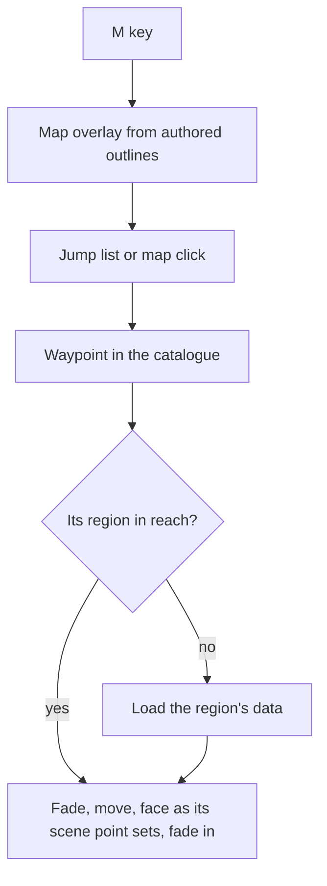

# Exploring

This page builds on the [world map](/docs/genshin/world-map), whose waypoints and outlines it presents. The free camera that flies the world is built, as the [free camera](/docs/genshin/free-camera) page describes. What is left is the means to go between places the camera cannot fly to in reasonable time, a map of where the places are, and the controls a player reaches for. Exploring is replaced, not extended, when the [character controller](/docs/proposals/genshin/character-controller) arrives. After that the character walks and the free camera stays as a photo mode.

## Decisions

- **Teleport like the game.** A jump list, grouped by region and area, holds every Teleport Waypoint and Statue of The Seven in the catalogue. Choosing one fades out, loads the target's region if it is not in reach, and fades in at the waypoint, at the place and facing the game's own scene point for it sets. Teleporting, rather than a flight across the map, is how a person goes between regions, as in the game.
- **The map is drawn from the catalogue.** M opens a top-down map of the continent. Region and area outlines are coloured by region, waypoints and statues are icons, the names are the catalogue's, and the camera is a pointer. The map is drawn from the catalogue's own outlines, never from the official map's imagery. Clicking a waypoint teleports to it.
- **The hour and weather are at hand.** A small control sets the clock and forces an area's weather, as the world screen's fixtures already hold an hour for each reference.
- **Touch flies the camera too.** Two thumbs on touch move and look the free camera, on the same input the keyboard, mouse and gamepad feed.
- **Collision is a query service, not a physics engine.** Genshin's movement (running, climbing, gliding, swimming) is kinematic: a controller asks the world where it may go. `collision` grows with its callers, rays and capsule sweeps against landmark meshes through a bounding volume hierarchy built once per landmark when the camera's spring arm and the character need them. A rigid-body engine is not added, since nothing in the world is a stack of falling boxes, and its solver would fight the kinematic movement the game's feel depends on.
- **Everything is reachable without the world.** The jump list and the map are DOM with keyboard focus and screen-reader names, so the world is never the only way to reach them. A person who cannot fly the camera can still go everywhere.

## Settled for the first build

What the world holds today decides each shape the decisions above leave open.

- **The jump list lists the catalogue's landmarks.** A region's data holds landmarks alone (`RegionData`'s `landmarks`, a Statue of The Seven and a tree in Mondstadt), and no source holds a Teleport Waypoint yet, so the list holds every landmark, grouped by its region and its `areaId`'s area in `catalogue.json`, and a teleport lands at the landmark's `position` facing its `rotation`. Waypoints join it as a `LandmarkKind` of their own once `fitRegionLandmarks` fits them from the game's placements, with no change to the list.
- **The control sets the hour alone.** It writes the world screen's `heldMinutes`, which `Windrise/Index.vue` already lays on the game clock; forcing an area's weather waits on [weather](/docs/proposals/genshin/weather), which no module draws yet.
- **The map draws what the catalogue holds.** `catalogue.json`'s regions and areas, an area's `outline` where it is drawn (one of the areas' so far) and its name at its landmarks' centre where it is not, the landmarks as icons and the camera as a pointer; an outline the reference board draws later appears with no change to the map.

## How it works



## Scope

**Today:** the world screen's camera is the [free camera](/docs/genshin/free-camera), with the keyboard, the mouse look once a page locks the pointer, and a gamepad's left stick. Nothing teleports, no map is drawn, and no control sets the clock.

**This adds:**

1. **The jump list and teleport.**
2. **The map overlay.**
3. **The hour and weather control.**
4. **Touch input** for the free camera.

## Key files

New files:

```text
apps/web/app/components/Genshin/Joystick.vue
apps/web/app/components/Genshin/JumpList.vue
apps/web/app/components/Genshin/MapOverlay.vue
apps/web/app/components/Genshin/ClockControl.vue
```

## Notes

- **The touch joystick is written anew.** The voxel world's went with it, and nothing on the Genshin world walks by touch yet, so the free camera is its first consumer.

## Sources

- [Teleport Waypoint](https://genshin-impact.fandom.com/wiki/Teleport_Waypoint), Genshin Impact Wiki: fast travel by selecting a waypoint on the map, with statues and domains acting as waypoints too.
- [Map](https://genshin-impact.fandom.com/wiki/Map), Genshin Impact Wiki: the map on M, and teleporting from it.
- [Game accessibility guidelines](https://gameaccessibilityguidelines.com/full-list/): support for several input devices, and menus reachable without the play itself.
- [KinematicCharacterController](https://rapier.rs/javascript3d/classes/KinematicCharacterController.html), Rapier: a kinematic controller that hits and slides against obstacles, confirming that the movement Genshin needs is queries and sliding rather than a rigid-body solve; weighed and not taken.
- [three-mesh-bvh](https://github.com/gkjohnson/three-mesh-bvh), Garrett Johnson: the bounding volume hierarchy for rays and shape casts against landmark meshes.
