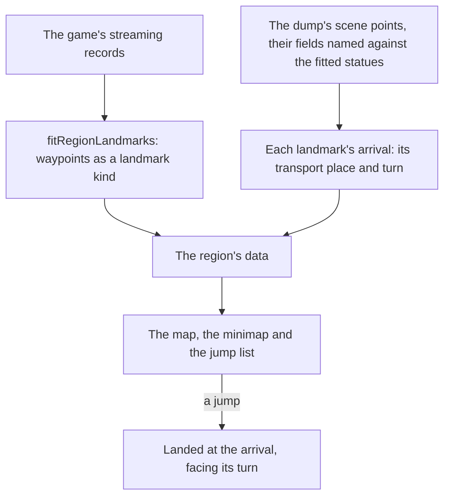

# Exploring

The world is explored today through its [map](/docs/genshin/map) on M, whose jump list and marks fade the [character](/docs/genshin/character-controller) to any Statue of The Seven, the HUD's [minimap](/docs/genshin/minimap), and the [touch controls](/docs/genshin/touch-controls) on a phone. What is left is where a jump may go, where exactly it lands, and how the map is read once the world holds more than a handful of places.

## Decisions

- **Waypoints are a landmark kind of their own.** The game's Teleport Waypoints are placed in its streaming records like any landmark, so `fitRegionLandmarks` fits them into each region's data as a `LandmarkKind` of their own, and they join `JUMP_LANDMARK_KINDS`. The map, the minimap and the jump list draw them with no change of their own, a waypoint named by its area as a statue is.
- **A jump lands at the game's own transport point.** The game sets a transport place and turn for every statue and waypoint in its scene points (`BinOutput/Scene/Point/scene3_point.json` in the text dump), under obfuscated field names. Each field is named by matching a statue's entry against its fitted place, and the fit then writes each landmark's arrival into its region's data, in place of `JUMP_STANDOFF_DISTANCE`'s provisional stand-off.
- **The map pans and zooms.** The game's map is dragged to pan and scrolled to zoom, over a continent far wider than a screen; the overlay's view grows the same two gestures, the jump list staying the keyboard's way to every place.

## How it works

## Scope

**Today:** a jump lands a provisional distance in front of a Statue of The Seven, the only kind a jump goes to, and the map shows everything it draws in one fixed view.

**This adds:**

1. **Teleport Waypoints**, fitted from the streaming records.
2. **The game's arrival points**, read from the scene points.
3. **The map's pan and zoom.**

## Key files

| File                                                           | Role after the change                                |
| :------------------------------------------------------------- | :--------------------------------------------------- |
| `scripts/src/services/genshinAssets/fit/fitRegionLandmarks.ts` | Fits waypoints and every landmark's arrival          |
| `packages/genshin-world/src/models/world/LandmarkKind.ts`      | Gains the waypoint                                   |
| `packages/genshin-world/src/services/map/constants.ts`         | `JUMP_LANDMARK_KINDS` gains the waypoint             |
| `packages/genshin-world/src/services/map/computeJumpPose.ts`   | Reads a landmark's arrival in place of the stand-off |
| `packages/genshin-world/src/components/Map/Overlay/Index.vue`  | Pans and zooms its view                              |

## Sources

- [Teleport Waypoint](https://genshin-impact.fandom.com/wiki/Teleport_Waypoint), Genshin Impact Wiki: fast travel by selecting a waypoint on the map, with statues and domains acting as waypoints too.
- [Map](https://genshin-impact.fandom.com/wiki/Map), Genshin Impact Wiki: the map on M, and teleporting from it.
