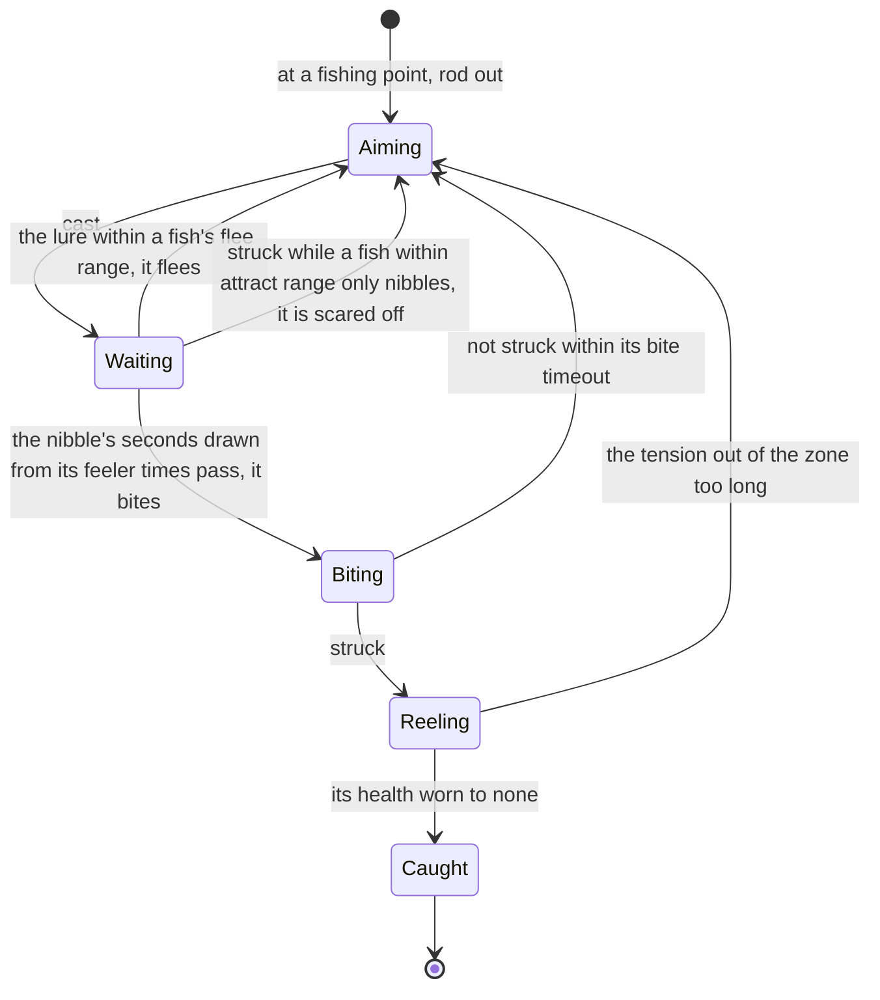

# Fishing

Fishing is one of the game's pastimes: bait crafted for the fish wanted, a line cast at a rippling fishing point, a bite struck, and the fish reeled in by keeping the line's tension in its zone. Fish are cooked, kept in the Serenitea Pot's ponds, and traded at each region's Fishing Association for rods and rewards. The game holds all of it in tables the client keeps whole, so it can be rebuilt to the number. Its bait is crafted ([crafting](/docs/proposals/genshin/crafting)), and the points, stocks, fish, rods and the cast's and reel's rules are [built](/docs/genshin/fishing).

## Decisions

- **A point's stock is its region's pools, for now.** Each region's pools are the game's, filed by city. Neither the official map's points nor the dump's tables tie a point to one pool, so until a recording shows which pool a point draws from, a point draws from every pool of its region. Nod-Krai's city is filed under no pool, so its points draw nothing, and the fifty-four pools filed under city zero, which no region names, are left out until a recording places them.
- **Stocks come back as the game sets them.** The game's clock picks which of a point's two stocks is fished, and its refill is the one the [fishing page](/docs/genshin/fishing) records (built).
- **Bait is not tied to a fish yet.** The bait table's feature tags name no fish, and no fish row names the tags it wants, so which bait draws which fish is read from the wiki's fish pages, each of which names its bait. Each kind is drawn only by its own bait, crafted from its recipe.
- **The bite is the fish's own.** A fish nibbles for a time within its feeler range and bites, and the bite is struck within its `biteTimeout` or lost. The timing and the caller's clock are not yet built.
- **The nibble's length is drawn from the fish's feeler times.** `feelerTimes` is a range in seconds, its least and its most (from `[0.75, 1]` to `[2, 8]` across the table), so a fish nibbles for a time drawn evenly between them by the caller's random source, as `claimExpedition` draws a count. A strike while it only nibbles scares it off and the cast is back to aiming, as a strike after `biteTimeout` seconds of biting is. The owed `fishing-reel.mkv` checks the scare; it does not gate the build.
- **The reel's zone moves by the fish's own fields.** The moving zone's width, speed, offset and duration are the fish's, and the reel takes the zone as its input meanwhile. How the zone travels over its duration waits on a recording of the minigame, as the tension rate and the allowance do.
- **The fish fights back with its skills.** Each fish's skills from `FishSkillExcelConfigData` act on the tension and the hit points on a clock of their own; the rod's pull and the struggles are read from the skill rows once the reel's zone is.
- **The stock limits stay unread.** Each pool's two limit numbers have scrambled names, and their meaning is not settled by any table here, so they wait on a reading.
- **What a catch gives.** The fish itself into the bag, its reward row, and proficiency toward the Fishing Association's rewards, exchanged at its shop ([shops](/docs/proposals/genshin/shops)).
- **Opened as the game opens it**, once the Serenitea Pot is owned and its quest is done, as the wiki gives the unlock.

## How it works



## Scope and order

**Built** ([fishing](/docs/genshin/fishing)): the fishing points by region, the fish, rods and each region's pools, the day and night stocks and their refill, the weighted draw, the lure's reaction and the reel's tension and allowance.

**This adds, in order:**

```text
packages/genshin-world/src/
├── models/fishing/FishingBite.ts
└── services/fishing/stepFishingBite.ts
```

1. **The bite and the nibbles, as a pure rule.** No source is owed: the `fishing/fish` record already holds each fish's `feelerTimes` and `biteTimeout`.
   - `FishingBite.ts`: a bite under way, its `nibbleSeconds` and its `elapsedSeconds`. The caller draws `nibbleSeconds` as `feelerTimes[0] + random() * (feelerTimes[1] - feelerTimes[0])` when the fish turns to the lure, with no helper around it.
   - `stepFishingBite.ts`: the bite after `seconds`, given whether the strike was pressed, returning its next `FishingPhase` and bite: `Waiting` while it nibbles, `Biting` from `nibbleSeconds`, `Reeling` on a strike while biting, and `Aiming` on a strike while nibbling or once `biteTimeout` seconds of biting pass unstruck.
   - `stepFishingBite.test.ts` beside it asserts each of those four transitions on a fish with `biteTimeout: 5` and a bite with `nibbleSeconds: 1`.
2. **The reel's zone and the fish's skills.** The zone travels on the fish's own `bonusWidth`, `bonusSpeed`, `bonusOffset` and `bonusDuration`, read provisionally until `fishing-reel.mkv` re-measures it, and the skills from `FishSkillExcelConfigData`, which the dump already holds.
3. **Bait and the rod's choice**, which fish each bait draws read from the wiki's fish pages, each naming its bait, through the repository's wiki reader, with the crafting recipes and the rod's multiplier and accuracy.
4. **The screen, the prompt in reach, the cast's input and the catch into the bag.**
5. **The Fishing Associations' exchanges.**

## Data and measures

- **Read from the game's tables:** `FishSkillExcelConfigData`, `FishBaitExcelConfigData` and `FishProficientExcelConfigData` are not read yet; the fish, pool, stock and rod tables are.
- **Waiting on a recording:** the reel's tension rate and its allowance, the zone's travel over its duration, and which pool a point draws from. Each is listed on the [roadmap](/docs/genshin/roadmap)'s Recordings owed list, and a provisional constant holds each meanwhile.

## Key files

| File                                                                           | Role after the change              |
| :----------------------------------------------------------------------------- | :--------------------------------- |
| `packages/genshin-world/src/services/interaction/computeInteractionPrompts.ts` | Offers fishing at a point in reach |
| `packages/genshin-engine/src/input/InputActionBindingMap.ts`                   | The cast, strike and reel          |
| `packages/genshin-world/src/services/inventory/addInventoryItem.ts`            | The fish caught, into the bag      |
| `packages/genshin-world/src/models/screen/ScreenKind.ts`                       | Gains the fishing view             |

## Sources

- [Fishing](https://genshin-impact.fandom.com/wiki/Fishing), Genshin Impact Wiki: the unlock after the Serenitea Pot, one bait per fish, the cast's distance, the bite and the tension, points emptied and back every 72 hours with separate day and night fish, and the Fishing Associations.
- [AnimeGameData](https://github.com/DimbreathBot/AnimeGameData), the community's per-patch dump: the skill, bait and proficiency tables, which the build does not read yet.
