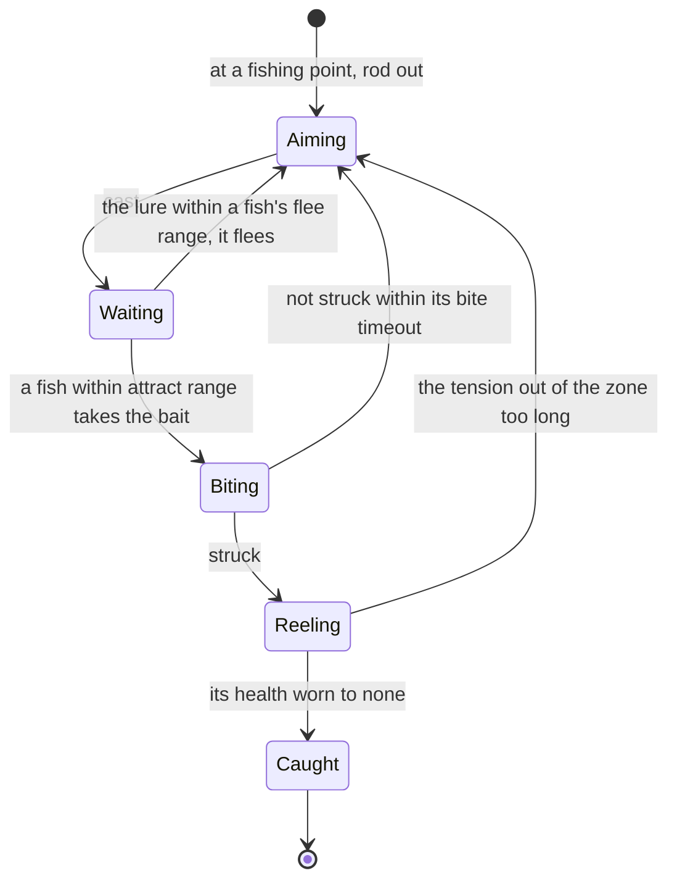

# Fishing

Fishing is one of the game's pastimes: bait crafted for the fish wanted, a line cast at a rippling fishing point, a bite struck, and the fish reeled in by keeping the line's tension in its zone. Fish are cooked, kept in the Serenitea Pot's ponds, and traded at each region's Fishing Association for rods and rewards. The game holds all of it in tables the client keeps whole, so it can be rebuilt to the number. Its bait is crafted ([crafting](/docs/proposals/genshin/crafting)) and its points stand where the [spawned places](/docs/proposals/genshin/spawned-places) fit them, so this page waits on both.

## Decisions

- **A fishing point's stock is the game's.** `FishPoolExcelConfigData` gives each point its stocks for the day and the night and how many fish it holds, and `FishStockExcelConfigData` each stock's fish by weight. A point's fish come back every 72 hours, kept with when it was emptied, and the day's and the night's are separate, so a point fished by day still holds its night fish.
- **Cast, drawn, scared.** The cast's spot is aimed, and a fish whose `attractRange` reaches the lure turns toward it if the bait is the one it takes, and flees if the lure lands within its `fleeRange`. It nibbles for its `feelerTimes` and bites; the bite is struck within its `biteTimeout` or lost.
- **Reeled by the game's minigame.** The fish has its `hp`. Reeling wears it down by the rod's attack (`FishRodExcelConfigData`) while the line's tension holds inside the moving zone, whose width, speed, offset and duration are the fish's own (`bonusWidth`, `bonusSpeed`, `bonusOffset`, `bonusDuration`), and the fish fights back with its skills from `FishSkillExcelConfigData`. The fish is caught at no health, and lost if the tension leaves the zone for too long.
- **Each fish takes one bait.** Each kind is drawn only by its own bait, crafted from its recipe.
- **What a catch gives.** The fish itself, its reward row, and proficiency toward the Fishing Association's rewards, exchanged at its shop ([shops](/docs/proposals/genshin/shops)).
- **Opened as the game opens it**, once the Serenitea Pot is owned and its quest is done, as the wiki gives the unlock.

## How it works

## Scope and order

**Today:** the world holds water and no fish.

**This adds, in order:**

1. **A fishing point and its stocks**, by Mondstadt's lake.
2. **Casting, the bite and reeling**, on the tables' numbers.
3. **Bait and rods.**
4. **The Fishing Associations' exchanges.**

## Data and measures

- **Read from the game's tables:** `FishExcelConfigData`, `FishPoolExcelConfigData`, `FishStockExcelConfigData`, `FishSkillExcelConfigData`, `FishRodExcelConfigData`, `FishBaitExcelConfigData` and `FishProficientExcelConfigData`.
- **Measured:** how long the tension may leave the zone, and how the reel's input moves the tension, off a recording of the minigame, provisional until then.

## Key files

| File                                                                           | Role after the change              |
| :----------------------------------------------------------------------------- | :--------------------------------- |
| `packages/genshin-world/src/services/interaction/computeInteractionPrompts.ts` | Offers fishing at a point in reach |
| `packages/genshin-engine/src/input/InputActionBindingMap.ts`                   | The cast, strike and reel          |
| `packages/genshin-world/src/services/inventory/addInventoryItem.ts`            | The fish caught, into the bag      |
| `packages/genshin-world/src/models/screen/ScreenKind.ts`                       | Gains the fishing view             |

## Sources

- [Fishing](https://genshin-impact.fandom.com/wiki/Fishing), Genshin Impact Wiki: the unlock after the Serenitea Pot, one bait per fish, the cast's distance, the bite and the tension, points emptied and back every 72 hours with separate day and night fish, and the Fishing Associations.
- [AnimeGameData](https://github.com/DimbreathBot/AnimeGameData), the community's per-patch dump: the fish, pool, stock, skill, rod, bait and proficiency tables.
