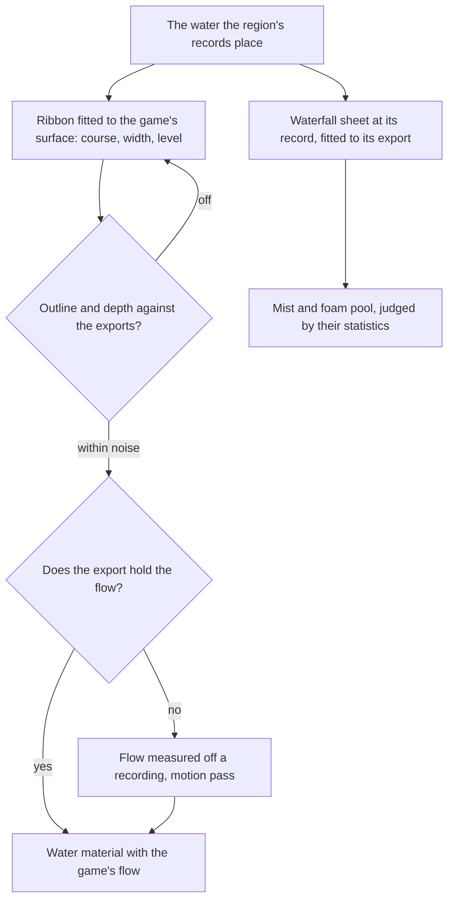

# Flowing water

This page builds on the [water](/docs/genshin/water), whose material already grades still water by depth, foams its shores and glints in the sun, and on the [scene derivation](/docs/genshin/scene-derivation)'s layout pass, which stands what the game places where it places it. Still water is one surface at a region's level. A river is not: it falls with its valley, it runs one way, and it pours over cliffs. Liyue's river valleys, Sumeru's rainforest and Mondstadt's falls all need it.

## Decisions

- **A river's course is the game's.** The water surfaces the game places along a river are read in the region's layout pass, and a river's ribbon mesh is fitted to them: its course, width and level, with texture coordinates running downstream. Its shape is gated as any shape is, by its outline and depth against the exports drawn at each reference's camera.
- **Its flow is read before it is measured.** The direction and speed its ripples and foam move at come from the game's own water material and its texture coordinates where the export holds them; what it holds without fields is measured off a recording of the river in the motion pass. Foam collects at rocks and bends.
- **Waterfalls are objects the game places.** Each sheet stands where its record sets it, a mesh with scrolling streaks fitted to the game's own in an object pass. The mist and foam pool at its foot are particles, so they are judged by their statistics against a recording, their spread, density and colour, never pixel for pixel.
- **One material with a flow.** The still water's material gains a flow direction and speed. Still water has none, so the sea and lakes are unchanged.

## How it works



## Scope

**Today:** the [water](/docs/genshin/water) is one surface at a region's level, still, with its foam, glints and caustics.

**This adds:**

1. **River ribbons** fitted to the water the game places.
2. **Waterfall sheets** at their records, with mist and a foam pool.

## Key files

| File                                                       | Role after the change                  |
| :--------------------------------------------------------- | :------------------------------------- |
| `packages/genshin-engine/src/nodes/createWaterMaterial.ts` | The water material, which gains a flow |

New files:

```text
packages/genshin-engine/src/water/        ← river ribbons and waterfall sheets fitted to the game's water
```

## Notes

- **Swimming is play.** Moving through the water, with its stamina, waits for the phase-three character controller.
