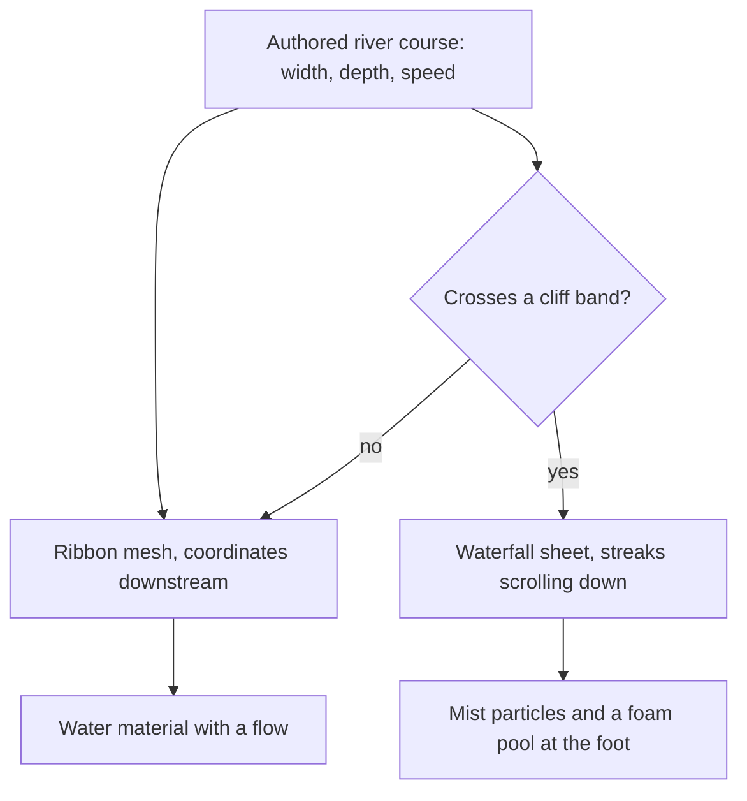

# Flowing water

This page builds on the [water](/docs/genshin/water), whose material already grades still water by depth, foams its shores and glints in the sun, and takes its courses from the [terrain's shapes](/docs/proposals/genshin/terrain-shapes). Still water is one surface at a region's level. A river is not: it falls with its valley, it runs one way, and it pours over cliffs. Liyue's river valleys, Sumeru's rainforest and Mondstadt's falls all need it.

## Decisions

- **Rivers flow along their courses.** A river's surface is a ribbon mesh built from its authored course, with texture coordinates running downstream. The water material's ripples scroll along that direction at the course's speed, and foam collects at rocks and bends.
- **Waterfalls are meshes on cliff bands.** Where a river course crosses a cliff band, a sheet mesh with scrolling streaks pours over the edge. At the foot, a mist of particles and a foam pool match the game's waterfalls, which are much wider than they are thick.
- **One material with a flow.** The still water's material gains a flow direction and speed. Still water has none, so the sea and lakes are unchanged.

## How it works



## Scope

**Today:** the [water](/docs/genshin/water) is one surface at a region's level, still, with its foam, glints and caustics.

**This adds:**

1. **River ribbons** from the authored courses.
2. **Waterfall sheets** where courses cross cliff bands, with mist and a foam pool.

## Key files

| File                                                       | Role after the change                  |
| :--------------------------------------------------------- | :------------------------------------- |
| `packages/genshin-engine/src/nodes/createWaterMaterial.ts` | The water material, which gains a flow |

New files:

```text
packages/genshin-engine/src/water/        ← river ribbons and waterfall sheets from authored courses
```

## Notes

- **Swimming is play.** Moving through the water, with its stamina, waits for the phase-three character controller.
