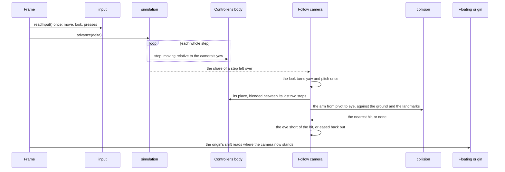

# Follow camera

This page builds on the [character controller](/docs/proposals/genshin/character-controller), whose body it follows, and on the [free camera](/docs/genshin/free-camera) it replaces in play. In the game, the camera stays behind the character and orbits a point above it. The player turns it freely and zooms it in and out, and the ground or a wall pulls it in toward the character rather than hiding the character behind them.

## Decisions

- **An orbit round a pivot above the body.** The look turns the camera's yaw and tilts its pitch, clamped short of straight up and down. The eye stands on that heading at a distance from the pivot and looks at the pivot. The game's camera settings give the distance a reset point between 4.5 and 6.0, which the camera returns to after a zoom, after combat and after a teleport. The pivot's height, the field of view, the pitch's limits, the wheel's nearest and furthest distances and the unit of that setting are all measured. The camera's pose is solved off recordings of the game by `pose`, as the [recreation passes](/docs/proposals/genshin/recreation-passes)' camera pass solves any recording's camera from the exports' landmarks. Each reading is kept in the camera's reference.
- **Pulled in by what stands between.** Each frame the arm from the pivot to the eye is tested against the ground and the landmarks. The ground is tested by stepping along the arm through the terrain's own height function, which is exact for a height field. The landmarks are tested by a ray through the hierarchy the controller's capsule sweep builds, so one collision service answers both. The eye stands short of the first hit by a clearance. How quickly it moves in and how it eases back out once the way clears are read off a recording of the camera passing a wall.
- **Once a frame, after the steps.** This settles what the free camera leaves open. The body moves in fixed steps and the view once a frame. The frame's look turns the camera once, however many steps the frame ran. The pivot follows the body's place, blended between its last two steps by how far the frame has come into the next one, which `simulation`'s loop exposes as the share of a step left in its accumulator. Without that blend a body stepping at a fixed rate stutters against the display's own rate. The steps read the camera's yaw at the frame's start, so a move stays relative to where the player is looking.
- **The game's controls and settings.** The mouse turns the camera and the right stick does on a controller, as the game's controls bind them. Pointer lock is the browser's way of hiding the cursor. So a click into the world locks the pointer, as the game hides its cursor in play, and Left Alt shows the cursor, as the game's Show Cursor does. The settings the game offers for this camera are read from the [menu screens](/docs/proposals/genshin/menu-screens)' settings, each with the game's range and default. They are the horizontal and vertical sensitivity, the default distance, and whether the camera's pitch follows the slope as the character climbs or descends.
- **The free camera is the photo mode.** The game's Paimon menu holds Take Photo. Choosing it swaps the world's camera to the free camera at the follow camera's pose, the heads-up display hides, and the body holds where it stood. Leaving puts the follow camera back behind the character. The game keeps its clock running in photo mode, unlike the rest of the menu, so the world keeps moving.

## How it works



## Scope and order

**Today:** the world is flown by the free camera. Its look is applied by each step, so a frame of several steps turns it several times, and nothing locks the pointer.

**This adds, in order:**

1. **The references.** Recordings showing the game's camera in play are found, published ones first, each with a turn, a zoom through the wheel's range and a pass by a wall. `pose` solves them for the pivot, the distances, the field of view, the pitch's limits and the pull-in.
2. **The loop's leftover share**, and the camera run once a frame on the blended body.
3. **The orbit, its zoom and its settings**, with the pointer lock and the right stick.
4. **The arm's collision** against the ground and the landmarks.
5. **Photo mode**, the free camera swapped in from the menu.

The camera is approved by its own measure: at each reference's state, the eye and the look solved from the recording match the camera's within that solve's noise.

## What this does not propose

- **The cameras of combat**: the automatic pans its setting turns on, the aimed shot's camera and the shake of a hit. Each comes with combat.
- **The boat's camera and the cameras of cutscenes**, which come with what they film.
- **Photo mode's own screen**: its blur, the character's expressions and poses, and its shutter. Photo mode here is the camera alone.

## Key files

| File                                                               | Role after the change                                            |
| :----------------------------------------------------------------- | :--------------------------------------------------------------- |
| `packages/genshin-engine/src/simulation/createFixedStepLoop.ts`    | Also gives the share of a step its accumulator holds over        |
| `packages/genshin-engine/src/models/simulation/FixedStepLoop.ts`   | Gains that share                                                 |
| `packages/genshin-engine/src/input/createInput.ts`                 | Reads the right stick's look, and Left Alt releasing the pointer |
| `packages/genshin-engine/src/index.ts`                             | Exports the follow camera                                        |
| `packages/genshin-world/src/components/World/FreeCamera/Index.vue` | Mounted only in photo mode                                       |
| `packages/genshin-world/src/components/World/Screen/Index.vue`     | Mounts the follow camera in play and swaps in the free camera    |

New files:

```text
packages/genshin-engine/src/camera/createFollowCamera.ts
packages/genshin-world/src/components/World/FollowCamera/Index.vue
packages/genshin-world/src/components/World/FollowCamera/Index.reference.ts
packages/genshin-world/src/components/World/FollowCamera/Orbit.reference.ts
```

## Sources

- [Settings](https://genshin-impact.fandom.com/wiki/Settings), Genshin Impact Wiki: the camera's horizontal and vertical sensitivity from 1 to 5, the default distance from 4.5 to 6.0 restored after a zoom, combat or a teleport, and the pitch that follows slopes.
- [Controls](https://genshin-impact.fandom.com/wiki/Controls), Genshin Impact Wiki: the camera turned by the mouse and the right stick, and Show Cursor on Left Alt.
- [Photo Mode](https://genshin-impact.fandom.com/wiki/Photo_Mode), Genshin Impact Wiki: photo mode reached from the Paimon menu, with its camera's horizontal and vertical movement, zoom and reset.
- [Time](https://genshin-impact.fandom.com/wiki/Time), Genshin Impact Wiki: the clock paused through the Paimon menu except in photo mode.
- [Fix your timestep!](https://gafferongames.com/post/fix_your_timestep/), Glenn Fiedler: the state shown blended between the last two steps by the accumulator's remainder over the step.

## Open questions

- **How far may photo mode's camera go?** The game's photo mode moves its camera round the character by sliders, one horizontal and one vertical, and a zoom, while the free camera flies anywhere. Should photo mode keep the free camera's unbounded flight, or be held to the game's range round the character?
