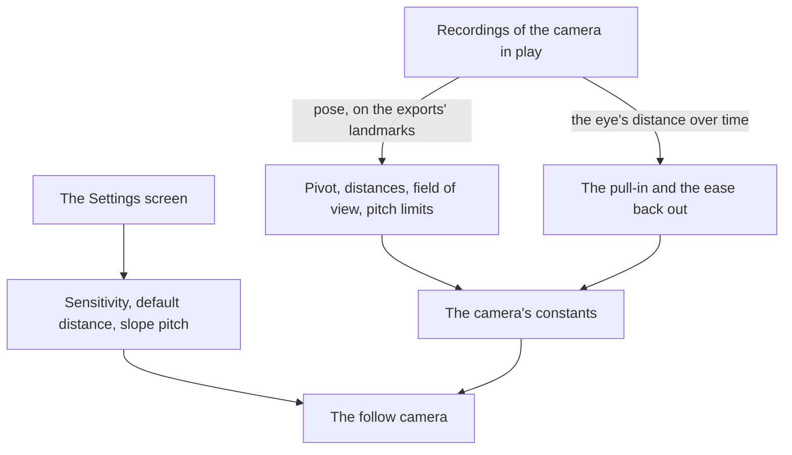

# Follow camera

The [follow camera](/docs/genshin/follow-camera) stands behind the character today: it orbits a pivot above the body, is pulled in by the ground, the water and the landmarks, and in photo mode orbits the held body. Its numbers are provisional, and the settings the game offers for it are not there yet.

## Decisions

- **The camera's pose is solved off recordings.** The field of view, the pivot's height, the limits of the pitch, the wheel's nearest and furthest distances and the unit of the default distance setting are solved by `pose` off recordings of the game in play, as the [recreation passes](/docs/proposals/genshin/recreation-passes)' camera pass solves any recording's camera from the exports' landmarks, each reading kept in the camera's reference. How quickly the eye is pulled in and how it eases back out once the way clears are read off a recording of the camera passing a wall.
- **The game's settings for this camera.** Its horizontal and vertical sensitivity, its default distance between 4.5 and 6.0, which the camera returns to after a zoom, after combat and after a teleport, and whether its pitch follows the slope as the character climbs or descends, are read from the [menu screens](/docs/proposals/genshin/menu-screens)' Settings, each with the game's range and default.
- **A sensitivity turns the look in proportion to it.** The wiki gives each sensitivity's range, 1 to 5, and no curve, so the look's radians a pixel are scaled by the setting over the middle of that range, 3, which turns the camera as it turns today. The default distance is read in metres until the references solve its unit.
- **Photo mode's range is the game's, solved off recordings.** Photo mode moves its camera round the character by the game's two sliders, one horizontal and one vertical, and its zoom, within the game's range. Until a recording solves that range, photo mode shares the follow camera's range, a provisional call the [as-built page](/docs/genshin/follow-camera) records.

## How it works



## Scope and order

**Today:** the camera's numbers are provisional, its sensitivity and default distance are read from the settings at the game's defaults, which the Settings screen does not set yet, and photo mode orbits the held character within the follow camera's range, not the game's.

**This adds, in order:**

1. **The references.** Recordings that show the game's camera in play are found, published ones first, each with a turn, a zoom through the wheel's range and a pass by a wall, and solved. Photo mode's sliders and zoom, at their ends, are among them, so its range is solved too.
2. **The settings' rows on the Settings screen**, and the slope's pitch, once the [menu screens](/docs/proposals/genshin/menu-screens) build its Controls tab. The defaults the camera starts at are read off that tab's export, which replaces `FOLLOW_CAMERA_DEFAULT_SETTINGS`' provisional values.

The camera is approved by its own measure: at each reference's state, the eye and the look solved from the recording match the camera's within that solve's noise.

## What this does not propose

- **The cameras of combat**: the automatic pans its setting turns on, the aimed shot's camera and the shake of a hit. Each comes with combat.
- **The boat's camera and the cameras of cutscenes**, which come with what they film.
- **Photo mode's own screen**: its blur, the character's expressions and poses, and its shutter. Photo mode here is the camera alone.

## Key files

| File                                                       | Role after the change                        |
| :--------------------------------------------------------- | :------------------------------------------- |
| `packages/genshin-engine/src/camera/constants.ts`          | The camera's solved numbers                  |
| `packages/genshin-engine/src/camera/createFollowCamera.ts` | Reads the settings' sensitivity and distance |

New files:

```text
packages/genshin-world/src/components/World/Character/Camera.reference.ts
```

## Sources

- [Settings](https://genshin-impact.fandom.com/wiki/Settings), Genshin Impact Wiki: the camera's horizontal and vertical sensitivity, each 1 to 5, and its default distance, 4.5 to 6.0, which a zoom, combat or a teleport resets; its pitch can follow slopes.
- [Photo Mode](https://genshin-impact.fandom.com/wiki/Photo_Mode), Genshin Impact Wiki: photo mode's camera moved round the character by sliders, one horizontal and one vertical, and a zoom.
