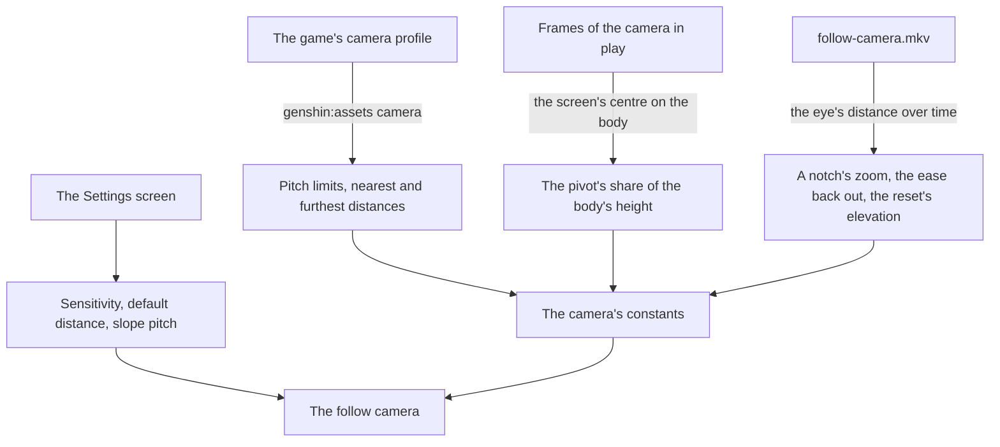

# Follow camera

The [follow camera](/docs/genshin/follow-camera) stands behind the character today: it orbits a pivot at a share of the body's height, is pulled in by the ground, the water and the landmarks, and in photo mode orbits the held body. Its field of view, its pitch limits and the wheel's nearest and furthest distances are the game's own, read from the game's camera profile, and its pivot is read off recordings. A notch's zoom, the ease back out and the reset's elevation are still provisional, and the settings the game offers for the camera are not there yet.

## Decisions

- **What the camera profile cannot say is read off one recording.** The profile holds the zoom's input ratio and the radius's lerp-back ratios, but the Zoom module eases a velocity and what the game computes from each ratio lives in code no dump holds. So a notch's zoom and the ease back out are read off a recording zoomed a notch at a time and swung past a wall, `follow-camera.mkv`. The same recording's reset, facing a flat horizon, tells whether the reset levels the camera or tilts it down by the default elevation the profile's first words hold, and its tilt from level to straight down whether the arm lengthens as the profile's radius added at the steepest elevation says.
- **The game's settings for this camera.** Its horizontal and vertical sensitivity, its default distance between 4.5 and 6.0, which the camera returns to after a zoom, after combat and after a teleport, and whether its pitch follows the slope as the character climbs or descends, are read from the [menu screens](/docs/proposals/genshin/menu-screens)' Settings, each with the game's range and default. The default distance is metres of the arm: its span is the profile's setting adjustment and its top the profile's furthest radius on foot.
- **A sensitivity turns the look in proportion to it.** The wiki gives each sensitivity's range, 1 to 5, and no curve, so the look's radians a pixel are scaled by the setting over the middle of that range, 3, which turns the camera as it turns today.
- **Photo mode's range is the game's, solved off recordings.** Photo mode moves its camera round the character by the game's two sliders, one horizontal and one vertical, and its zoom, within the game's range. Until a recording solves that range, photo mode shares the follow camera's range, a provisional call the [as-built page](/docs/genshin/follow-camera) records.

## How it works

## Scope and order

**Today:** the field of view, the pitch limits and the wheel's range are the game's, and the pivot is measured; a notch's zoom and the ease back out are provisional, the reset levels the camera, its sensitivity and default distance are read from the settings at the game's defaults, which the Settings screen does not set yet, and photo mode orbits the held character within the follow camera's range, not the game's.

**This adds, in order:**

1. **The recording.** `follow-camera.mkv` on the roadmap's Recordings owed list, read for a notch's zoom, the ease back out, the reset's elevation and the arm's length as the camera looks down, each kept in the character's reference. Photo mode's sliders and zoom at their ends, `photo-mode-range.mkv`, solve its range.
2. **The settings' rows on the Settings screen**, and the slope's pitch, once the [menu screens](/docs/proposals/genshin/menu-screens) build its Controls tab. The defaults the camera starts at are read off that tab's export, which replaces `FOLLOW_CAMERA_DEFAULT_SETTINGS`' provisional values.

The camera is approved by its own measure: at each reading of the recording, the eye's distance and its ease match the camera's within the reading's noise.

## What this does not propose

- **The cameras of combat**: the automatic pans its setting turns on, the aimed shot's camera, the shake of a hit and the pull the profile's combat fields hold. Each comes with combat.
- **The boat's camera and the cameras of cutscenes**, which come with what they film.
- **Photo mode's own screen**: its blur, the character's expressions and poses, and its shutter. Photo mode here is the camera alone.

## Key files

| File                                                                        | Role after the change                                                            |
| :-------------------------------------------------------------------------- | :------------------------------------------------------------------------------- |
| `packages/genshin-engine/src/camera/constants.ts`                           | The notch's zoom and the ease, read off the recording                            |
| `packages/genshin-engine/src/camera/createFollowCamera.ts`                  | Reads the settings' sensitivity and distance, and resets to the game's elevation |
| `packages/genshin-world/src/components/World/Character/Camera.reference.ts` | Each reading of the recording                                                    |

## Sources

- [Settings](https://genshin-impact.fandom.com/wiki/Settings), Genshin Impact Wiki: the camera's horizontal and vertical sensitivity, each 1 to 5, and its default distance, 4.5 to 6.0, which a zoom, combat or a teleport resets; its pitch can follow slopes.
- [Photo Mode](https://genshin-impact.fandom.com/wiki/Photo_Mode), Genshin Impact Wiki: photo mode's camera moved round the character by sliders, one horizontal and one vertical, and a zoom.
- [WorldReverse](https://github.com/fengjixuchui/WorldReverse/tree/main/Assets/DummyScripts/Assembly-CSharp), fengjixuchui: the 2022 dummy scripts naming the camera profile's fields, `SCameraModuleZoom` among its modules.
