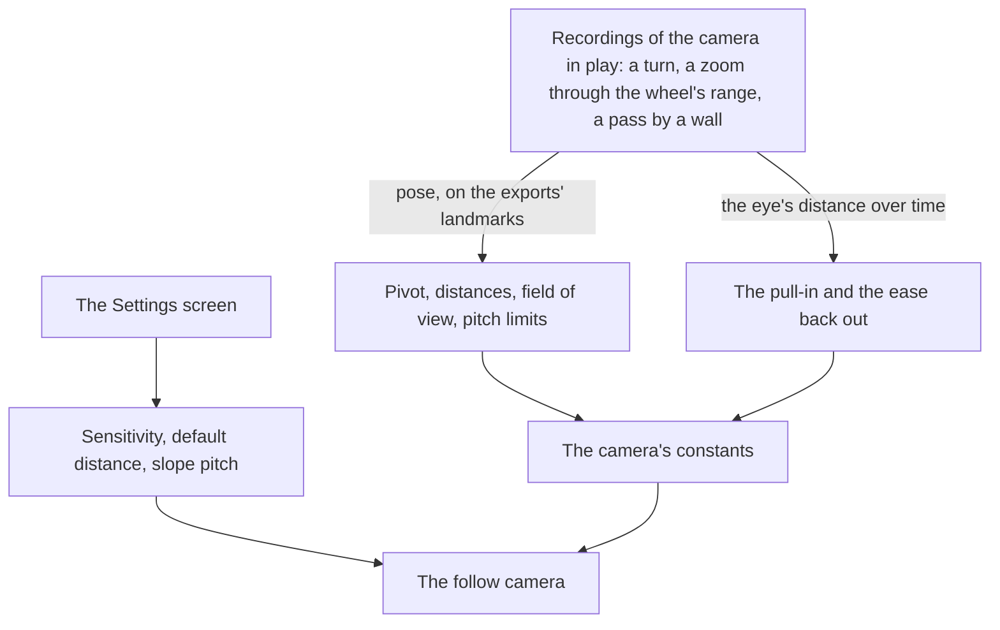

# Follow camera

The [follow camera](/docs/genshin/follow-camera) stands behind the character today: it orbits a pivot above the body, is pulled in by the ground, the water and the landmarks, and hands the view to the free camera in photo mode. Its numbers are provisional, and the settings the game offers for it are not there yet.

## Decisions

- **The camera's pose is solved off recordings.** The pivot's height, the field of view, the pitch's limits, the wheel's nearest and furthest distances and the unit of the default distance setting are solved by `pose` off recordings of the game in play, as the [recreation passes](/docs/proposals/genshin/recreation-passes)' camera pass solves any recording's camera from the exports' landmarks, each reading kept in the camera's reference. How quickly the eye is pulled in and how it eases back out once the way clears are read off a recording of the camera passing a wall.
- **The game's settings for this camera.** Its horizontal and vertical sensitivity, its default distance between 4.5 and 6.0, which the camera returns to after a zoom, after combat and after a teleport, and whether its pitch follows the slope as the character climbs or descends, are read from the [menu screens](/docs/proposals/genshin/menu-screens)' Settings, each with the game's range and default.

## How it works



## Scope and order

**Today:** the camera's numbers are provisional, and its sensitivity and default distance are fixed.

**This adds, in order:**

1. **The references.** Recordings of the game's camera in play are found, published ones first, each with a turn, a zoom through the wheel's range and a pass by a wall, and solved.
2. **The settings**, once the Settings screen holds them.

The camera is approved by its own measure: at each reference's state, the eye and the look solved from the recording match the camera's within that solve's noise.

## What this does not propose

- **The cameras of combat**: the automatic pans its setting turns on, the aimed shot's camera and the shake of a hit. Each comes with combat.
- **The boat's camera and the cameras of cutscenes**, which come with what they film.
- **Photo mode's own screen**: its blur, the character's expressions and poses, and its shutter. Photo mode here is the camera alone.

## Key files

| File                                                       | Role after the change                        |
| :--------------------------------------------------------- | :------------------------------------------- |
| `packages/genshin-engine/src/camera/constants.ts`          | The camera's solved numbers                  |
| `packages/genshin-engine/src/camera/createFollowCamera.ts` | Reads the settings' sensitivity and distance |

New files:

```text
packages/genshin-world/src/components/World/Character/Camera.reference.ts
```

## Sources

- [Settings](https://genshin-impact.fandom.com/wiki/Settings), Genshin Impact Wiki: the camera's horizontal and vertical sensitivity from 1 to 5, the default distance from 4.5 to 6.0 restored after a zoom, combat or a teleport, and the pitch that follows slopes.
- [Photo Mode](https://genshin-impact.fandom.com/wiki/Photo_Mode), Genshin Impact Wiki: photo mode's camera moved round the character by sliders, one horizontal and one vertical, and a zoom.

## Open questions

- **How far may photo mode's camera go?** The game's photo mode moves its camera round the character by sliders, one horizontal and one vertical, and a zoom, while the free camera flies anywhere. Photo mode keeps the free camera's flight until this is settled: should it keep its unbounded flight, or be held to the game's range round the character?
