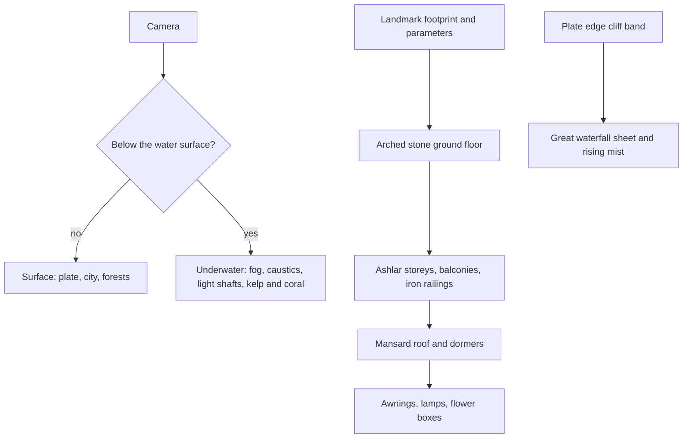

# Fontaine

This region is built on [terrain](/docs/proposals/genshin/terrain), [vegetation](/docs/proposals/genshin/vegetation), [water](/docs/proposals/genshin/water), [sky and time](/docs/genshin/sky-and-time) and [weather](/docs/proposals/genshin/weather), authored by the [reference board](/docs/proposals/genshin/reference-board)'s method. Fontaine is the nation of the Hydro Archon, its culture drawn from Western Europe, especially France and Britain. Its plate is raised above the rest of the continent and ends in a massive waterfall, and it prides itself on the arts and on machinery. Half of it is under water. The [water](/docs/proposals/genshin/water) page's world under the surface was made part of the engine for this region.

## Decisions

- **A raised plate and its falls.** Fontaine's terrain sits high above its neighbours. Its edge is a cliff band carrying the great waterfall, a landmark-tier waterfall sheet many times wider than any other, with mist that rises to the plate's height.
- **Under water is half the region.** Underwater areas are part of the surface layer, reached by diving. The water material's underwater mode gives them turquoise fog, caustics and light shafts, and the seabed is heightfield like any ground. Kelp, coral and drifting particles are the vegetation there. The Sea of Bygone Eras is a layer of its own, as the game maps it apart.
- **A pale, luminous palette.** Turquoise water, white and cream stone, blue slate roofs, gold trim and green lawns under a hazy blue sky, with pink and purple in Erinnyes Forest and grey in the ruins of Morte.
- **The Fontaine building kit.**
  - a stone ground floor with arched openings
  - cream ashlar upper storeys with balconies and wrought-iron railings
  - a mansard roof with dormers
  - dressing: awnings, lamp posts, flower boxes

  Aqueducts, bridges, clock towers and the brass machinery of the research institutes are kit pieces of their own. The Court of Fontaine's Palais Mermonia and Opera Epiclese are landmark-tier. Aquabus lines are authored paths with a hovering boat on them.

- **Elynas and the Fortress of Meropide.** The island formed by a colossal dragon's remains is a landmark-tier mesh. The underwater prison-fortress is a landmark on the seabed.

## How it works



## Areas

The catalogue holds Fontaine's areas as the game names them: the Court of Fontaine Region, the Belleau Region, the Beryl Region, the Liffey Region, Erinnyes Forest, the Fontaine Research Institute of Kinetic Energy Engineering Region, the Morte Region, the Nostoi Region and the Sea of Bygone Eras. Subareas include the Court of Fontaine, Palais Mermonia's Caesareum Palace, Opera Epiclese, Romaritime Harbor, Lumidouce Harbor, Poisson, Petrichor, Elynas, the Fortress of Meropide, Merusea Village, the Fountain of Lucine, Loch Urania, Salacia Plain, Mont Esus East, the slopes of Mont Automnequi, the Institute of Natural Philosophy, the Weeping Willow of the Lake, the Central Laboratory Ruins, Fort Charybdis Ruins and Thalatta Submarine Canyon.

## Build order

1. **The Court of Fontaine** and its plate edge, with the great waterfall.
2. **The Belleau and Beryl regions** with Romaritime Harbor and Lumidouce Harbor.
3. **Underwater Fontaine**, from Salacia Plain and Merusea Village to the Fortress of Meropide.
4. **Erinnyes Forest**, **Liffey**, the **Research Institute** and **Morte**.
5. **Nostoi** and the **Sea of Bygone Eras** as a layer.

## Capture checklist

The Court of Fontaine from the aquabus, the Fountain of Lucine, Palais Mermonia, Opera Epiclese, the great waterfall from below, Poisson, the Research Institute's machinery, Elynas from the sea, Merusea Village under water, and the Fortress of Meropide from outside.

## Key files

| File                                                      | Role after the change                        |
| :-------------------------------------------------------- | :------------------------------------------- |
| `packages/genshin-engine/src/noise/createSimplexNoise.ts` | The detail noise of the plate and the seabed |

New files:

```text
apps/web/public/genshin/fontaine.json
packages/genshin-engine/src/kits/fontaine/   ← building, aqueduct, clock tower and machinery generators
```

## Sources

- [Fontaine](https://genshin-impact.fandom.com/wiki/Fontaine), Genshin Impact Wiki: the elevated continental plate, the massive waterfall at its edge, its areas and subareas, and its pride in culture and technology.
- [Sea of Bygone Eras](https://genshin-impact.fandom.com/wiki/Sea_of_Bygone_Eras), Genshin Impact Wiki: a map of its own, separate from the main world's, hence a layer.
- [The setting of Genshin Impact](https://en.wikipedia.org/wiki/Teyvat), Wikipedia: Fontaine drawn from Western Europe, especially France and the United Kingdom.
