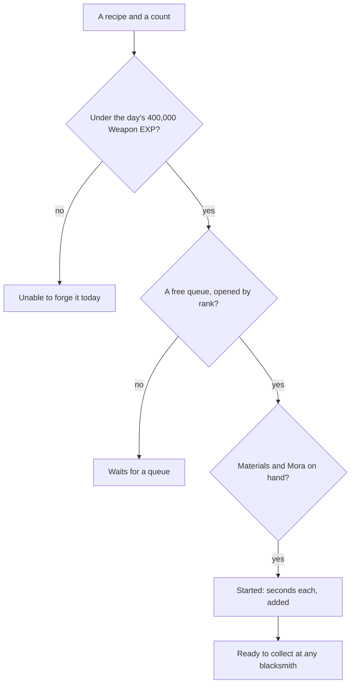

# Forging

The blacksmiths forge weapon enhancement ores from ores mined in the world, and four-star weapons from billets the weekly bosses drop. The ores are most of the Weapon EXP the [weapon enhancement](/docs/proposals/genshin/weapon-enhancement) page spends, and the ores forged from are mined by [gathering](/docs/proposals/genshin/gathering), so this page waits on both.

## Decisions

- **Every recipe is the game's own.** `ForgeExcelConfigData` holds each: its materials, its result, its Mora and its seconds for one item, the most one queue holds, the Adventure Rank it needs, and its forge points, the Weapon EXP an ore counts toward the day's cap. A forge of several items takes their seconds and Mora added, as ten Enhancement Ores take 30 seconds and 50 Mora.
- **Queues by Adventure Rank.** One queue at first, a second at rank 5, a third at 10 and a fourth at 15, as `ForgeUpdateExcelConfigData` holds them. Splitting one recipe across queues forges it in parallel.
- **Real time, collected anywhere.** A queue is kept with when it started, so it finishes while the page is closed, and every blacksmith is the same forge: what is forged at one is collected at any other. The Serenitea Pot's forge is the same forge too, except that it refuses Magical Crystal Chunks.
- **A hidden daily cap.** The enhancement ores forged in a day, Normal, Fine and Mystic together, count at most 400,000 Weapon EXP by their forge points, and a recipe past it is refused with the game's own words for the day, until the daily reset. The Mystic Enhancement Ore made from Magical Crystal Chunks and Original Resin does not count.
- **Weapons from billets and diagrams.** A four-star weapon is forged from its region's billet and ores once its diagram is learned, which shops and reputation give.
- **A character's forging talent** gives its bonus to the forge, as the wiki lists each, read from the character's passive.

## How it works

## Scope and order

**Today:** nothing forges.

**This adds, in order:**

1. **Enhancement ores**, one queue, at Mondstadt's blacksmith.
2. **The queues by rank, and the daily cap.**
3. **Weapons from billets**, with their diagrams.
4. **Forging talents.**

## Data and measures

- **Read from the game's tables:** `ForgeExcelConfigData`, `ForgeUpdateExcelConfigData` and the ores' and weapons' rows.
- **Read from the game's text:** the day's refusal, by its text id.

## Key files

| File                                                                | Role after the change                   |
| :------------------------------------------------------------------ | :-------------------------------------- |
| `packages/genshin-world/src/services/inventory/addInventoryItem.ts` | The ores and weapons collected          |
| `packages/genshin-world/src/models/inventory/Wallet.ts`             | The Mora a forge spends                 |
| `packages/genshin-world/src/models/screen/ScreenKind.ts`            | Gains the forge's screen                |
| `packages/genshin-text/src/models/GameTextKey.ts`                   | Gains the forge's words and its refusal |

## Sources

- [Forging](https://genshin-impact.fandom.com/wiki/Forging), Genshin Impact Wiki: forging ores and billets, time and Mora stacking per item, every blacksmith one forge and the Serenitea Pot's refusing Magical Crystal Chunks, four queues at ranks 1, 5, 10 and 15, the hidden cap of 400,000 Weapon EXP and the recipe it spares, the refusal's words, and forging talents.
- [Enhancement Ore](https://genshin-impact.fandom.com/wiki/Enhancement_Ore), Genshin Impact Wiki: the ore's 400 Weapon EXP, up to 40 a queue, and its share of the daily cap.
- [AnimeGameData](https://github.com/DimbreathBot/AnimeGameData), the community's per-patch dump: the forge recipes with their forge points, and the queues by rank.
