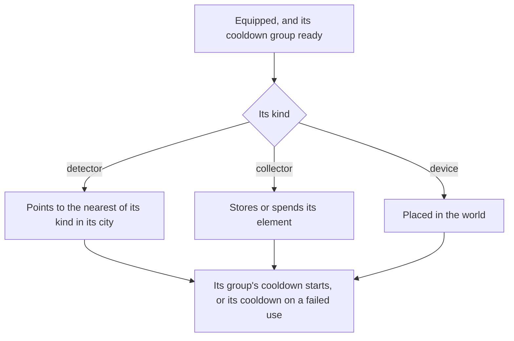

# Gadgets

Gadgets are the game's tools: the Wind Catcher, the Treasure Compasses and Oculus Resonance Stones that find chests and Oculi, the Portable Waypoint, the Kamera, the Parametric Transformer and many more. The bag already files them under their own tab ([inventory](/docs/genshin/inventory)), and the controls already bind `Z` to the one equipped ([controls](/docs/genshin/controls)). Most find or act on what the world spawns, so this page waits on the [spawned places](/docs/proposals/genshin/spawned-places) and the [crafting](/docs/proposals/genshin/crafting) bench most are made at. The gadgets' data and cooldowns are built ([gadgets](/docs/genshin/gadgets)); what remains is below.

## Decisions

- **A gadget's kind is the game's own.** `BinOutput/Widget/ConfigWidget.json` names each gadget's kind, which the built data reads as the four kinds of the [gadgets](/docs/genshin/gadgets) page. Each kind is one small module. The config's other widgets wait on the pages that name them, as the built page lists.
- **A detector points to what the config spawns.** A Treasure Compass (`ConfigWidgetClientDetector`) spawns a treasure box of its city, and the Seelie detector (`ConfigWidgetTreasureMapDetector`) a Seelie crystal. No widget of the config spawns an Oculus, so the Oculus Resonance Stone's target is not in the config, and its detector is not settled until its target is read from another table.
- **A compass works in its city.** The city table's open-state names put city 1 at Mondstadt (Mengde) and city 2 at Liyue, and the Mondstadt and Liyue compasses name those cities. The city table gives each city its areas, not its region, so a city joins a region's chest slice only once the areas are outlined; the Dragonspine compass names city 3, whose name is not read here.
- **Equipped on Z, four on the quick swap.** One gadget is equipped to the quick-use slot and used with `Z`. Holding it opens the quick swap, which holds up to four gadgets chosen in the bag. Only a gadget the config marks equipable can be equipped.
- **A cooldown runs on while paused.** A gadget that is not used up has a cooldown, shared within its cooldown group, which keeps counting while the world is paused under a menu, unlike every combat cooldown. It is kept as the moment it is ready, so it is read rather than ticked. The wiki states this; a recording confirms it ([Recordings owed](/docs/genshin/roadmap#recordings-owed)).
- **Where a gadget may be used is the game's.** `WidgetUseableExcelConfigData` says where each may not be used: in another player's world, which waits on [co-op](/docs/genshin/deferred/co-op) being deferred, and in a domain's type or scene, which the [domains](/docs/proposals/genshin/domains) page supplies. The open world refuses none, so this check is not yet built.
- **Made from instructions.** Most are crafted at the bench or forged once their instructions or diagram are used, which reputation and offerings give; a few come from quests and are kept.

## How it works

## Scope and order

**Built:** the gadgets' data and their cooldowns, on [gadgets](/docs/genshin/gadgets).

**This still adds, in order:**

1. **The quick-use slot.** The equipped gadget and its use on `Z`, with the usable-here check once domains stand. The slot waits on the bag's items, which hold no widget material type yet.
2. **Detectors**, the Treasure Compass to treasure boxes once a compass's city joins a region's chest slice, then the Oculus Resonance Stone once its target is settled.
3. **Collectors and placed devices**, one kind at a time.
4. **The quick swap.**

## Data and measures

- **Read from the game's data:** `ConfigWidget.json`, read into the built slice. `WidgetUseableExcelConfigData` and `WidgetExcelConfigData` are fetched into the dump, and neither is read yet: the first waits on domains and co-op, the second on the bag's items.
- **Measured:** each gadget's effect where its kind's config leaves it open, off a recording, and the cooldown counting on through a menu, which is owed a recording.

## Key files

| File                                                               | Role after the change                        |
| :----------------------------------------------------------------- | :------------------------------------------- |
| `packages/genshin-engine/src/input/InputActionBindingMap.ts`       | `Z` and the quick swap's hold                |
| `packages/genshin-world/src/models/inventory/Inventory.ts`         | Gains the equipped gadget and the quick swap |
| `packages/genshin-world/src/components/Inventory/Screen/Index.vue` | Equips a gadget from its tab                 |
| `packages/genshin-world/src/components/Hud/Screen/Index.vue`       | Shows the equipped gadget and its cooldown   |

## Sources

- [Gadget](https://genshin-impact.fandom.com/wiki/Gadget), Genshin Impact Wiki: gadgets as the bag's sixth tab, the quick-use slot, cooldowns that run while paused, gadgets crafted or forged from their instructions, and the quick swap of four.
- [AnimeGameData](https://github.com/DimbreathBot/AnimeGameData), the community's per-patch dump: the widget config with each gadget's kind, cooldowns and ranges, and the widget tables.
