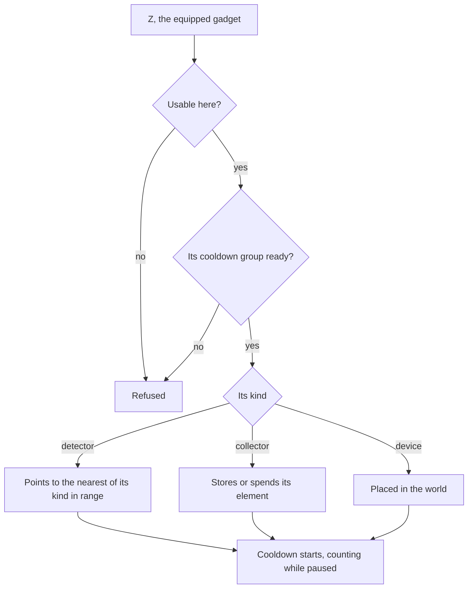

# Gadgets

Gadgets are the game's tools: the Wind Catcher, the Treasure Compasses and Oculus Resonance Stones that find chests and Oculi, the Portable Waypoint, the Kamera, the Parametric Transformer and many more. The bag already files them under their own tab ([inventory](/docs/genshin/inventory)), and the controls already bind `Z` to the one equipped ([controls](/docs/genshin/controls)). What is missing is what each does. Most find or act on what the world spawns, so this page waits on the [spawned places](/docs/proposals/genshin/spawned-places) and the [crafting](/docs/proposals/genshin/crafting) bench most are made at.

## Decisions

- **A gadget's kind is the game's own.** `BinOutput/Widget/ConfigWidget.json` names each gadget's kind, readable as the ability configs are not: a collector that stores an element and spends it, a detector that points to the nearest thing of its kind within its region (a Treasure Compass to chests, an Oculus Resonance Stone to Oculi), a gather point finder, and a device placed in the world. Each kind is one small module, and each gadget its kind with the config's numbers: its cooldown, its cooldown on a failed use, its cooldown group, its ranges, and the region it works in.
- **Equipped on Z, four on the quick swap.** One gadget is equipped to the quick-use slot and used with `Z`. Holding it opens the quick swap, which holds up to four gadgets chosen in the bag.
- **A cooldown runs on while paused.** A gadget that is not used up has a cooldown, shared within its cooldown group, which keeps counting while the world is paused under a menu, unlike every combat cooldown. It is kept as when it was used, so it is read rather than ticked.
- **Where a gadget may be used is the game's.** `WidgetUseableExcelConfigData` says where each may not be used, in a domain or another player's world, and the gadget is refused there.
- **Made from instructions.** Most are crafted at the bench or forged once their instructions or diagram are used, which reputation and offerings give; a few come from quests and are kept.

## How it works

## Scope and order

**Today:** the bag files gadgets and `Z` is bound, with nothing behind either.

**This adds, in order:**

1. **The quick-use slot and the cooldowns.**
2. **Detectors**, the Treasure Compass and the Oculus Resonance Stone first, once chests and Oculi stand.
3. **Collectors and placed devices**, one kind at a time.
4. **The quick swap.**

## Data and measures

- **Read from the game's data:** `ConfigWidget.json`, `WidgetExcelConfigData` and `WidgetUseableExcelConfigData`, and each gadget's item row.
- **Measured:** each gadget's effect where its kind's config leaves it open, off a recording.

## Key files

| File                                                               | Role after the change                        |
| :----------------------------------------------------------------- | :------------------------------------------- |
| `packages/genshin-engine/src/input/InputActionBindingMap.ts`       | `Z` and the quick swap's hold                |
| `packages/genshin-world/src/models/inventory/Inventory.ts`         | Gains the equipped gadget and the quick swap |
| `packages/genshin-world/src/components/Inventory/Screen/Index.vue` | Equips a gadget from its tab                 |
| `packages/genshin-world/src/components/Hud/Screen/Index.vue`       | Shows the equipped gadget and its cooldown   |

## Sources

- [Gadget](https://genshin-impact.fandom.com/wiki/Gadget), Genshin Impact Wiki: gadgets as the bag's sixth tab, the quick-use slot, cooldowns that run while paused, gadgets crafted or forged from their instructions, and the quick swap of four.
- [AnimeGameData](https://gitlab.com/Dimbreath/AnimeGameData), the community's per-patch dump: the widget config with each gadget's kind, cooldowns and ranges, and the widget tables.
