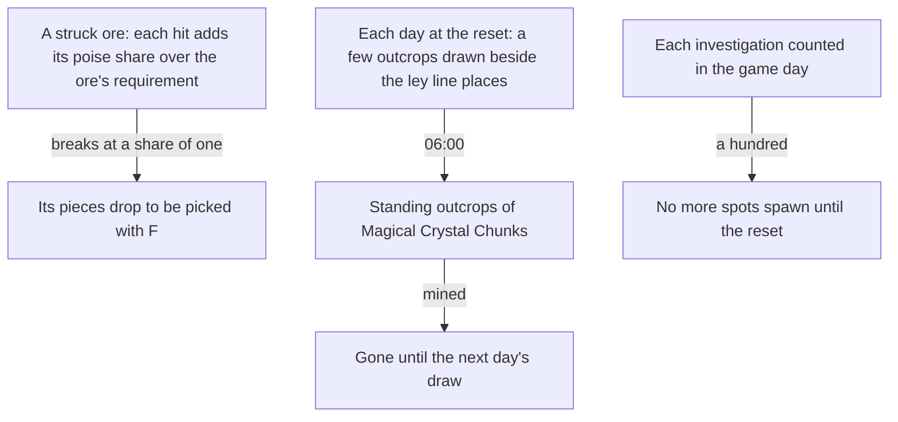

# Gathering

The plants and specialties the map marks are built as gathering points, picked with F and back on the wiki's respawns, all but four cooking ingredients and one specialty the [gathering](/docs/genshin/gathering) page's notes name. The mining outcrops' opening, respawn and the investigation cap are built as rules: see the [mining outcrops](/docs/genshin/mining-outcrops) and [investigation](/docs/genshin/investigation) pages. The ores are built too, struck until they break and dropping their pieces, as the [gathering](/docs/genshin/gathering) page records. This proposal keeps what is not built yet, the mining outcrops' places and draw, and the investigation spots, each of which waits on a measure or on a system the points do not have yet.

## Decisions

- **An ore is struck until it breaks.** A plant is picked with F, an ore is struck by attacks until it breaks, then its pieces drop to be picked up. What breaks it is the wiki's Mineral page, not a count of hits: an ore takes poise damage from melee or blunt hits, Iron Chunk, White Iron Chunk and Starsilver needing 200 from melee hits or 29 from blunt ones, and Crystal Chunk, Magical Crystal Chunk and the other crystal ores 2000 or 286. A hit adds its poise damage over the requirement of its class to the ore's broken share, so melee and blunt hits mix, and the ore breaks at a share of one; a hit neither melee nor blunt, a catalyst's or a bow's, adds nothing. A blunt hit is one whose `KitHit` sets `isBlunt`, its class taking precedence, and a melee hit is any other normal or charged attack of a sword, claymore or polearm wielder. The hit's `poiseDamage` is the kit's own, so the owed `ore-strike.mkv` only checks the result.
- **An ore drops one piece, and up to two more.** One piece is certain and each of two more comes at 10%, drawn from the world's seeded random source, as the wiki's Mineral page gives it.
- **An ore comes back as the wiki's Reset page gives it.** An Iron Chunk at the game's midnight, as a cooking ingredient does; a White Iron Chunk or Starsilver 48 hours after it breaks, as the Reset page's two-day list gives them (the first draft's 24 hours read the one-day list, which holds investigation points, not nodes); a Crystal Chunk, an Amethyst Lump or a Condessence Crystal away from a mining outcrop 72 hours after, the Condessence Crystal by the crystal nodes' rule since the Reset page names none for it. A Magical Crystal Chunk is an outcrop, not a fixed ore, so it is left to the outcrops' draw, and a Scarlet Quartz, Rainbowdrop Crystal or Electro Crystal (shattered from a Tourmaline by Pyro) has no poise requirement on the Mineral page, so it is not written until one is settled. A Condessence Crystal has no ground row in the gather table, so no point of it is written.
- **An ore is struck by the character's hits, read as an enemy's capsule is.** The hits a step lands reach the ores in their area at the ore's ground point, and a hit is melee when it is a normal or charged attack of a sword, claymore or polearm wielder, read off the character table, so no kit carries a flag. The hits are read before an infusion copies them.
- **Mining outcrops come daily, and a mined one comes back at the next draw.** From Adventure Rank 30, a region's mining outcrops of Magical Crystal Chunks stand at a few places drawn each day beside the ley line outcrops' places, and come at 06:00 in UTC+8, two hours after the daily reset. The day's unmined outcrops are gone with the next day. Reputation's mining outcrop search marks them ([reputation](/docs/proposals/genshin/reputation)).
- **Investigation spots.** A spot that sparkles gives a few artifacts, ingredients, ores or Mora once investigated. A player may investigate a hundred spots a day, after which no more spawn, and the Mora spots come back as their refresh says. The day is the game day, which starts at the 04:00 reset in UTC+8, so the count that the cap compares is kept from that reset.

## How it works

## Scope and order

**Built:** the plants and specialties, as [gathering](/docs/genshin/gathering) records, but for the four cooking ingredients and one specialty its notes name as left out; the mining outcrops' rank, respawn and standing, as [mining outcrops](/docs/genshin/mining-outcrops) records; the investigation cap, as [investigation](/docs/genshin/investigation) records; and the ores in the world, as [gathering](/docs/genshin/gathering) records: their points with each respawn, the struck share beside the points, the character's hits feeding them, and the pieces a broken ore drops.

**Left of the first step:** the regenerated place slices for the Ores label wait on the static-data host: bulk generated JSON stays out of `generated/` until the Azure Blob design for generated static data lands, and `pnpm -C scripts genshin:assets gathering` writes them locally meanwhile. Until then the committed Mondstadt slice holds no ore, and the ores stand in the world only where the slice is regenerated locally.

**This adds, in order:**

1. **Mining outcrops' places and draw**, drawn each day from Adventure Rank 30, once the ley line places are placed.
2. **Investigation spots**, their places and rewards, with the daily cap's store counting them.

## Data and measures

- **Read from the game's tables:** the ore rows of `GatherExcelConfigData` and the ore items' rows of `MaterialExcelConfigData`, with the ore categories of the official map.
- **Placed by the spawned places:** each ore and outcrop from the official map's points, fitted as the [spawned places](/docs/genshin/spawned-places) page sets out.
- **Read from the wiki:** each ore's poise requirement, its drops and its respawn (the [Mineral](https://genshin-impact.fandom.com/wiki/Mineral) and Reset pages, through the persona's wiki reader).
- **Checked against a recording:** the hits an ore takes by the kind of attack (`ore-strike.mkv` on the [roadmap](/docs/genshin/roadmap)), which confirms the rule and gates nothing.

## Key files

| File                                                                     | Role after the change                                        |
| :----------------------------------------------------------------------- | :----------------------------------------------------------- |
| `packages/genshin-world/src/services/leyLine/drawOutcropPlace.ts`        | The daily draw a mining outcrop's place reuses               |
| `packages/genshin-world/src/services/leyLine/computeNextOutcropPlace.ts` | Where an outcrop moves once mined, shared with the ley lines |

## Sources

- [Mining Outcrop](https://genshin-impact.fandom.com/wiki/Mining_Outcrop), Genshin Impact Wiki: the daily places beside the ley line outcrops, and the rank and respawn the [mining outcrops](/docs/genshin/mining-outcrops) page cites.
- [Investigation](https://genshin-impact.fandom.com/wiki/Investigation), Genshin Impact Wiki: the daily cap, which the [investigation](/docs/genshin/investigation) page builds, and the spots this proposal places.
- [Daily Reset](https://genshin-impact.fandom.com/wiki/Daily_Reset), Genshin Impact Wiki: what comes back at the daily reset and around it.
