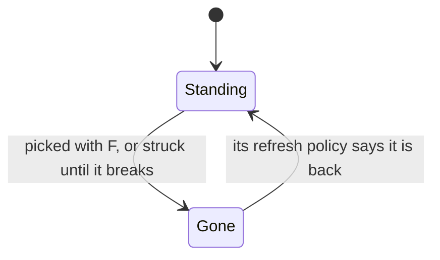

# Gathering

Most of what the game's crafting, cooking and ascension spend is gathered: cooking ingredients and flowers picked off the ground, ores mined from rock, and each region's local specialties, which characters ascend with. Every gathering point is a thing the game's servers spawn, so it stands at the [spawned places](/docs/proposals/genshin/spawned-places), and it is picked through the [interaction](/docs/proposals/genshin/interaction) prompts, which already pick up what lies in reach. This page waits on both.

## Decisions

- **A gathering point is the game's own row.** `GatherExcelConfigData` holds each kind: the gadget it is, the item it gives and any extra, where it grows (on the ground, on a wall, in water), and its refresh. Its name and icon are its item's, by text id.
- **It comes back on the game's refresh.** Each row's `refreshId` names its policy in `RefreshPolicyExcelConfigData`: an interval in seconds, a day, a week, or a number of days from the day's start. A point picked is kept with the time it was picked, and read as gone until its policy says it is back, so nothing runs while the page is closed. A local specialty, for one, comes back 46 hours after it is picked, as the wiki gives it.
- **Picked, or struck until it breaks.** A plant or a specialty is picked with F; an ore is struck by attacks until it breaks, then its pieces drop to be picked up. How many hits it takes by the kind of attack is measured.
- **Mining outcrops come daily.** From Adventure Rank 30, a region's mining outcrops of Magical Crystal Chunks stand at a few places drawn each day beside the ley line outcrops' places and come at 06:00, two hours after the daily reset, the day's unmined ones gone with the next. Reputation's mining outcrop search marks them ([reputation](/docs/proposals/genshin/reputation)).
- **Investigation spots.** A spot that sparkles gives a few artifacts, ingredients, ores or Mora once investigated, and comes back as its kind's refresh says.

## How it works

## Scope and order

**Today:** the interaction prompts pick up what lies in reach, and nothing grows in the world.

**This adds, in order:**

1. **Gathering points** in Windrise's area, their items and their refresh.
2. **Ores struck until they break.**
3. **Each region's local specialties**, with its region.
4. **Mining outcrops**, with Adventure Rank.
5. **Investigation spots.**

## Data and measures

- **Read from the game's tables:** `GatherExcelConfigData`, `RefreshPolicyExcelConfigData` and the items' rows of `MaterialExcelConfigData`.
- **Placed by the spawned places:** each point's place, from the official map's marks of its item.
- **Measured:** the hits an ore takes by the kind of attack, off a recording, provisional until then.

## Key files

| File                                                                           | Role after the change                      |
| :----------------------------------------------------------------------------- | :----------------------------------------- |
| `packages/genshin-world/src/services/interaction/getHeldPickUp.ts`             | Picks a gathering point as it picks a drop |
| `packages/genshin-world/src/services/interaction/computeInteractionPrompts.ts` | Lists a point in reach to pick             |
| `packages/genshin-world/src/models/inventory/ItemDefinition.ts`                | Each item a point gives, read from its row |
| `packages/genshin-world/src/services/inventory/addInventoryItem.ts`            | What a point gives, into the bag           |

## Sources

- [Local Specialty](https://genshin-impact.fandom.com/wiki/Local_Specialty), Genshin Impact Wiki: specialties used in ascension, back 46 hours after picking.
- [Mining Outcrop](https://genshin-impact.fandom.com/wiki/Mining_Outcrop), Genshin Impact Wiki: Magical Crystal Chunks from rank 30, the daily places beside the ley line outcrops, and the respawn at 06:00, two hours after the reset.
- [Investigation](https://genshin-impact.fandom.com/wiki/Investigation), Genshin Impact Wiki: spots that give artifacts, ingredients, ores or Mora.
- [Daily Reset](https://genshin-impact.fandom.com/wiki/Daily_Reset), Genshin Impact Wiki: what comes back at the daily reset and around it.
- [AnimeGameData](https://gitlab.com/Dimbreath/AnimeGameData), the community's per-patch dump: the gather table and the refresh policies it names.
