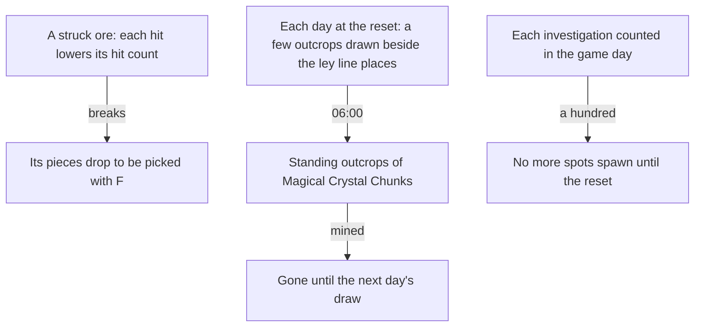

# Gathering

The plants and specialties the map marks are built as gathering points, picked with F and back on the wiki's respawns, all but four cooking ingredients and one specialty the [gathering](/docs/genshin/gathering) page's notes name. The mining outcrops' opening, respawn and the investigation cap are built as rules: see the [mining outcrops](/docs/genshin/mining-outcrops) and [investigation](/docs/genshin/investigation) pages. This proposal keeps what is not built yet, the ores, the mining outcrops' places and draw, and the investigation spots, each of which waits on a measure or on a system the points do not have yet.

## Decisions

- **An ore is struck until it breaks.** A plant is picked with F, an ore is struck by attacks until it breaks, then its pieces drop to be picked up. How many hits an ore takes, by the kind of attack, is measured, so until a recording gives it, each ore's count is a provisional constant with a queue item. The constant lands with the ores' places, since a constant no reader holds is not kept before then.
- **Mining outcrops come daily, and a mined one comes back at the next draw.** From Adventure Rank 30, a region's mining outcrops of Magical Crystal Chunks stand at a few places drawn each day beside the ley line outcrops' places, and come at 06:00 in UTC+8, two hours after the daily reset. The day's unmined outcrops are gone with the next day. Reputation's mining outcrop search marks them ([reputation](/docs/proposals/genshin/reputation)).
- **Investigation spots.** A spot that sparkles gives a few artifacts, ingredients, ores or Mora once investigated. A player may investigate a hundred spots a day, after which no more spawn, and the Mora spots come back as their refresh says. The day is the game day, which starts at the 04:00 reset in UTC+8, so the count that the cap compares is kept from that reset.

## How it works

## Scope and order

**Built:** the plants and specialties, as [gathering](/docs/genshin/gathering) records, but for the four cooking ingredients and one specialty its notes name as left out; the mining outcrops' rank, respawn and standing, as [mining outcrops](/docs/genshin/mining-outcrops) records; and the investigation cap, as [investigation](/docs/genshin/investigation) records.

**This adds, in order:**

1. **Ores struck until they break**, once their hit count is measured.
2. **Mining outcrops' places and draw**, drawn each day from Adventure Rank 30, once the ley line places are placed.
3. **Investigation spots**, their places and rewards, with the daily cap's store counting them.

## Data and measures

- **Read from the game's tables:** the ore rows of `GatherExcelConfigData` and the ore items' rows of `MaterialExcelConfigData`, with the ore categories of the official map.
- **Placed by the spawned places:** each ore and outcrop from the official map's points, fitted as the [spawned places](/docs/genshin/spawned-places) page sets out.
- **Measured:** the hits an ore takes by the kind of attack, off a recording (`ore-strike.mkv` on the [roadmap](/docs/genshin/roadmap)), provisional until then.

## Key files

| File                                                                     | Role after the change                                        |
| :----------------------------------------------------------------------- | :----------------------------------------------------------- |
| `packages/genshin-world/src/services/leyLine/drawOutcropPlace.ts`        | The daily draw a mining outcrop's place reuses               |
| `packages/genshin-world/src/services/leyLine/computeNextOutcropPlace.ts` | Where an outcrop moves once mined, shared with the ley lines |

## Sources

- [Mining Outcrop](https://genshin-impact.fandom.com/wiki/Mining_Outcrop), Genshin Impact Wiki: Magical Crystal Chunks from rank 30, the daily places beside the ley line outcrops, and the respawn at 06:00, two hours after the reset.
- [Investigation](https://genshin-impact.fandom.com/wiki/Investigation), Genshin Impact Wiki: spots that give artifacts, ingredients, ores or Mora, and the daily cap of a hundred investigations.
- [Daily Reset](https://genshin-impact.fandom.com/wiki/Daily_Reset), Genshin Impact Wiki: what comes back at the daily reset and around it.
