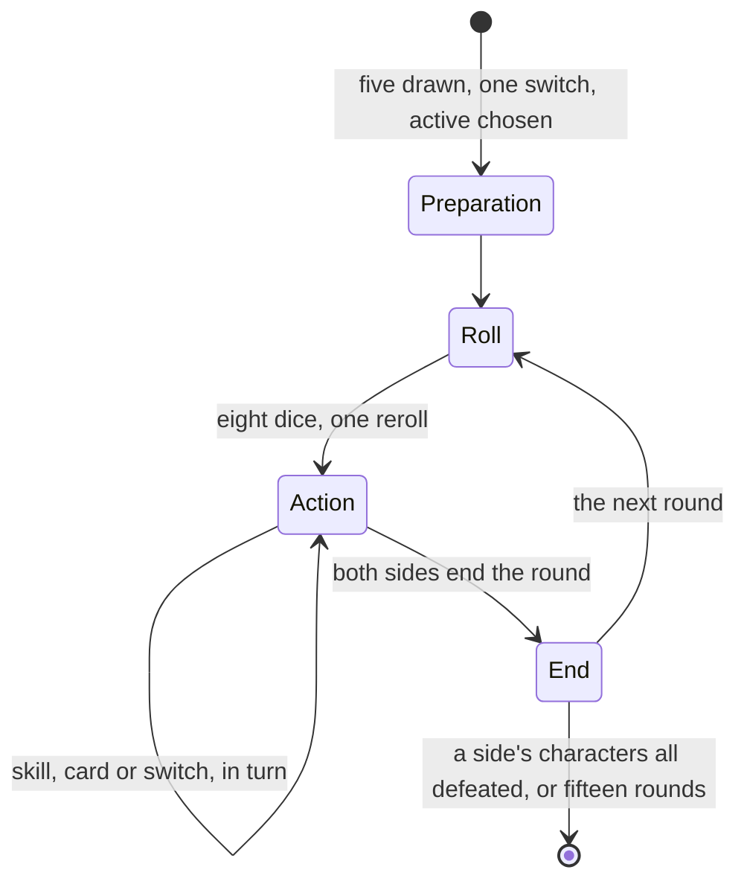

# Genius Invokation TCG

Genius Invokation TCG is a card game inside the game: each player's three character cards fight with skills paid for in elemental dice, while action cards equip, feed, summon and support them. Its residents and tavern regulars challenge the player to duels, and winning earns their cards. It is a rules engine of its own, sharing only the elements with the world, and a duel is fought at a resident's table, so it waits on the [dialogue](/docs/proposals/genshin/dialogue)'s talk with them.

## Decisions

- **A rules engine of its own, in the world package.** A duel is a pure state over the two players' zones, character cards, dice, hand, draw pile, summons and supports, advanced by a deterministic step for each action, with the world's seeded random source for dice and draws, so a test plays a duel move for move. Its elements and reactions are the card game's own rules, read from its tables, never [combat](/docs/genshin/combat)'s, which they only resemble.
- **The duel's flow is the game's.** Each side draws five and may switch any once, then chooses an active character. Each round rolls eight elemental dice with one reroll, takes actions in turn, a skill, a card, a switch or ending the round, and closes with the end phase; a duel ends when one side's characters are all defeated, or both concede after fifteen rounds. A hand holds ten at most, and the summons and support zones four each.
- **Every card is the game's own row.** `GCGCardExcelConfigData`, `GCGCharExcelConfigData`, `GCGSkillExcelConfigData` and `GCGCostExcelConfigData` give each card, character, skill and cost, `GCGElementReactionExcelConfigData` the reactions, and `GCGRuleExcelConfigData` the rules each duel runs. Names and descriptions are the game's by text id.
- **A card's effect is a module.** The game keeps its cards' behaviour in configs under `BinOutput/GCG`, which are written as each card's module over the engine's shared effects, from the card's own description where the configs are not read, as a character's kit is.
- **Duels are against the game's opponents.** The residents the game seats for an Invitational and the tavern's challengers play the decks `GCGDeckExcelConfigData` gives them. Winning earns their cards and Lucky Coins, the Card Shop sells cards for Lucky Coins, and the player's Player Level grows by duels, as the game earns each.
- **Opened at Adventure Rank 32** with its tutorial quest, as the wiki gives it.
- **No duel against another player.** Duels with friends need other players, which [co-op](/docs/genshin/deferred/co-op) defers; the game gives them no reward either.

## How it works

## Scope and order

**Today:** nothing plays a card.

**This adds, in order:**

1. **The rules engine**, with the tutorial's starting characters and their cards.
2. **The duel screen**, opened from a resident's talk.
3. **Every card's module**, in the order the game's opponents use them.
4. **Invitationals, tavern challengers, the Card Shop and the Player Level.**

## Data and measures

- **Read from the game's tables:** the `GCG*` tables and the configs under `BinOutput/GCG`.
- **Read from the wiki:** each card's effect where its configs are not read, and each duel rule's detail.
- **Measured:** the duel screen's layout off a recording, through the recreation passes.

## Key files

| File                                                       | Role after the change                          |
| :--------------------------------------------------------- | :--------------------------------------------- |
| `packages/genshin-world/src/models/world/Resident.ts`      | A resident who challenges the player to a duel |
| `packages/genshin-world/src/models/screen/ScreenKind.ts`   | Gains the duel's screen                        |
| `packages/genshin-engine/src/random/createSeededRandom.ts` | The dice and the draws                         |
| `packages/genshin-text/src/models/GameTextKey.ts`          | Gains the duel's interface words               |

## Sources

- [Genius Invokation TCG](https://genshin-impact.fandom.com/wiki/Genius_Invokation_TCG), Genshin Impact Wiki: the unlock at rank 32 and the tutorial quest, duels against characters and NPCs, unrewarded duels with friends, character and action cards, and the Card Shop and Lucky Coins.
- [Genius Invokation TCG: Rules](https://genshin-impact.fandom.com/wiki/Genius_Invokation_TCG/Rules), Genshin Impact Wiki: the zones and their limits, five drawn and one switch, eight dice and one reroll, the round's phases, and fifteen rounds at most.
- [AnimeGameData](https://gitlab.com/Dimbreath/AnimeGameData), the community's per-patch dump: the GCG card, character, skill, cost, reaction, rule and deck tables, and the GCG configs.
