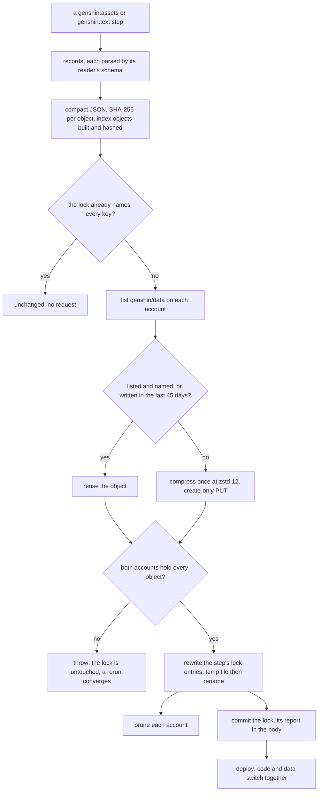
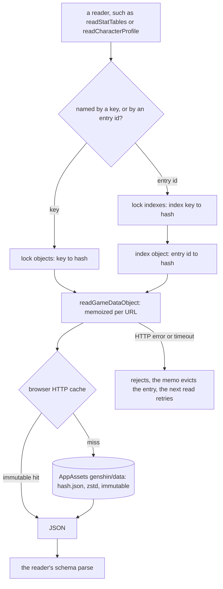
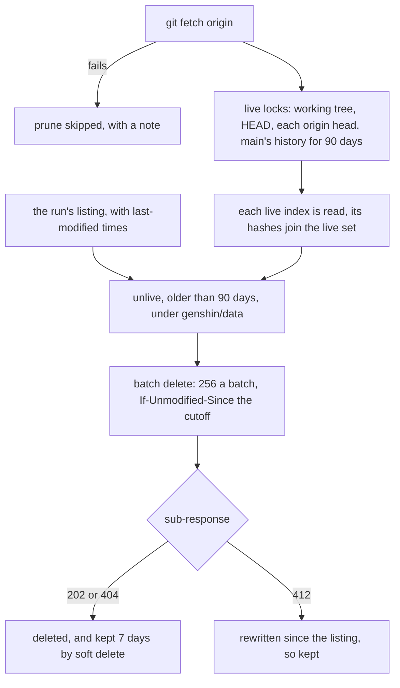
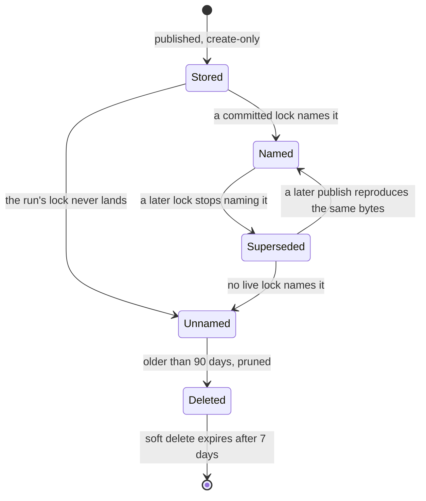
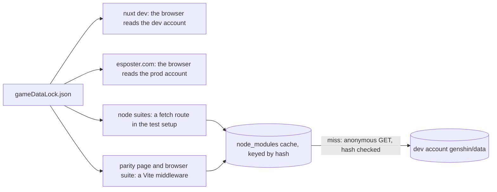

# Hosted game data

The tables and words that genshin-world reads are generated from the installed client and built into the package as about 6,700 files, about 100 MB of JSON and chunks, which every build and every published dist carries. This proposal publishes them to Azure Blob Storage instead, as immutable objects named by their own hash, and has the browser fetch each one when a screen opens it. The package keeps one generated file, a lock that maps each key to its object's hash, so a data version ships with the code that reads it and no build reads or bundles the data. It is the data layer that every later page reading the game's tables stands on, so it comes before them.

## Decisions

- **Generated game data is published, not bundled.** The tables and words genshin-world reads are written as objects in Blob Storage by a publisher in `scripts`, and the package bundles no record of them. The one generated file that stays is `gameDataLock.json`, a map from each key to the hash of its object, about 20 KB.
- **The container is AppAssets, under `genshin/data/`.** AppAssets is already public and already serves the character packs. GenshinAssets holds each player's save and stays private, since making it public would expose every save.
- **Objects are content-addressed and flat.** A record is one immutable object named by the SHA-256 of its compact JSON, with no folder per dataset, so identical bytes in two datasets are stored once. A change of compression level never renames an object, because the hash is taken over the plaintext.
- **Four entity collections get an index object.** Profile and book bodies have one index per language, and talent multipliers and talent labels have one each. An index maps an entry id to its record's hash, so one entity is one lookup and one fetch, never a fetch of its whole collection.
- **The lock is the only switch between data versions.** It is committed, read by the package and by the publisher, and changed only by a publish. Code and data deploy together, so a rollback is a git revert, and a tab left open across a deploy keeps reading the objects its own code names.
- **Writes use the owner's login, and reads are anonymous.** The publisher authenticates with `DefaultAzureCredential`, which resolves to `az login` on the owner's workstations, so no account key sits on either disk. It needs a Storage Blob Data Contributor grant scoped to the container on each account. Every read is an anonymous GET.
- **No CDN.** Azure serves the objects directly. Immutable caching already answers a repeat visit with no request, and a CDN added later would change only the base URL ([CDN in front of Blob storage](/docs/infra/rejected/cdn-in-front-of-blob-storage)).
- **Nothing is served through the app.** No Nitro route or public-asset copy carries the data, so no build compresses it and the app's egress stays off Railway ([static data in public assets](/docs/genshin/rejected/static-data-in-public-assets)).
- **CORS stays narrow.** Prod admits only the production site and dev admits only localhost. The package takes a required `gameDataBaseUrl`, so a host that is not one of those mirrors the objects it names, and the package takes a major version for it.
- **Deleted objects are kept for ninety days.** Prune removes an object that no recent lock names only after ninety days, and the account's seven-day soft delete is the last net.

## How it works

The publisher is the only writer. The browser is the only reader of the bulk data, and the test suites and the parity page read it through a local mirror.

### Publishing: create and update

A step builds its records in memory, each parsed by its reader's schema before anything is sent. The publisher then decides which objects each account lacks. It stops with no request when the lock already names every key the step would publish, so a rerun on the same dump costs only the build.



### Reading

A reader looks its key up in the lock, which is imported with the code. An entity read takes one more step through its index object. Each object is fetched once per page and parsed by the reader's schema on every call, so each caller gets a fresh copy.



### Deleting

Prune runs at the end of every real publish, once per account, and reuses that run's listing. The live set comes from git, so an object a branch or a recent release still names is never deleted.



### One object's life



### Local consumers



## Scope by phase

The work is two phases, and each ships whole with its docs.

- **Phase one: profile and book bodies.** The publisher, the lock, the reader primitives and the local mirror arrive with the first dataset they serve. Profile and book bodies move, about 6,300 files and about 90 MB, together with their loader maps and the 392 index chunk files. Node suites that read a profile, such as the one reading Amber's profile, need the fetch route and the mirror in this phase, not the next.
- **Phase two: everything else.** The other 35 folders, about 430 files and about 15 MB, move with their builders and readers. The three synchronous imports go too: the Bennett kit's weapon type moves onto `Combatant`, the GCG game reader becomes async, and the Windrise wildlife becomes a loaded ref. About 45 test files call readers that gain a base argument in this phase, and each call site changes with them.
- **Stays committed and bundled.** The genshin-text files, about 200 KB, stay because useGameText reads them during server rendering and English is the static first-paint default. The persona's character lines, about 6 MB, stay because the persona plugin reads them offline under node and never rebuilds them. The generated TypeScript in db-schema and apps/web, and the three build inputs in apps/web, stay as they are.
- **`src/data` is open.** `writeWorldData` writes game tables into `packages/genshin-world/src/data` from fifteen steps, and several of its files are read synchronously or by the server. Moving them is a follow-on with the readers that need them, and this proposal keeps them bundled.

## Data layout

- **Container and prefix.** AppAssets on each account, `app-assets` in the URL, with the prefix `genshin/data`, held in one constant of the new `services/data` module that the package, the publisher and the tooling all read.
- **Object.** `{sha256}.json`, stored as a zstd frame at compression level 12 with three headers: `Content-Encoding: zstd`, `Content-Type: application/json` and `Cache-Control: public, max-age=31536000, immutable`. Blob Storage stores the cache header and returns it unchanged. Objects are created create-only and never changed, with one exception: a publish may rewrite a stale copy whose bytes it reuses.
- **Index.** A record of entry id to hash, stored like any object and sorted before it is hashed. The per-language split keeps the largest index near 20 KB, so a short book never pulls a large index.
- **Lock.** `packages/genshin-world/src/generated/gameDataLock.json`, shaped `{ "indexes": { ... }, "objects": { ... } }`, with keys of the form `{folder}/{file stem}` such as `stats/weapons` or `gcg/deck3`. It is written sorted, two-space indented and one entry to a line, so a diff names exactly what changed, and it carries no timestamp or game version, since either would change on every run. Provenance goes in the commit body.
- **Types.** genshin-world imports the lock statically, so `GameDataKey` and `GameDataIndexKey` are the keys of the lock, and a wrong key is a compile error. The scripts read the lock from disk on every call.
- **Datasets.** A `GameDataset` enum, one member per folder, names what a step replaces and which keys the lock keeps.
- **Rejected layouts.** Version folders re-upload every unchanged file for each new version. Per-dataset manifests add a fetch before each read. A git-style tree costs two or three sequential reads per object. A mutable pointer blob lets data run ahead of the parsers that read it, and game-version keys would name an install that exists on one machine.

## Write path

- **Builders.** Each writer that targets `genshin-world/src/generated` returns records instead of writing files. A record is either `{ key, schema, value }` or `{ indexKey, entryId, schema, value }`. A step calls `publishGameData` with its records and the datasets it replaces, so today's clear-and-rewrite becomes replace this scope.
- **Validation.** Each value is parsed by its reader's schema before it is hashed, so a generator bug fails the run with no request sent. Each is serialized once as compact JSON, which drops the pretty-printing the current writers use.
- **Credential.** `DefaultAzureCredential` is acquired before the build, so a missing login fails in seconds. The publisher does not use `@esposter/db`'s container getter, which needs a connection string and provisions the container.
- **Upload.** Each account is listed once, with last-modified times. A needed object is reused when it is listed and either named by the current lock or written within 45 days. An unlisted object is uploaded create-only, and a 412 counts as already stored. A listed but unnamed stale copy is rewritten with the same bytes, which restarts its age so no prune can take it. Uploads go in waves of 100, leaves before indexes. Blob Batch does not cover uploads, so each upload is a single Put Blob.
- **Compression.** Each frame is compressed once and shared by both accounts. The whole set measures about 32 MiB at level 12, against about 36 MiB at level 1.
- **Lock.** Written only after both accounts succeed, by reading the lock again and merging this run's scopes, then writing a temp file and renaming it. Any failure throws before this step, so the lock stays untouched and a rerun converges.
- **Report and dry run.** Each scope prints unchanged, or its added, changed and removed records, plus uploads and compressed bytes per account. A dry run runs the same code against the azure-mock containers and never constructs a credential, writes the lock or prunes.

## Read path

- **Primitives.** `readGameDataObject(base, hash)` fetches `${base}/${hash}.json` with a timeout. A non-OK response throws an `InvalidOperationError` carrying the status, as the region reader does. Results are memoized per URL in an evicting promise cache, lifted from `createProvisionedClientCache` into `@esposter/shared`. A failed read is evicted, so the next read retries.
- **Readers.** `readGameData(base, key, schema)` parses the object named by the lock, and `readGameDataEntry(base, indexKey, entryId, schema)` reads the index through its own schema and then the entry. An id missing from its index throws, as a loader map's miss does today.
- **Base URL.** `WorldScreenProps` gains a required `gameDataBaseUrl`, beside the region and character-pack bases. The World component passes the AppAssets base, and the screen provides it through an injection key, so services stay pure functions of their base and Node can call them.
- **Caching and failure.** Immutable keys mean a repeat visit makes no request, with no ETag round trips and no IndexedDB or service worker. A failed read rejects as a failed import does today, and each caller's existing `.match` logs it. There is no client-side hash check, since TLS, the immutable keys and the schema parse already cover it.
- **Latency.** World mount issues about 16 parallel GETs to a new origin, and an index-backed read takes two round trips. Mount is timed before and after phase two. If it regresses, the fix is a preconnect, or merging the stats tables, which are always read whole, into one object.

## Tests and dev

- **nuxt dev** reads the dev account through the same base URL, and the dev account admits localhost. Development therefore exercises the real host, its CORS, its zstd decoding and its cache headers, and no dev-only module copies the data.
- **The local mirror** caches decoded objects under `node_modules/.cache`, keyed by hash, and fills a miss from the dev account. It checks the hash of what it fetched, which also catches a zstd body that Node failed to decode, and it writes through a temp file. Being content-addressed, it has no versions and no prune.
- **Node suites** read through a fetch route in the vitest setup: a URL under the local base is answered from the mirror and anything else passes through. Tests pass the local base to the real readers, so no test file copies game data. Three fixtures and nine suites that import JSON statically convert to the same reads.
- **Parity page** serves the mirror through a Vite middleware at the same local path, which keeps it same-origin.
- **CI** restores the mirror in a composite action with a cache per shard, keyed on the lock, so each shard fetches only the objects that changed. Reads are anonymous, so CI needs no Azure secret.
- **Tests that earn their line:** the reader primitives (a concurrent read shares one fetch, a rejected read is evicted, the error message), the missing-entry throw, the publisher against the azure-mock containers (a first publish, an identical rerun, one changed record, a failing target leaving the lock untouched, insertion order not changing the lock, a stale copy being rewritten), prune (it keeps what a live lock reaches and what is younger than retention, a 412 keeps the blob, it never deletes outside the prefix, it aborts on an unreadable live index), `deleteBlobs` (404 is success, 412 is kept), and the mirror's hash check. The mock needs `ifUnmodifiedSince` honoured in batch deletes first.

## Lifecycle

- **Create.** Once per phase, a throwaway script in the scratchpad maps the committed files to records, canonicalizes each with a parse and a stringify so the migrated builders hash to the same objects, and publishes to both accounts. `pnpm -C scripts genshin:data verify` then fetches anonymously every object the lock reaches on both accounts and compares it with the committed file. Only then does a commit name the lock, so HEAD never names data the account lacks.
- **Read.** The lock, then at most one index object, then the record. All three are immutable, so deployed code always reads the data it was committed with.
- **Update.** A new patch, or a generator fix within one, runs the steps in dependency order, and each publishes only what changed. A rerun on the same dump reports unchanged with no request, which is the determinism check. If two machines regenerate the same dataset before pushing, the lock conflicts; either side is taken, since both published to both accounts, and the step is rerun.
- **Delete.** Prune, as above, and `pnpm -C scripts genshin:data prune --dry-run` on demand. A dataset retired by removing its member and builder drops its keys from the next lock, and prune removes its objects after ninety days.
- **Rollback.** A git revert or a redeploy within ninety days resolves its objects. Older than that needs a soft-delete restore within seven days of the prune, or a republish of that lock's records.
- **Outside consumers.** Esposter's own accounts admit its origins only. An npm consumer must mirror the objects the lock names and pass `gameDataBaseUrl`, and its README says so.

## Cost

Magnitudes, priced from the Azure Retail Prices API for Australia East and Railway's published egress rate ([Sources](#sources)).

- **Storage** is about 33 MB per account at the Hot tier, a fraction of a cent a month.
- **First publish** is about 6,200 writes per account, a few cents across both accounts.
- **Reads** of a cold session come to a few hundred kilobytes, so the first 100 GB of egress a month covers about a quarter of a million cold sessions. Repeat visits make no request until a patch changes an object.
- **Egress** above the free allowance is about $0.12 per GB at the default routing, against Railway's $0.05 per GB for the same bytes served by the app.
- **A CDN** would add a base fee and a per-GB rate on top of storage that is already under a cent a month ([rejected](/docs/infra/rejected/cdn-in-front-of-blob-storage)).

## Key files

| File                                                                                       | Role after the change                                                                                              |
| :----------------------------------------------------------------------------------------- | :----------------------------------------------------------------------------------------------------------------- |
| `packages/db/src/services/azure/container/writeJsonBlob.ts`                                | Split into `compressJson` and `uploadCompressedJson`, with its signature unchanged                                 |
| `packages/db/src/services/azure/container/deleteDirectory.ts`                              | Its delete loop extracted into `deleteBlobs`, which prune and retirement share                                     |
| `packages/db/src/services/azure/container/listBlobNames.ts`                                | Rebuilt on a `listBlobItems` that returns last-modified times as well as names                                     |
| `packages/db/src/services/azure/createProvisionedClientCache.ts`                           | Rebuilt on the evicting promise cache lifted into `@esposter/shared`                                               |
| `packages/db-schema/src/services/azure/container/AzureContainerPropertiesMap.ts`           | Already lists AppAssets as the public container the objects live in                                                |
| `packages/keyframe-store/src/services/getContentAddress.ts`                                | Names each object by the hash of its compact JSON                                                                  |
| `apps/web/app/components/Genshin/World.vue`                                                | Passes the AppAssets base, as it passes the character-pack base, as `gameDataBaseUrl`                              |
| `packages/genshin-world/src/models/world/WorldScreenProps.ts`                              | Gains the required `gameDataBaseUrl` prop                                                                          |
| `packages/genshin-world/src/components/World/Screen/Index.vue`                             | Reads the name text and stat tables at mount and provides the base to its composables                              |
| `packages/genshin-world/src/services/constants.ts`                                         | `REGION_FETCH_TIMEOUT_MS` renamed `DATA_FETCH_TIMEOUT_MS`, and the readers share it                                |
| `packages/genshin-world/src/services/profile/readCharacterProfile.ts`                      | Reads its profile through `readGameDataEntry` (phase one)                                                          |
| `packages/genshin-world/src/services/profile/ProfileTextLoaderMap.ts`                      | Deleted with its generator's loader-map half (phase one)                                                           |
| `packages/genshin-world/src/services/archive/BookBodyLoaderMap.ts`                         | Deleted with its generator's loader-map half (phase one)                                                           |
| `packages/genshin-world/tsconfig.build.json`                                               | Gains an exact path for the lock in phase one, and loses its paths block in phase two                              |
| `scripts/src/services/genshinAssets/profile/writeProfileText.ts`                           | Becomes a builder that returns records and publishes per-language indexes (phase one)                              |
| `scripts/src/services/genshinAssets/archive/writeBookBodies.ts`                            | Becomes a builder that returns records and publishes per-language indexes (phase one)                              |
| `scripts/src/services/genshinAssets/shared/writeWorldData.ts`                              | Keeps writing `src/data`, which stays bundled, as the open item in Scope says                                      |
| `packages/genshin-world/src/services/character/readStatTables.ts`                          | Fetches the characters table with its other tables, replacing the static import behind the Bennett kit (phase two) |
| `packages/genshin-world/src/services/character/getCharacterWeaponType.ts`                  | Deleted, its job taken by `Combatant.weaponType` (phase two)                                                       |
| `packages/genshin-world/src/models/kit/Combatant.ts`                                       | Gains a required `weaponType`, filled from the stat tables (phase two)                                             |
| `packages/genshin-world/src/composables/useWorldCombat.ts`                                 | Fills `weaponType` from the stat tables before any kit runs (phase two)                                            |
| `packages/genshin-world/src/services/gcg/readGcgGame.ts`                                   | Becomes async, and its only caller already awaits it (phase two)                                                   |
| `apps/infra/src/azure/resources/Microsoft.Authorization/roleAssignments/jimmyChenOwner.ts` | The owner's role assignment, which the new write grant follows for each account                                    |

New files, as a tree:

```text
apps/infra/src/azure/constants/JimmyChenPrincipalId.ts
apps/infra/src/azure/resources/Microsoft.Authorization/roleAssignments/
  jimmyChenDevstesposter001AppAssetsStorageBlobDataContributor.ts
  jimmyChenProdstesposter001AppAssetsStorageBlobDataContributor.ts
packages/db/src/services/azure/container/listBlobItems.ts
packages/genshin-world/src/generated/gameDataLock.json
packages/genshin-world/src/models/data/GameDataset.ts
packages/genshin-world/src/services/data/
packages/genshin-world/scripts/gameData/          (phase two: the local mirror)
scripts/src/services/gameData/
scripts/src/gameData/index.ts
.github/actions/setup-game-data/action.yaml       (phase two)
```

## Notes

- **The develop deployment is not admitted.** The develop Railway site is not one of the two origins either account admits. Its World mount reads stats and name text, so with the current accounts the World would not open there after phase two, and only its character packs fail today. Adding that origin to the dev account is a decision for the owner, and the proposal does not take it.
- **The package's type output is unverified.** Whether `rolldown-plugin-dts` emits a declaration for `GameDataKey = keyof typeof lock.objects` when the type comes from a bundled JSON import is not checked. Phase one builds it before any consumer relies on it.
- **Azure's mock keys containers by name alone.** Two publisher targets both named `app-assets` share one store, so the target that uploads second sees the first's objects. Before the per-target tests can tell the accounts apart, the mock must key by account or the targets must name their containers apart.
- **Blob Batch deletes are not atomic.** A batch runs each delete on its own, so a failure partway leaves the rest deleted and each sub-response reports its own outcome.
- **Pre-existing gaps are carried, not fixed.** `gcg/games.json` is `{}`, so the GCG game reader throws for every id, and about 160 generated files have no reader yet. Both move with their folders unchanged, and this proposal does not fix either.
- **Saves stay private.** Each player's save remains in GenshinAssets, which this proposal does not touch.

## Sources

- [Railway pricing](https://railway.com/pricing) — egress for services is $0.05 per GB, the rate Railway bills for the bytes the app serves today.
- [Azure Retail Prices API](https://prices.azure.com/api/retail/prices) — queried for Storage in `australiaeast` with the Hot LRS SKU: $0.02 per GB-month stored, $0.055 per 10,000 write operations, $0.0044 per 10,000 read operations. The Bandwidth service for `australiaeast` gives the first 100 GB free and then $0.12 per GB at the default routing, and Azure Front Door Standard gives a $35 monthly base fee and $0.17 per GB out for zone 1.
- [Put Blob](https://learn.microsoft.com/en-us/rest/api/storageservices/put-blob) — the write API the publisher calls. It stores the Cache-Control value without using it, returns Content-Encoding on read, and lists Storage Blob Data Contributor as the least privileged role.
- [Specifying conditional headers for Blob service operations](https://learn.microsoft.com/en-us/rest/api/storageservices/specifying-conditional-headers-for-blob-service-operations) — If-None-Match set to `*` fails a write when the blob exists, with 412 Precondition Failed, which makes the create-only upload and its already-stored case exact.
- [Blob Batch](https://learn.microsoft.com/en-us/rest/api/storageservices/blob-batch) — supports only Delete Blob and Set Blob Tier as sub-requests, up to 256 a batch, not atomic, so uploads are single Put Blob calls and deletes go in batches of 256.
- [Delete Blob](https://learn.microsoft.com/en-us/rest/api/storageservices/delete-blob) — honours If-Unmodified-Since with 412 when the blob changed, returns 202 on success, keeps a soft-deleted blob for the retention period, and is not charged.
