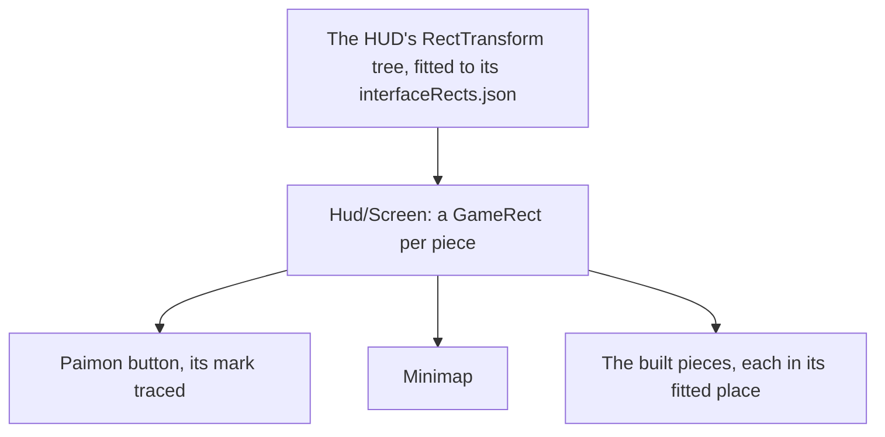

# HUD

The [HUD](/docs/genshin/hud) is built with its stamina meter, its quest tracker, the deployed team's portraits, the member on the field's health and its skill and burst buttons, beside the Paimon button, the [minimap](/docs/genshin/minimap) and the [touch controls](/docs/genshin/touch-controls). Every place, size and colour of those is provisional: the pieces stand where the shell puts them until the game's own layout is read. This page keeps what is still unbuilt. It builds on [interface layout](/docs/genshin/interface-layout), which places every screen by the game's own rect tree.

## Decisions

- **Laid out by the game's own tree.** Each piece sits in the `GameRect` of its place in the HUD's RectTransform tree, as the login's interface does. Finding the HUD's block is named work: its entry in `DerivedAssetComponentMap` comes first, then `genshin:assets interface` over it and the fit that writes its rects. Each piece rides in its game parent, so the screen holds on any window shape.
- **Measured like the login.** Each piece's size, colour and place come from a recording of the English PC client's world at 1080 high (showing the Paimon button, the minimap turning as the camera turns, the party down the right through a switch, the stamina meter draining to empty and refilling, a quest navigated on its tracker, and a fight with the HP bar falling, the skill on its cooldown and the burst filling, used and cooling), published ones searched first, named in `ParityReferenceMap`. The screen is compared over that recording's own frame with the scene behind it, then shot bare and approved in the visual suite, with its fixture and reference beside it.
- **The HUD's block is the UI pages' block.** The asset index holds no GameObject, so the block is found by an indexed asset beside the page, as the login's is: `GrpMainPage`, an Animator in `00/01706952.blk`, the block holding the in-level pages' animators (the map's `InLevelMapMarkMap` beside it). Its root is the page's GameObject, `InLevelMainPage`, the name its clips (`Ani_InLevelMainPage_FadeIn`, `_FadeOut`, `_VirtualDial_Show`, `_VirtualDial_Hide`) give it, as `LoginMainPage` is the login's.
- **Paimon's mark is traced.** The Paimon button's face is traced from the game's into a path of our own, as every glyph is ([interface library](/docs/genshin/interface-library)).

## How it works



## Scope and order

**Today:** the shell stands at provisional places with every piece built: the stamina meter, the quest tracker, the party's portraits, the member's health and the skill and burst buttons.

**This adds, in order:**

1. **The HUD's block, exported and fitted.** `DerivedAssetComponent` (`scripts/src/models/genshinAssets/shared/DerivedAssetComponent.ts`) gains `Hud = "hud"`, and `DerivedAssetComponentMap` its entry: `{ clipPattern: "^Ani_InLevelMainPage_", interface: { anchorPattern: "^GrpMainPage$", root: "InLevelMainPage" }, roots: [], screen: "HudScreen" }`. `pnpm -C scripts genshin:assets interface hud` exports the tree into `~/Esposter/genshin-parity/extracted/hud/interface/interface.json` and prints it. Where no GameObject is named `InLevelMainPage`, the root is the dumped GameObject (`extracted/hud/interface/json/GameObject/`) that is `GrpMainPage`'s father, and the entry names it. A new `scripts/src/services/genshinAssets/fit/fitHud.ts`, keyed in `DerivedAssetFitMap`, runs `interfaceRects` as `fitLoginScene` does, writing `packages/genshin-world/src/data/hud/interfaceRects.json` through `fitInterfaceRects`. `pnpm -C scripts genshin:assets fit hud --only interfaceRects` writes it. The proof is the file itself: its keys hold the Paimon button's, the minimap's, the party's and the skills' paths, which the next step's markup reads. No new test is owed, since `fitInterfaceRects` has its own.
2. **Each piece placed by the fitted rects.** `Hud/Screen` nests a `GameRect` per piece in the tree's order, as `Login/Interface` does, and each built piece moves into its rect. It is measured with `pnpm -C scripts genshin:parity compare hud-world-pickup`, whose committed row (0.95%) must not rise; the user's eyes then judge the comparison, queued for them.
3. **The looks and Paimon's mark.** Each piece's look is replaced with the game's, read off the copied captures and `hud-world-pickup`, and Paimon's mark is traced from the same frame with `genshin:parity trace`. `world-hud-hidden.mkv` re-measures the composite later; it gates nothing.

## What this does not propose

- **The pieces of features the world lacks**: the chat and the top right's shortcuts.
- **The agent console's bar.** The console is hidden from the game until it is rebuilt in the game's style, which is its own page's.

## Key files

| File                                                                    | Role after the change                |
| :---------------------------------------------------------------------- | :----------------------------------- |
| `packages/genshin-world/src/components/Hud/Screen/Index.vue`            | Places each piece in its fitted rect |
| `scripts/src/services/genshinAssets/shared/DerivedAssetComponentMap.ts` | Gains the HUD's block and its roots  |
| `scripts/src/services/genshinParity/shared/ParityReferenceMap.ts`       | Gains the HUD's recordings           |

New files:

```text
packages/genshin-world/src/components/Hud/Screen/Index.fixture.ts
packages/genshin-world/src/components/Hud/Screen/Index.reference.ts
packages/genshin-world/src/data/hud/interfaceRects.json
```

## Sources

- [Paimon Menu](https://genshin-impact.fandom.com/wiki/Paimon_Menu), Genshin Impact Wiki, for the top-left Paimon button, which opens the menu as Escape does.
