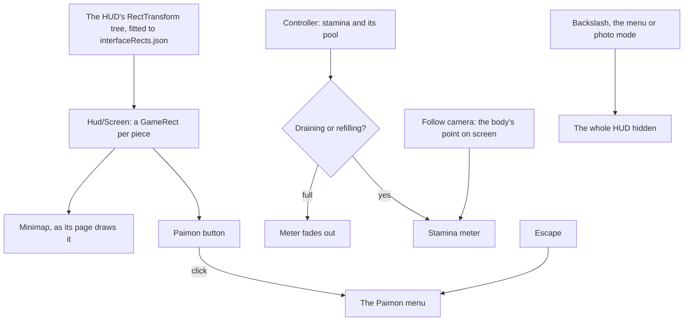

# HUD

This page builds on the [character controller](/docs/proposals/genshin/character-controller), whose stamina the HUD's first piece shows, and on the [interface library](/docs/genshin/interface-library), whose `GameScreen` and `GameRect` lay out every screen. While a person is in the world, the game keeps a heads-up display over it. The Paimon button and the minimap sit in the top left, and a meter beside the character fills and drains with stamina. The world screen has no heads-up display yet.

## Decisions

- **One screen, laid out by the game's own tree.** The HUD is `Hud/Screen` in the world package, drawn inside `GameScreen` over the world's canvas. Each piece sits in the `GameRect` of its place in the HUD's RectTransform tree, as [interface layout](/docs/genshin/interface-layout) lays out the login. Finding the HUD's block is named work. Its entry in `DerivedAssetComponentMap` comes first, then `genshin:assets interface` over it and the fit that writes its rects. Each piece rides in its game parent, so the screen holds on any window shape.
- **Only what the world backs.** A piece appears with the feature it shows: the stamina meter with the controller, the Paimon button with the [menu screens](/docs/proposals/genshin/menu-screens) and the [minimap](/docs/proposals/genshin/minimap) with its own page, which this one only places. The game's other pieces (the party list, health, the skill and burst buttons, the quest tracker, the top right's shortcuts and the chat) each wait on the feature behind them. None is drawn as an inert copy, since a button that does nothing tells the player the world has something it lacks.
- **The stamina meter follows the character.** The game shows it beside the character while stamina drains or refills, and hides it once the pool is full. It is cut into sections of 100 each. Its rect therefore cannot hold its place, which moves with the character on screen. Each frame it is placed at the body's point as the [follow camera](/docs/proposals/genshin/follow-camera) projects it, plus an offset measured off the recording. That is one transform written a frame, with no layout. Its shape, colours, sections and fades are measured from the recording too, and it carries `role="meter"` with the pool's value for a screen reader.
- **The Paimon button opens the menu, as Escape does.** Its mark is traced from the game's into a path of our own, as every glyph is ([interface library](/docs/genshin/interface-library)). It is a button named for the menu, so a pointer, a touch and the keyboard all reach the menu.
- **The HUD hides as the game's does.** The backslash hides and shows it, as the game's Hide UI key does. It is also hidden while the menu is open and in photo mode.
- **Measured like the login.** Each piece's size, colour and place come from a recording of the English PC client's world at 1080 high, published ones searched first, and named in `ParityReferenceMap`. The screen is compared over that recording's own frame with the scene behind it, then shot bare and approved in the visual suite.

## How it works



## Scope and order

**Today:** the world screen draws no heads-up display.

**This adds, in order:**

1. **The references.** A recording of the world's HUD, with the meter draining and refilling, is found or recorded. The HUD's block comes with it, with its component entry and its fitted rects.
2. **`Hud/Screen`**, mounted by the world screen, with the minimap's place in it.
3. **The stamina meter**, with the controller's stamina.
4. **The Paimon button**, with the menu screens.

## What this does not propose

- **The pieces of features the world lacks**: the party list and its portraits, health, the skill and burst buttons, the quest tracker, the shortcuts and the chat.
- **The agent console's bar.** The console is hidden from the game until it is rebuilt in the game's style, which is its own page's.

## Key files

| File                                                                    | Role after the change               |
| :---------------------------------------------------------------------- | :---------------------------------- |
| `packages/genshin-world/src/components/World/Screen/Index.vue`          | Mounts the HUD over the canvas      |
| `scripts/src/services/genshinAssets/shared/DerivedAssetComponentMap.ts` | Gains the HUD's block and its roots |
| `scripts/src/services/genshinParity/shared/ParityReferenceMap.ts`       | Gains the HUD's recordings          |

New files:

```text
packages/genshin-world/src/components/Hud/Screen/Index.vue
packages/genshin-world/src/components/Hud/Screen/Index.fixture.ts
packages/genshin-world/src/components/Hud/Screen/Index.reference.ts
packages/genshin-world/src/components/Hud/Stamina/Index.vue
packages/genshin-world/src/components/Hud/Stamina/Index.fixture.ts
packages/genshin-world/src/components/Hud/PaimonButton/Index.vue
packages/genshin-world/src/components/Hud/PaimonButton/Index.fixture.ts
packages/genshin-world/src/data/hud/interfaceRects.json
```

## Sources

- [Stamina](https://genshin-impact.fandom.com/wiki/Stamina), Genshin Impact Wiki: the meter beside the character while stamina drains or refills, hidden when full, cut into sections of 100.
- [Paimon Menu](https://genshin-impact.fandom.com/wiki/Paimon_Menu), Genshin Impact Wiki: the Paimon button in the top left corner opening the menu, as Escape does.
- [Map](https://genshin-impact.fandom.com/wiki/Map), Genshin Impact Wiki: the minimap in the top left, opening the map.
- [Controls](https://genshin-impact.fandom.com/wiki/Controls), Genshin Impact Wiki: Hide UI on the backslash.
