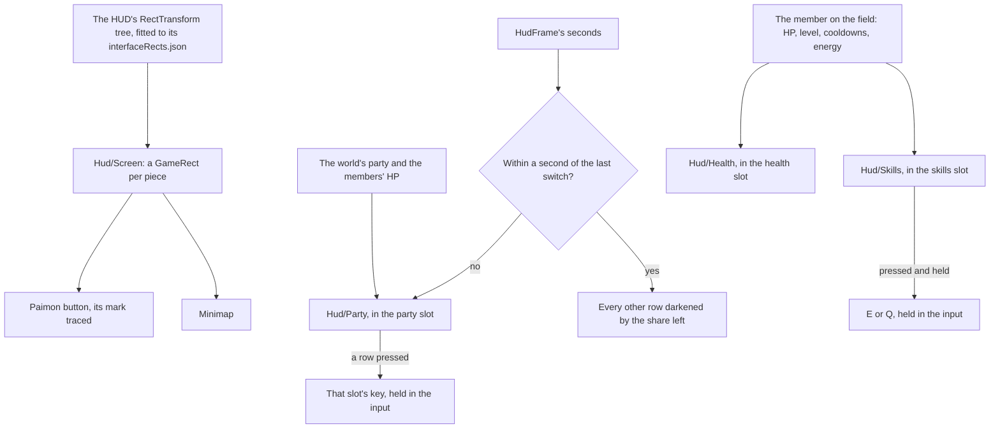

# HUD

The [HUD](/docs/genshin/hud) is built as a shell with its stamina meter and quest tracker: the Paimon button, the [minimap](/docs/genshin/minimap), the tracker under it, the meter beside the character, places for the party, the health and the skill and burst buttons, and the [touch controls](/docs/genshin/touch-controls) under them. Its places, sizes and colours are provisional, and three of its places are empty. This page builds on the [party](/docs/genshin/party), whose deployed team the portraits show, on [combat](/docs/genshin/combat), whose damage and energy the bars and buttons show, and on [interface layout](/docs/genshin/interface-layout), which places every screen by the game's own rect tree.

## Decisions

- **Laid out by the game's own tree.** Each piece sits in the `GameRect` of its place in the HUD's RectTransform tree, as the login's interface does. Finding the HUD's block is named work: its entry in `DerivedAssetComponentMap` comes first, then `genshin:assets interface` over it and the fit that writes its rects. Each piece rides in its game parent, so the screen holds on any window shape.
- **Measured like the login.** Each piece's size, colour and place come from a recording of the English PC client's world at 1080 high, published ones searched first, named in `ParityReferenceMap`. The screen is compared over that recording's own frame with the scene behind it, then shot bare and approved in the visual suite, with its fixture and reference beside it.
- **Paimon's mark is traced.** The Paimon button's face is traced from the game's into a path of our own, as every glyph is ([interface library](/docs/genshin/interface-library)).
- **The party's portraits fill the party's place.** `Hud/Party` draws the deployed team down the right in the HUD's `party` slot, a row a member in slot order: the member's name from the roster's name text, a round portrait stand-in, a thin HP bar under the name, and the slot's number. The one on the field is marked, a member who is down is greyed, and for `PARTY_SWITCH_COOLDOWN_SECONDS` after a switch every other row is darkened by the share of the cooldown left, read off the world's clock that `HudFrame` gains as `seconds`. A press on a row holds that slot's key (`getActionKeyCode` over `PARTY_MEMBER_INPUT_ACTIONS`), so a pointer switches as `1` to `4` do.
- **The member on the field's HP bar sits at the bottom's middle.** `Hud/Health` fills the `health` slot: the game's level (`LevelFormat`) before the bar, the bar filled by HP over Max HP, and the two as whole numbers under it, HP rounded up, Max HP rounded. It carries `role="meter"` named by the game's word for HP.
- **The skill and burst buttons sit at the bottom right.** `Hud/Skills` fills the `skills` slot with the member on the field's skill and burst: a cooldown darkens its button by the share left and counts its seconds down to a tenth, and the burst fills from its foot with its energy over its cost and glows once full and off cooldown. Pressing one holds `E` or `Q` in the world's input until released, so a held skill holds as the key does, and the buttons let go of both as the HUD hides. Each is named by the controls' words for its key.

## How it works



## Scope and order

**Today:** the shell stands at provisional places with the stamina meter and the quest tracker, its party, health and skills places empty.

**This adds, in order:**

1. **The references.** A recording of the world's HUD, with the meter draining and refilling, a quest navigated, a switch and a fight, is found or recorded. The HUD's block comes with it, with its component entry and its fitted rects, and Paimon's mark is traced from it.
2. **The party's portraits**, with the world's party and the members' HP.
3. **The HP bar**, with the member on the field's HP.
4. **The skill and burst buttons**, with the member on the field's cooldowns and energy.

## What this does not propose

- **The pieces of features the world lacks**: the chat and the top right's shortcuts.
- **The agent console's bar.** The console is hidden from the game until it is rebuilt in the game's style, which is its own page's.

## Key files

| File                                                                    | Role after the change                                      |
| :---------------------------------------------------------------------- | :--------------------------------------------------------- |
| `packages/genshin-world/src/components/Hud/Screen/Index.vue`            | Places each piece in its fitted rect                       |
| `packages/genshin-world/src/components/World/Screen/Index.vue`          | Fills the party's, the health's and the skills' slots      |
| `packages/genshin-world/src/models/hud/HudFrame.ts`                     | Gains the world's clock, which the switch's cooldown reads |
| `scripts/src/services/genshinAssets/shared/DerivedAssetComponentMap.ts` | Gains the HUD's block and its roots                        |
| `scripts/src/services/genshinParity/shared/ParityReferenceMap.ts`       | Gains the HUD's recordings                                 |

New files:

```text
packages/genshin-world/src/components/Hud/Screen/Index.fixture.ts
packages/genshin-world/src/components/Hud/Screen/Index.reference.ts
packages/genshin-world/src/components/Hud/Party/Index.vue
packages/genshin-world/src/components/Hud/Health/Index.vue
packages/genshin-world/src/components/Hud/Skills/Index.vue
packages/genshin-world/src/data/hud/interfaceRects.json
```

## Sources

- [Paimon Menu](https://genshin-impact.fandom.com/wiki/Paimon_Menu), Genshin Impact Wiki: the top-left Paimon button, which opens the menu as Escape does.
- [Party](https://genshin-impact.fandom.com/wiki/Party), Genshin Impact Wiki: the one second switch cooldown.
- [Elemental Skill](https://genshin-impact.fandom.com/wiki/Elemental_Skill), Genshin Impact Wiki: the skill's cooldown, during which it cannot be used.
- [Elemental Burst](https://genshin-impact.fandom.com/wiki/Elemental_Burst), Genshin Impact Wiki: the burst's icon at the bottom right showing its cooldown's time and filling with the character's energy, glowing once ready.
