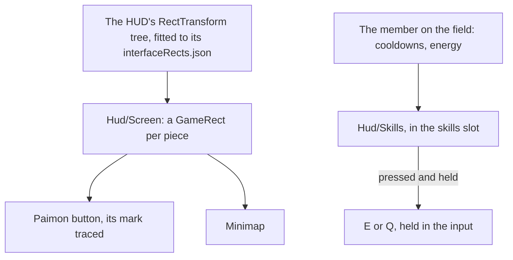

# HUD

The [HUD](/docs/genshin/hud) is built as a shell with its stamina meter, its quest tracker, the deployed team's portraits and the member on the field's health: the Paimon button, the [minimap](/docs/genshin/minimap), the tracker under it, the meter beside the character, the portraits down the right, the health at the bottom's middle, and the [touch controls](/docs/genshin/touch-controls) under them. Its places, sizes and colours are provisional, and its skill and burst place at the bottom right is empty. This page builds on the [party](/docs/genshin/party), whose member on the field the buttons show, on [combat](/docs/genshin/combat), whose energy the burst fills by, and on [interface layout](/docs/genshin/interface-layout), which places every screen by the game's own rect tree.

## Decisions

- **Laid out by the game's own tree.** Each piece sits in the `GameRect` of its place in the HUD's RectTransform tree, as the login's interface does. Finding the HUD's block is named work: its entry in `DerivedAssetComponentMap` comes first, then `genshin:assets interface` over it and the fit that writes its rects. Each piece rides in its game parent, so the screen holds on any window shape.
- **Measured like the login.** Each piece's size, colour and place come from a recording of the English PC client's world at 1080 high, published ones searched first, named in `ParityReferenceMap`. The screen is compared over that recording's own frame with the scene behind it, then shot bare and approved in the visual suite, with its fixture and reference beside it.
- **Paimon's mark is traced.** The Paimon button's face is traced from the game's into a path of our own, as every glyph is ([interface library](/docs/genshin/interface-library)).
- **The skill and burst buttons sit at the bottom right.** `Hud/Skills` fills the `skills` slot with the member on the field's skill and burst: a cooldown darkens its button by the share left and counts its seconds down to a tenth, and the burst fills from its foot with its energy over its cost and glows once full and off cooldown. Pressing one holds `E` or `Q` in the world's input until released, so a held skill holds as the key does, and the buttons let go of both as the HUD hides. Each is named by the controls' words for its key.

## How it works



## Scope and order

**Today:** the shell stands at provisional places with the stamina meter, the quest tracker, the party's portraits and the member's health in place, and the skill and burst place empty.

**This adds, in order:**

1. **The references.** A recording of the world's HUD, with the meter draining and refilling, a quest navigated, a switch and a fight, is found or recorded. The HUD's block comes with it, with its component entry and its fitted rects, and Paimon's mark is traced from it.
2. **The skill and burst buttons**, with the member on the field's cooldowns and energy.

## What this does not propose

- **The pieces of features the world lacks**: the chat and the top right's shortcuts.
- **The agent console's bar.** The console is hidden from the game until it is rebuilt in the game's style, which is its own page's.

## Key files

| File                                                                    | Role after the change                |
| :---------------------------------------------------------------------- | :----------------------------------- |
| `packages/genshin-world/src/components/Hud/Screen/Index.vue`            | Places each piece in its fitted rect |
| `packages/genshin-world/src/components/World/Screen/Index.vue`          | Fills the skills' slot               |
| `scripts/src/services/genshinAssets/shared/DerivedAssetComponentMap.ts` | Gains the HUD's block and its roots  |
| `scripts/src/services/genshinParity/shared/ParityReferenceMap.ts`       | Gains the HUD's recordings           |

New files:

```text
packages/genshin-world/src/components/Hud/Screen/Index.fixture.ts
packages/genshin-world/src/components/Hud/Screen/Index.reference.ts
packages/genshin-world/src/components/Hud/Skills/Index.vue
packages/genshin-world/src/data/hud/interfaceRects.json
```

## Sources

- [Paimon Menu](https://genshin-impact.fandom.com/wiki/Paimon_Menu), Genshin Impact Wiki: the top-left Paimon button, which opens the menu as Escape does.
- [Elemental Skill](https://genshin-impact.fandom.com/wiki/Elemental_Skill), Genshin Impact Wiki: the skill's cooldown, during which it cannot be used.
- [Elemental Burst](https://genshin-impact.fandom.com/wiki/Elemental_Burst), Genshin Impact Wiki: the burst's icon at the bottom right showing its cooldown's time and filling with the character's energy, glowing once ready.
