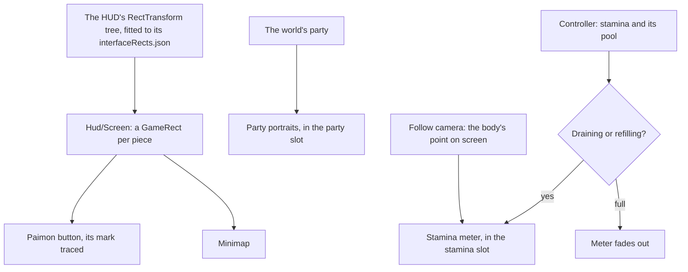

# HUD

The [HUD](/docs/genshin/hud) is built as a shell: the Paimon button, the [minimap](/docs/genshin/minimap), places for the party and the stamina meter, and the [touch controls](/docs/genshin/touch-controls) under them, hidden on the backslash and under every screen. Its places, sizes and colours are provisional, and two of its places are empty. This page builds on the [character controller](/docs/genshin/character-controller), whose stamina the meter shows, and on [interface layout](/docs/genshin/interface-layout), which places every screen by the game's own rect tree.

## Decisions

- **Laid out by the game's own tree.** Each piece sits in the `GameRect` of its place in the HUD's RectTransform tree, as the login's interface does. Finding the HUD's block is named work: its entry in `DerivedAssetComponentMap` comes first, then `genshin:assets interface` over it and the fit that writes its rects. Each piece rides in its game parent, so the screen holds on any window shape.
- **Measured like the login.** Each piece's size, colour and place come from a recording of the English PC client's world at 1080 high, published ones searched first, named in `ParityReferenceMap`. The screen is compared over that recording's own frame with the scene behind it, then shot bare and approved in the visual suite, with its fixture and reference beside it.
- **Paimon's mark is traced.** The Paimon button's face is traced from the game's into a path of our own, as every glyph is ([interface library](/docs/genshin/interface-library)).
- **The stamina meter follows the character.** The game shows it beside the character while stamina drains or refills, and hides it once the pool is full. It is cut into sections of 100 each. Each frame it is placed at the body's point as the [follow camera](/docs/genshin/follow-camera) projects it, plus an offset measured off the recording: one transform written a frame, with no layout. Its shape, colours, sections and fades are measured from the recording too, and it carries `role="meter"` with the pool's value for a screen reader. It fills the HUD's `stamina` slot.
- **The party's portraits fill the party's place.** Once the world holds a party, its deployed team's members are drawn down the right in the HUD's `party` slot, the one on the field marked, each with its number key, as the game draws them.

## How it works



## Scope and order

**Today:** the shell stands at provisional places, with the party's and the stamina meter's places empty.

**This adds, in order:**

1. **The references.** A recording of the world's HUD, with the meter draining and refilling, is found or recorded. The HUD's block comes with it, with its component entry and its fitted rects, and Paimon's mark is traced from it.
2. **The stamina meter**, with the controller's body.
3. **The party's portraits**, with the world's party.

## What this does not propose

- **The pieces of features the world lacks**: health, the skill and burst buttons, the quest tracker, the shortcuts and the chat.
- **The agent console's bar.** The console is hidden from the game until it is rebuilt in the game's style, which is its own page's.

## Key files

| File                                                                    | Role after the change                   |
| :---------------------------------------------------------------------- | :-------------------------------------- |
| `packages/genshin-world/src/components/Hud/Screen/Index.vue`            | Places each piece in its fitted rect    |
| `packages/genshin-world/src/components/World/Screen/Index.vue`          | Fills the party's and the meter's slots |
| `scripts/src/services/genshinAssets/shared/DerivedAssetComponentMap.ts` | Gains the HUD's block and its roots     |
| `scripts/src/services/genshinParity/shared/ParityReferenceMap.ts`       | Gains the HUD's recordings              |

New files:

```text
packages/genshin-world/src/components/Hud/Screen/Index.fixture.ts
packages/genshin-world/src/components/Hud/Screen/Index.reference.ts
packages/genshin-world/src/components/Hud/Stamina/Index.vue
packages/genshin-world/src/components/Hud/Stamina/Index.fixture.ts
packages/genshin-world/src/components/Hud/Party/Index.vue
packages/genshin-world/src/components/Hud/Party/Index.fixture.ts
packages/genshin-world/src/data/hud/interfaceRects.json
```

## Sources

- [Stamina](https://genshin-impact.fandom.com/wiki/Stamina), Genshin Impact Wiki: the meter beside the character while stamina drains or refills, hidden when full, cut into sections of 100.
- [Paimon Menu](https://genshin-impact.fandom.com/wiki/Paimon_Menu), Genshin Impact Wiki: the Paimon button in the top left corner opening the menu, as Escape does.
