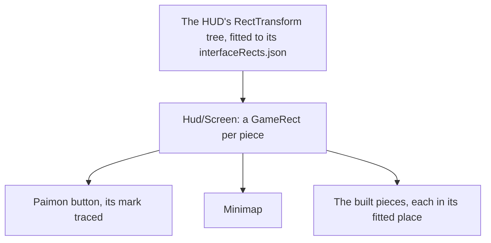

# HUD

The [HUD](/docs/genshin/hud) is built with its stamina meter, its quest tracker, the deployed team's portraits, the member on the field's health and its skill and burst buttons, beside the Paimon button, the [minimap](/docs/genshin/minimap) and the [touch controls](/docs/genshin/touch-controls). Each piece but the quest tracker stands in its fitted rect of the game's own tree, the tracker having no rect there and staying at its provisional place, and every size and colour of those is provisional. This page keeps what is still unbuilt. It builds on [interface layout](/docs/genshin/interface-layout), which places every screen by the game's own rect tree.

## Decisions

- **Laid out by the game's own tree.** Each piece with a place in the HUD's RectTransform tree sits in that place's `GameRect`, as the login's interface does; the quest tracker has none, so it stays provisionally placed. Built: the HUD's block has its entry in `DerivedAssetComponentMap`, `genshin:assets interface` exports it and `fitHud` publishes its rects. Each piece rides in its game parent, so the screen holds on any window shape.
- **Measured like the login.** Each piece's size and colour come from a recording of the English PC client's world at 1080 high (showing the Paimon button, the minimap turning as the camera turns, the party down the right through a switch, the stamina meter draining to empty and refilling, a quest navigated on its tracker, and a fight with the HP bar falling, the skill on its cooldown and the burst filling, used and cooling), published ones searched first, named in `ParityReferenceMap`. The screen is compared over that recording's own frame with the scene behind it, then shot bare and approved in the visual suite, with its fixture and reference beside it.
- **The HUD's block is the in-level page's block.** The asset index holds no GameObject, so the block is found by an indexed asset beside the page, as the login's is. The page's GameObject, `InLevelMainPage`, is in `00/04803507.blk`, and its clips (`Ani_InLevelMainPage_FadeIn`, `_FadeOut` in `00/03931010.blk`, `_VirtualDial_Show` and `_Hide` in `00/13058112.blk`) are named for it, as `LoginMainPage`'s are the login's. The anchor is `TeamBtn_MP`, the party button's Animator, which only `00/04803507.blk` holds among the game's blocks, where `GrpMainPage` is in four. Its root is `InLevelMainPage`: its tree holds `GrpMiniMap`, `BtnPlayerProfile`, `SPBar`, `TeamBtnContainer` and `GrpActionBtn`, the pieces [HUD](/docs/genshin/hud) lists.
- **Paimon's mark is traced.** Built: the Paimon button draws the face traced from the game's own frame (`hud-world-pickup`, the 90 pixel box at 100, 10) as a path of our own, as every glyph is ([interface library](/docs/genshin/interface-library)). Its ink is the whole head as the trace splits it, with the tracer's default share, so its place and fill are provisional until measured.

## How it works



## Scope and order

**Today:** the HUD's block is exported and fitted, and every piece but the quest tracker stands in its fitted rect of the game's tree ([as-built page](/docs/genshin/hud)), its looks still provisional: the stamina meter, the party's portraits, the member's health and the skill and burst buttons. The quest tracker has no rect in the HUD's tree and stays at its provisional place until one is found.

**This adds, in order:**

1. **The looks.** Each piece's look is replaced with the game's, read off the copied captures and `hud-world-pickup`. Paimon's mark is built (traced from the same frame, as the Decisions say). `world-hud-hidden.mkv` re-measures the composite later; it gates nothing. The stamina meter, party, health and skill buttons are built first, each measured with `genshin:parity compare hud-world-pickup` before and after; the quest tracker's altitude line ("Higher 1540m") comes last, since it waits on the navigated objective's height, which no region data carries until a height is extracted and published by the Mac.

The looks, as built so far (`hud-world-pickup`, head 3ee1c42c1f: mean 10.34%, shape 0.220, tone 9.50%, FLIP 0.4321): the party's rows are built, each name right of its HP bar and left of its portrait, with no slot number (mean 10.34%, shape 0.237, FLIP 0.4319). The health bar was tried with the level before the bar and the numbers over it, and was reverted: its mean rose to 10.35%. The stamina meter has no frame to measure against, since `hud-world-pickup` shows it hidden at full stamina. The skill buttons' three discs carry the game's sprint, attack and jump glyphs rather than the skill and burst icons, so they wait on a glyph pass.

## What this does not propose

- **The pieces of features the world lacks**: the chat and the top right's shortcuts.
- **The agent console's bar.** The console is hidden from the game until it is rebuilt in the game's style, which is its own page's.

## Key files

| File                                                              | Role after the change                 |
| :---------------------------------------------------------------- | :------------------------------------ |
| `packages/genshin-world/src/components/Hud/Screen/Index.vue`      | Draws each piece with the game's look |
| `scripts/src/services/genshinParity/shared/ParityReferenceMap.ts` | Gains the HUD's recordings            |

New files:

```text
packages/genshin-world/src/components/Hud/Screen/Index.reference.ts
```

## Sources

- [Paimon Menu](https://genshin-impact.fandom.com/wiki/Paimon_Menu), Genshin Impact Wiki, for the top-left Paimon button, which opens the menu as Escape does.
