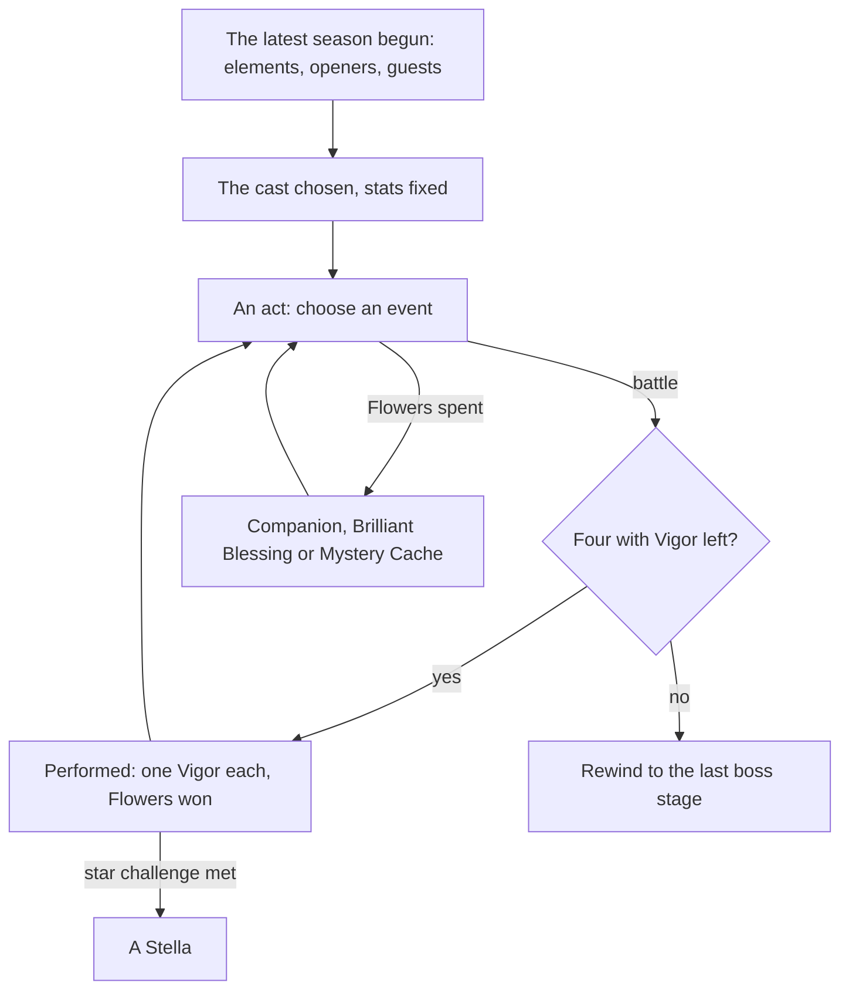

# Imaginarium Theater

The Imaginarium Theater is the game's roguelike combat challenge, held in the Mondstadt Library's Theater Lobby. Each season names three elements and a few characters; a player brings a cast of their own of those elements and plays through acts, each character able to perform twice, choosing events between battles that add characters or blessings. It is fought with the [character kits](/docs/proposals/genshin/character-kits) and opens at [Adventure Rank](/docs/proposals/genshin/adventure-rank) 35 with its quest, so this page waits on both.

The season schedule, the difficulties and their level floors, Vigor, Blessing Level, the opening character's bonus and the Stella rewards are built, as the [as-built page](/docs/genshin/imaginarium-theater) names. What stays here is the cast's makeup, the stage, the acts and events, and the screen.

## Decisions

- **The cast by the season's rules.** Four members perform each stage. The Alternate Cast is the player's own characters of the season's three elements, plus its four special guests whatever their element, at least level 60 for the lower difficulties and 70 above, as many as the difficulty asks. The opening characters are the player's own or their trial versions. A cast's stats are fixed once chosen, and every member starts each stage at full health and energy.
- **Events between battles.** A Battle Event gives Fantasia Flowers and the choice of one of two Alternate Cast members to join the Principal Cast. The other events are paid in Fantasia Flowers: a Companion event invites a character, a Brilliant Blessing grants a reaction's buff, and a Mystery Cache grants an effect, some for the worse. Events can be rerolled, and a run can be rewound to the end of its last boss stage a limited number of times.
- **Vigor comes back only from a Mystery Cache's option.** A character with none left cannot perform again this run.
- **Stella for each act's star challenge.** An act's star challenge, enemies defeated in time, a number defeated, or a monolith kept above its health, gives one Stella. The run's Stellas are counted and their rewards given as the built rule counts them.
- **Five difficulties**, each with its cast size, level floor and acts, from the season's tables. The level floors are built; the cast sizes and acts are waiting on their table fields to be named.
- **A season's cast is the role combat avatar table's.** `RoleCombatAvatarConfigExcelConfigData`, joined to a schedule row by its `avatarConfigId`, holds each season's three elements, its six opening characters, its four special guests and the openers' trial versions, under the dump's obfuscated keys at this revision: `OELGONFGFGP` the element codes (three, then a trailing 0), `KHOAOIDDJGB` the openers' avatar ids, `DIKGJFHIMIN` the guests' and `JAKBMPALEEN` the trial versions'. The codes read 2 Pyro, 3 Hydro, 4 Dendro, 5 Electro, 6 Cryo, 7 Anemo and 8 Geo: in all 26 rows the master holds, the openers' own elements, two to an element, are exactly the season's three. The writer keeps that check, so a renamed key or a shifted code fails the run rather than writing a wrong cast.
- **The cast's floor is the difficulty's.** A character joins the Alternate Cast when its element is one of the season's three or it is one of the season's special guests, whatever its element, and its level is at least the difficulty's level floor, which the difficulty slice already holds.
- **What this leaves out.** The Supporting Cast, characters lent by friends, needs other players and is left with [co-op](/docs/genshin/deferred/co-op).

## How it works



## Scope and order

**Built:** the rules and schedule, as the [as-built page](/docs/genshin/imaginarium-theater) states.

**This adds, in order:**

```text
scripts/src/models/genshinAssets/imaginarium/ExcelRoleCombatAvatarConfigRow.ts
```

1. **A season's cast.** Add `RoleCombatAvatarConfigExcelConfigData` to the dump table list the text fetch reads, then fetch again. Model its row in `ExcelRoleCombatAvatarConfigRow.ts` under the dump's keys, each named in a comment by what it holds, and add `ImaginariumElementCodeMap` (the codes the Decisions read) to `scripts/src/services/genshinAssets/imaginarium/constants.ts`. `toImaginariumSeason.ts` takes the season's avatar config row as well and adds `elements`, `openingCharacterIds` and `specialGuestIds` to each season of the existing `imaginarium/seasons` record, and `buildImaginarium.ts` reads each opener's element through `getCharacterDatas` (`scripts/src/services/genshinAssets/stats/`) and refuses a season whose openers' elements are not its three. In the world, `models/imaginarium/ImaginariumSeason.ts` gains the three fields in its interface and schema, and a new `services/imaginarium/checkIsImaginariumCastEligible.ts` answers whether a character of an element and a level may join a season's Alternate Cast at a difficulty. Tests: `toImaginariumSeason.test.ts` (the codes `[2, 5, 6, 0]` read Pyro, Electro and Cryo, the trailing 0 dropped) and `checkIsImaginariumCastEligible.test.ts` (a character off the season's elements refused, a special guest of any element taken, a level under the floor refused).
2. **A stage**, at the lowest difficulty, fought with the character kits.
3. **The acts and Battle Events.**
4. **The paid events**, with the Mystery Cache's Vigor.
5. **The rewind, the star challenges and the other difficulties.**
6. **The Theater Lobby**, once the Mondstadt Library's interior stands.

## Data and measures

- **Read from the game's tables:** the rest of the `RoleCombat*` tables, once their fields are named: each difficulty's cast size and acts, the level, buff and reward tables. The schedule and difficulty tables are read already, and the avatar config table's fields for the season's cast are named in the Decisions.
- **Read from the wiki:** what each Mystery Cache and Brilliant Blessing does, where the game's own description is unclear.

## Key files

| File                                                            | Role after the change                               |
| :-------------------------------------------------------------- | :-------------------------------------------------- |
| `packages/genshin-world/src/models/party/Party.ts`              | The Principal Cast's four on each stage             |
| `packages/genshin-world/src/models/character/Character.ts`      | A character's stats as fixed for the run            |
| `packages/genshin-world/src/models/enemy/EnemyCamp.ts`          | A stage's enemies                                   |
| `packages/genshin-world/src/components/World/Session/Index.vue` | Enters the Theater's scene and returns to the world |

## Sources

- [Imaginarium Theater](https://genshin-impact.fandom.com/wiki/Imaginarium_Theater), Genshin Impact Wiki: the Theater Lobby and its unlock at rank 35, four performing, two Vigor each, the season's three elements, opening characters and their 20%, special guests, levels 60 and 70, events and their costs in Fantasia Flowers, the rewind, Blessing Level's stats, Stella and the difficulties, and the Supporting Cast lent by friends.
- [AnimeGameData](https://github.com/DimbreathBot/AnimeGameData), the community's per-patch dump: the role combat schedule and the tables beside it.
