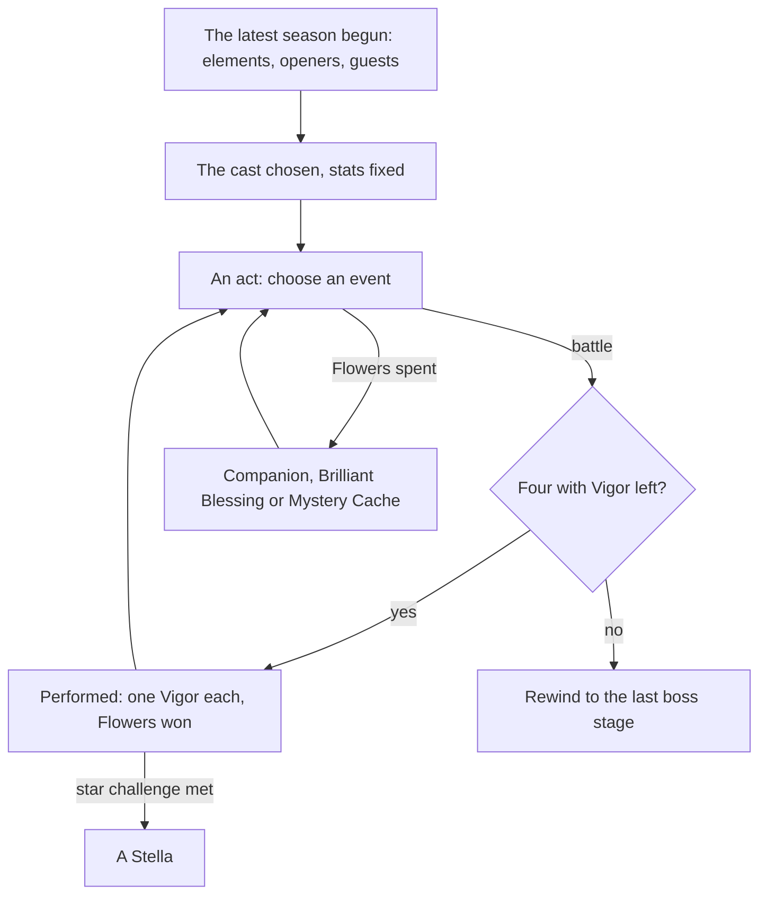

# Imaginarium Theater

The Imaginarium Theater is the game's roguelike combat challenge, held in the Mondstadt Library's Theater Lobby. Each season names three elements and a few characters; a player brings a cast of their own of those elements and plays through acts, each character able to perform twice, choosing events between battles that add characters or blessings. It is fought with the [character kits](/docs/proposals/genshin/character-kits) and opens at [Adventure Rank](/docs/proposals/genshin/adventure-rank) 35 with its quest, so this page waits on both.

## Decisions

- **The season is the latest begun.** `RoleCombatScheduleExcelConfigData` lists the game's seasons with their dates, elements, opening characters and special guests. The Theater plays the most recent season already begun, so an older dump holds on to its final season instead of none, as the Spiral Abyss keeps its period.
- **The cast by the season's rules.** Four members perform each stage. The Alternate Cast is the player's own characters of the season's three elements, plus its four special guests whatever their element, at least level 60 for the lower difficulties and 70 above, as many as the difficulty asks. The opening characters are the player's own or their trial versions, and an owned opening character takes 20% more HP, ATK and DEF for the season, inside and out. A cast's stats are fixed once chosen, and every member starts each stage at full health and energy.
- **Two Vigor each.** Each character has two Vigor and spends one for every stage performed, and with none left cannot perform again this run; only a Mystery Cache's option restores it.
- **Events between battles.** A Battle Event gives Fantasia Flowers and the choice of one of two Alternate Cast members to join the Principal Cast. The other events are paid in Fantasia Flowers: a Companion event invites a character, a Brilliant Blessing grants a reaction's buff, and a Mystery Cache grants an effect, some for the worse. Events can be rerolled, and a run can be rewound to the end of its last boss stage a limited number of times.
- **Blessing Level adds stats.** Each Alternate Cast member past the number required adds 2 to the Blessing Level, and each Brilliant Blessing gained or raised adds 1. Each level adds 800 Max HP, 50 ATK, 50 DEF and 20 Elemental Mastery, doubled for special guests, as the wiki gives them.
- **Stella for each act's star challenge.** An act's star challenge, enemies defeated in time, a number defeated, or a monolith kept above its health, gives one Stella, and every three in a run give their reward.
- **Five difficulties**, each with its cast size, level floor and acts, from the season's tables.
- **What this leaves out.** The Supporting Cast, characters lent by friends, needs other players and is left with [co-op](/docs/genshin/deferred/co-op).

## How it works

## Scope and order

**Today:** nothing runs a challenge of acts.

**This adds, in order:**

1. **A season's cast and a stage**, at the lowest difficulty.
2. **Vigor, the acts and Battle Events.**
3. **The paid events and Blessing Level.**
4. **Stella, the rewind and the other difficulties.**
5. **The Theater Lobby**, once the Mondstadt Library's interior stands.

## Data and measures

- **Read from the game's tables:** the `RoleCombat*` tables: its schedule, difficulties, levels, buffs, events and rewards.
- **Read from the wiki:** what each Mystery Cache and Brilliant Blessing does, where the game's own description is unclear.

## Key files

| File                                                           | Role after the change                               |
| :------------------------------------------------------------- | :-------------------------------------------------- |
| `packages/genshin-world/src/models/party/Party.ts`             | The Principal Cast's four on each stage             |
| `packages/genshin-world/src/models/character/Character.ts`     | A character's stats as fixed for the run            |
| `packages/genshin-world/src/models/enemy/EnemyCamp.ts`         | A stage's enemies                                   |
| `packages/genshin-world/src/components/World/Screen/Index.vue` | Enters the Theater's scene and returns to the world |

## Sources

- [Imaginarium Theater](https://genshin-impact.fandom.com/wiki/Imaginarium_Theater), Genshin Impact Wiki: the Theater Lobby and its unlock at rank 35, four performing, two Vigor each, the season's three elements, opening characters and their 20%, special guests, levels 60 and 70, events and their costs in Fantasia Flowers, the rewind, Blessing Level's stats, Stella and the difficulties, and the Supporting Cast lent by friends.
- [AnimeGameData](https://gitlab.com/Dimbreath/AnimeGameData), the community's per-patch dump: the role combat schedule and the tables beside it.
