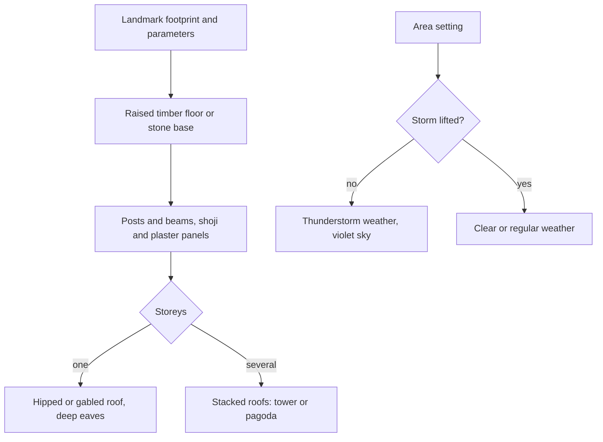

# Inazuma

This region is built on [terrain](/docs/genshin/terrain) and its [shapes](/docs/proposals/genshin/terrain-shapes), [vegetation](/docs/genshin/vegetation) and its [trees and scatter](/docs/proposals/genshin/trees-and-scatter), [water](/docs/genshin/water) and its [flow](/docs/proposals/genshin/flowing-water), [sky and time](/docs/genshin/sky-and-time) and [weather](/docs/proposals/genshin/weather), re-derived by the [scene derivation](/docs/genshin/scene-derivation)'s method, each scene in its [recreation passes](/docs/proposals/genshin/recreation-passes). Inazuma is the nation of the Electro Archon, its culture drawn from Edo-period Japan. It is an archipelago: each island has its own character, and they are divided by sea and a storm that closes the nation to outsiders. It is the first region made of separate islands, so the sea between them is as much a part of it as the land.

## Decisions

- **The storm is an area setting.** Inazuma's permanent thunderstorm, and Yashiori Island's own storm, are weather that each area can switch on or off. In the game they lift when a quest completes. Here they are lifted by default and restored from the hour and weather control, so the islands can be seen both ways.
- **Each island has its own palette.**
  - Narukami Island: sakura pink, red maple and dark cedar under a violet storm sky
  - Kannazuka: scorched ground and forges
  - Yashiori Island: grey earth and the ribs of a colossal serpent's skeleton, landmark-tier bone meshes
  - Watatsumi Island: pale sand, purple and pink coral, and floating jellyfish lights under a sky tinted like the sea
  - Seirai Island: dark rock under storm
  - Tsurumi Island: grey fog and bare trees
- **The Inazuma building kit.**
  - a raised timber floor on posts or a stone base
  - post-and-beam walls with shoji and plastered panels
  - a hipped or gabled tiled roof with deep eaves, sometimes stacked into towers

  Torii gates, stone lanterns, shrines and pagodas are kit pieces of their own. The Grand Narukami Shrine with its sacred sakura, and Tenshukaku above Inazuma City, are landmark-tier and matched pose by pose.

- **A capital's witness claims are its region's own.** The `World/Screen` fixture's top-level claims stay Windrise's, and each capital world's claims sit in its `witnessComponents` under the derived-asset component the parity page draws, so no region's renderer falls to Windrise's families: their paving matches the common ruins Inazuma, Sumeru and Mondstadt hold too. A region's drawn families are the ground and the meshes its kit's building stands in for, found by the game's own code for the region in its mesh names (`Area_Dq_` here); the rest of the export is claimed as not drawn yet, one entry per kind. Each other region's first step builds its claims this way, and whichever runs first adds `witnessComponents` itself.
- **Enkanomiya is a layer with its own sky.** It lies beneath Watatsumi Island, is entered at its gate, and is lit by an artificial sun, Dainichi Mikoshi, rather than by the [sky](/docs/genshin/sky-and-time)'s clock. Its white stone ruins are a kit of their own.

## How it works

## Areas

The catalogue holds Inazuma's areas as the game names them: Narukami Island, Kannazuka, Yashiori Island, Watatsumi Island, Seirai Island, Tsurumi Island, Enkanomiya and the Three Realms Gateway Offering. Subareas include Inazuma City, Ritou, the Grand Narukami Shrine, Mt. Yougou, Chinju Forest, Byakko Plain, Konda Village, the Kamisato Estate, Tatarasuna, the Kujou Encampment, Nazuchi Beach, Jakotsu Mine, Musoujin Gorge, Sangonomiya Shrine, Bourou Village, Suigetsu Pool, Amakane Island, Asase Shrine, Koseki Village, Moshiri Ceremonial Site, Oina Beach, and Enkanomiya's Dainichi Mikoshi, Evernight Temple, The Serpent's Heart and The Serpent's Bowels.

## Build order

1. **Ritou and Narukami Island**, where the game lands: Inazuma City, Tenshukaku and the Grand Narukami Shrine.
2. **Kannazuka and Yashiori Island**, with the serpent's bones.
3. **Watatsumi Island**, then **Seirai** and **Tsurumi**.
4. **Enkanomiya**, as a layer.

## Reference checklist

Ritou's harbour, Inazuma City's main street, Tenshukaku from the plaza, the Grand Narukami Shrine and its sakura, a torii line on Mt. Yougou, Tatarasuna's forge, the serpent's ribs on Yashiori, Sangonomiya Shrine, Tsurumi in fog, and Dainichi Mikoshi from Enkanomiya's plaza.

## Key files

| File                                                      | Role after the change                      |
| :-------------------------------------------------------- | :----------------------------------------- |
| `packages/genshin-engine/src/noise/createSimplexNoise.ts` | The detail noise each island's biome tunes |

Built (see [the as-built page](/docs/genshin/inazuma)): the building kit, the island palettes and the region data file.

**Still to build, in order:**

1. **Inazuma City's witness claims**, which the roadmap's `inazuma-every-renderer` item waits on.
   - The claims by component come first, if `ScreenFixture` (`packages/genshin-world/parity/models/ScreenFixture.ts`) has no `witnessComponents` yet. It gains `witnessComponents?: Record<string, Pick<ScreenFixture, "witnessFamilies" | "witnessStandIns" | "witnessUndrawn">>`, keyed by a derived-asset component's name. `openParityPage` (`scripts/src/services/genshinParity/shared/openParityPage.ts`) adds `&witnessComponent=<component>` beside its `&witness=` query, and `parity/main.ts` reads `const claims = screen.witnessComponents?.[searchParameters.get("witnessComponent") ?? ""] ?? screen`, handing `claims` to `loadWitness` and `claimWitnessRenderers` where it hands `screen` today.
   - `models/inazuma/InazumaPartFamily.ts` (`Ground`, `Buildings`) and `services/inazuma/InazumaPartFamilyMeshRegexMap.ts`: `Ground` is `/^BigWorldTerrain_/u` and `Buildings` is `/^Area_Dq_Build_/u`, the city's houses the kit's building stands in for.
   - `services/inazuma/InazumaUndrawnMeshRegexMap.ts`, one entry per kind of mesh the export holds (`~/Esposter/genshin-parity/extracted/inazuma/`): `props` `/^(?:Area_(?:Dq|Common)_Prop|Area_MdProps|Indoor_MdProps)_/u`, `lights` `/^Area_(?:Dq|Common)_Light_/u`, `cloth` `/^Area_Dq_Ecloth_/u`, `rocks` `/^Area_Dq_Rock_/u`, `commonBuildings` `/^Area_Common_Build_/u`, `plants` `/^(?:Stages_(?:Deadbush|Lvy|BeachShell)|Area_Dq_Lvy|Area_Ly_Grass)/u`, `stagePlanes` `/^Stages_(?:Plane|DecalCube)_/u`, `effects` `/^(?:Eff_|CloudPlane|Area_Common_Effect_)/u` and `plot` `/^Area_Dq_Plot_/u`. Together with the families they match every mesh today's export names.
   - The `World/Screen` fixture's `witnessComponents` gains `inazuma`, with these two maps as its `witnessFamilies` and `witnessUndrawn`.
   - Proved by `pnpm -C scripts genshin:parity passes inazuma --pass Inventory` printing 0 renderers unclaimed on today's witness. The maps are data, so no unit test is owed; a name the `inazuma-capital` re-extraction adds is reported by that item's own Inventory run.
2. **The shrine, torii and Enkanomiya ruin generators**, in `packages/genshin-world/src/services/inazuma/`, each fitted against its exports when the passes reach its shape.

## Sources

- [Inazuma](https://genshin-impact.fandom.com/wiki/Inazuma) and [Enkanomiya](https://genshin-impact.fandom.com/wiki/Enkanomiya), Genshin Impact Wiki: the nation's areas and subareas, and Enkanomiya beneath Watatsumi Island, entered through a pool beside Sangonomiya Shrine.
- [Weather](https://genshin-impact.fandom.com/wiki/Weather), Genshin Impact Wiki: the permanent thunderstorms over Inazuma and Yashiori Island, each lifted by a quest, and the fog on Tsurumi Island.
- [The setting of Genshin Impact](https://en.wikipedia.org/wiki/Teyvat), Wikipedia: Inazuma drawn from Japan's Edo period, and Enkanomiya's design from ancient Greece.
