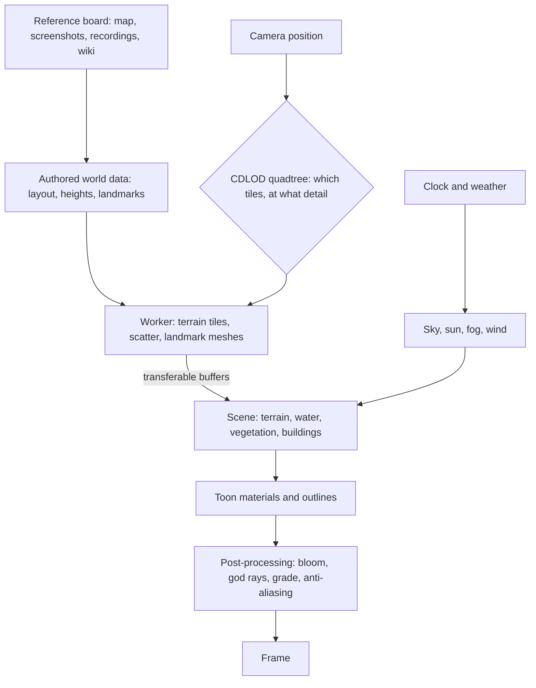

# Genshin

Genshin Impact is set on one continent: seven nations, each with its own element, climate and architecture, plus the borderlands around them. This proposal rebuilds it in the app with TresJS and Three.js's WebGPU renderer. The goal is a recreation you can explore, as close to the game's regions as careful reference can make it. The world comes first: its look, its sky, its ground, water and plants, then the regions one by one. After that, the game's features are copied one at a time, starting with the character and how it moves. It is the [agent console](/docs/infra/claude-interface/agent-console)'s world. The console is shown in the app as Genshin at `/genshin`, and the Genshin world replaces its voxel world outright, with no voxel option kept. The console's Claude sessions keep working over the new world until they get a Genshin-style interface of their own.

## Decisions

- **A fan work, labelled as one.** Region, place and landmark names are the game's own, since the point is the game's world. The page says it is an unofficial, non-commercial fan recreation and does not pass itself off as HoYoverse's. HoYoverse's written rules for fans cover merchandise rather than software, so this area follows what they ask of any derivative work: it is marked as fan-made, never counterfeits official art, and claims no rights of its own. This supersedes the console's [voxel open world](/docs/infra/rejected/voxel-open-world), whose realm was original, since the realm is now the game's own.
- **Every asset is authored here.** Geometry is generated in code from parameters, textures are procedural nodes in the Three.js Shading Language (TSL), and shaders are written in the repository. No model, texture, sound or piece of art taken from the game or its media is committed or served. This is the same line the fan guide draws, and it is also what makes the project a showcase of the renderer rather than an asset viewer.
- **The game is looked at, never unpacked.** The installed game keeps its content in encrypted asset bundles. Reading them needs third-party decryption tools that break the game's terms, next to an anti-cheat driver. The reference is instead what a player can see, gathered the way the [reference board](/docs/proposals/genshin/reference-board) describes. That means screenshots and recordings taken in the game, the official interactive map, and the community wiki. None of it is committed.
- **As close to the real region as reference allows.** Layout follows the official map, scale is calibrated against in-game measurements, and each landmark is modelled against its reference board. A region is judged side by side with its screenshots, and that judgement is the user's eyes, as the `run-app` skill already requires for any visual check.
- **An engine of modules.** The [engine architecture](/docs/proposals/genshin/engine-architecture) divides the world into a package of single-purpose modules that the app mounts, so each system is built, tested and replaced on its own.
- **WebGPU through TresJS.** `TresCanvas` takes a renderer factory, so the scene runs on three's `WebGPURenderer` while components stay declarative. Materials and post-processing are TSL node graphs, as the [fluid simulator](/docs/fluid-simulator) already does. TresJS comes first, and raw Three.js is used only where TresJS and cientos have nothing, with the reason given on the page that does it.
- **TSL takes the full lint.** Type-aware oxlint loops forever on the fluid simulator's composable, which `oxlint.config.ts` excludes. The engine's modules import the same `three/webgpu` and TSL types and lint in about a second, so the engine takes no exclusion, and a new one is added only for a file measured to hang.
- **The world keeps a budget.** Its cost grows with what the camera can see, never with the size of the continent. Every page here applies the rules the [engine architecture](/docs/proposals/genshin/engine-architecture) sets out: instancing, level of detail, off-thread generation, and transferable buffers.

## How it works

## The pages of this proposal

### Phase one: the world engine

| Page                                                               | What it adds                                                                      |
| :----------------------------------------------------------------- | :-------------------------------------------------------------------------------- |
| [Engine architecture](/docs/proposals/genshin/engine-architecture) | the engine as modules with one job each, and the order a frame runs in            |
| [Reference board](/docs/proposals/genshin/reference-board)         | how a region is referenced, calibrated and compared so the recreation stays close |
| [Terrain shapes](/docs/proposals/genshin/terrain-shapes)           | the continent's heights from authored shapes, and the ground painted by biome     |
| [Flowing water](/docs/proposals/genshin/flowing-water)             | rivers along their courses, and waterfalls over cliff bands                       |
| [Trees and scatter](/docs/proposals/genshin/trees-and-scatter)     | tree species and impostors, and flowers, bushes and rocks scattered by biome      |
| [Weather](/docs/proposals/genshin/weather)                         | rain, storms, snow, fog and sandstorms, set per area as the game sets them        |
| [Exploring](/docs/proposals/genshin/exploring)                     | a free camera, waypoints to jump between, and the map overlay                     |

### Phase two: the regions

Each region is built on the whole engine above. It adds its palette, a parametric building kit, its flora, its weather and its landmarks.

| Page                                           | Region                                               |
| :--------------------------------------------- | :--------------------------------------------------- |
| [Mondstadt](/docs/proposals/genshin/mondstadt) | the Anemo nation, and Dragonspine                    |
| [Liyue](/docs/proposals/genshin/liyue)         | the Geo nation, the Chasm and Chenyu Vale            |
| [Inazuma](/docs/proposals/genshin/inazuma)     | the Electro archipelago, and Enkanomiya              |
| [Sumeru](/docs/proposals/genshin/sumeru)       | the Dendro rainforest and desert                     |
| [Fontaine](/docs/proposals/genshin/fontaine)   | the Hydro nation, above and under water              |
| [Natlan](/docs/proposals/genshin/natlan)       | the Pyro nation of volcanoes, springs and tribes     |
| [Nod-Krai](/docs/proposals/genshin/nod-krai)   | the moonlit borderland archipelago                   |
| [Snezhnaya](/docs/proposals/genshin/snezhnaya) | the Cryo nation of tundra, factories and its capital |

## Scope and order

1. **The rest of the engine**, in the order of the table above, each shown first in the Windrise scene the [rendering style](/docs/genshin/rendering-style) is built in. The reference board comes before any region, since it is how a region is authored into the [world map](/docs/genshin/world-map).
2. **Mondstadt first among the regions.** It is where the game begins, and its opening areas are the ones the Windrise scene already holds. The rest follow in the game's release order.
3. **Then the play features, one page each, written when the world is walkable.** First the character controller (run, sprint, jump, climb, glide, swim and stamina) and its camera. Then characters, drawn only from a model the person has downloaded for themselves from HoYoverse's official MMD releases and loaded from their own disk. Then elemental reactions, and after that each feature in turn. Each gets its page when its turn comes, not before, so no spec is written against an engine that does not yet exist.

## What this does not propose

- **Assets from the game.** Nothing is extracted, traced into a texture or re-hosted. The official map is read as a stencil while authoring, and only the shapes drawn over it are kept.
- **Multiplayer.** The world is the person's own, as the game's is outside co-op.
- **A monetised or official-looking product.** No payment, no HoYoverse branding in the chrome, and no claim to be the game.

## Key files

| File                                                   | Role after the change                                        |
| :----------------------------------------------------- | :----------------------------------------------------------- |
| `apps/web/app/composables/visual/useFluidSimulator.ts` | The WebGPU and TSL setup the area's renderer factory follows |

## Notes

- **As-built pages form a Genshin area.** Each engine page, once built, is rewritten in the [Genshin](/docs/genshin) area, beside the [agent console](/docs/infra/claude-interface/agent-console)'s docs, which keep only the console that works the sessions.
- **The map is a reference, and the geography is authored.** Coastlines, rivers and heights are drawn by hand over the official map and committed as our own vector data. How close it gets is limited by the reference, not by the renderer.

## Sources

- [Genshin Impact: Crafting an Anime Style Open World](https://www.gdconf.com/news/learn-about-making-genshin-impacts-open-world-gdc-2021), Haoyu Cai's GDC 2021 talk: the studio's own account of the anime-style open world this area recreates.
- [miHoYo lists rules on overseas Genshin Impact fan-made merchandise](https://www.siliconera.com/mihoyo-lists-rules-on-overseas-genshin-impact-fan-made-merchandise/), Siliconera: the fan guide's terms, which are to label the work as fan-made, never counterfeit official art and claim no copyright. This area applies them.
- [The world of Genshin Impact](https://genshin-impact.fandom.com/wiki/Teyvat), Genshin Impact Wiki: the nations, the borderlands and the regions this proposal lists.
- [The official interactive map](https://act.hoyolab.com/ys/app/interactive-map/index.html), HoYoLAB: the official map every region's layout is read from.
- [TresCanvas](https://docs.tresjs.org/api/components/tres-canvas), TresJS: the `renderer` factory that puts `WebGPURenderer` under declarative components.
