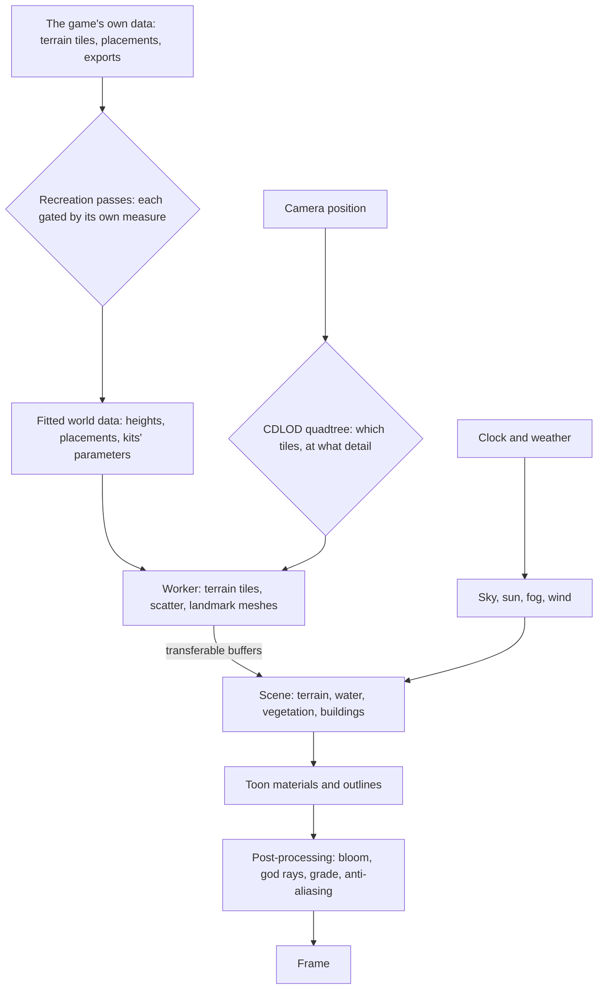

# Genshin

Genshin Impact is set on one continent: seven nations, each with its own element, climate and architecture, plus the borderlands around them. This proposal rebuilds it in the app with TresJS and Three.js's WebGPU renderer. The goal is a recreation you can explore, as close to the game's regions as careful reference can make it. The world comes first: its look, its sky, its ground, water and plants, then the regions one by one. After that, the game's features are copied one at a time, starting with the character and how it moves. It is the [agent console](/docs/infra/claude-interface/agent-console)'s world. The console is shown in the app as Genshin at `/genshin`, and the Genshin world replaces its voxel world outright, with no voxel option kept. The console's Claude sessions keep working over the new world until they get a Genshin-style interface of their own.

## Decisions

- **A fan work, labelled as one.** Region, place and landmark names are the game's own, since the point is the game's world. The page says it is an unofficial, non-commercial fan recreation and does not pass itself off as HoYoverse's. HoYoverse's written rules for fans cover merchandise rather than software, so this area follows what they ask of any derivative work: it is marked as fan-made, never counterfeits official art, and claims no rights of its own. This supersedes the console's [voxel open world](/docs/infra/rejected/voxel-open-world), whose realm was original, since the realm is now the game's own.
- **Every asset is authored here.** Geometry is generated in code from parameters, textures are procedural nodes in the Three.js Shading Language (TSL), and shaders are written in the repository. No model, texture, sound or image file taken from the game or its media is committed or served. The one exception is decided: the interface matches the game's exactly, so its glyphs are traced from the game's own marks into paths of our own, the way the [parity](/docs/genshin/parity) loop does it. The other is decided too: the music's voices, which no oscillator of ours makes sound like an orchestra, may play public-domain recordings of real instruments layered over the synthesizer, never the game's ([sampled instruments](/docs/genshin/sampled-instruments)). A third is decided as well: the characters are HoYoverse's official MMD models, which it publishes for fans apart from the game, hosted in the app's own Blob Storage under the terms bundled with each and never taken from the game's files ([characters](/docs/proposals/genshin/characters)). The world stays generated, which is also what makes the project a showcase of the renderer rather than an asset viewer. Generated is not approximate: a scene is re-derived from the game's own assets as closely as they allow, by our own shaders, generators and data, with no fidelity ceiling short of copying the game's files ([scene derivation](/docs/genshin/scene-derivation)).
- **The game's files are references, never shipped.** The installed game keeps its content in encrypted asset bundles. AnimeStudio, a third-party exporter, reads them locally with the game closed, and its exports sit in the references folder beside every screenshot and recording, outside the repository ([derived assets](/docs/genshin/derived-assets)). Nothing is injected into the running game, which an anti-cheat driver watches, and the game's code metadata is not decrypted. What a player can see stays a reference too, gathered as [parity](/docs/genshin/parity) gathers any: the community wiki and published recordings searched first, and the game recorded only for what nothing published shows. None of it is committed.
- **As close to the real region as the game's own data allows.** Every scene is rebuilt in the [recreation passes](/docs/proposals/genshin/recreation-passes): its layout read from the game's terrain tiles and streaming records, its shapes and surfaces fitted against the game's own exports, a recording's camera read off it by the exports' landmarks, and only its display transform, light, air and sounds read off a recording's colour, each pass judged by its own measure and frozen ([scene derivation](/docs/genshin/scene-derivation)). The frame's perceptual score against its references, then the user's eyes, are its acceptance, never its loop.
- **An engine of modules.** The [engine architecture](/docs/genshin/engine-architecture) divides the world into a package of single-purpose modules that the app mounts, so each system is built, tested and replaced on its own; a page adds the module it first needs.
- **WebGPU through TresJS.** `TresCanvas` takes a renderer factory, so the scene runs on three's `WebGPURenderer` while components stay declarative. Materials and post-processing are TSL node graphs, as the [fluid simulator](/docs/fluid-simulator) already does. TresJS comes first, and raw Three.js is used only where TresJS and cientos have nothing, with the reason given on the page that does it.
- **TSL takes the full lint.** Type-aware oxlint loops forever on the fluid simulator's composable, which `oxlint.config.ts` excludes. The engine's modules import the same `three/webgpu` and TSL types and lint in about a second, so the engine takes no exclusion, and a new one is added only for a file measured to hang.
- **The world keeps a budget.** Its cost grows with what the camera can see, never with the size of the continent. Every page here applies the rules the [engine architecture](/docs/genshin/engine-architecture) sets out: instancing, level of detail, off-thread generation, and transferable buffers.

## How it works

## The pages of this proposal

### Phase one: the world engine

| Page                                                           | What it adds                                                                  |
| :------------------------------------------------------------- | :---------------------------------------------------------------------------- |
| [Recreation passes](/docs/proposals/genshin/recreation-passes) | a screen rebuilt in ordered passes, each gated by its own measure and frozen  |
| [Localized opening](/docs/proposals/genshin/localized-opening) | the publisher's splash and layouts as each client language shows              |
| [Terrain shapes](/docs/proposals/genshin/terrain-shapes)       | the continent's heights from authored shapes, and the ground painted by biome |
| [Flowing water](/docs/proposals/genshin/flowing-water)         | rivers along their courses, and waterfalls over cliff bands                   |
| [Trees and scatter](/docs/proposals/genshin/trees-and-scatter) | tree species and impostors, and flowers, bushes and rocks scattered by biome  |
| [Weather](/docs/proposals/genshin/weather)                     | rain, storms, snow, fog and sandstorms, set per area as the game sets them    |
| [Exploring](/docs/proposals/genshin/exploring)                 | waypoints to jump to, the game's arrival points, and the map's pan and zoom   |

### Phase two: the regions

Each region is built on the whole engine above. It adds its palette, a parametric building kit, its flora, its weather and its landmarks.

| Page                                           | Region                                               |
| :--------------------------------------------- | :--------------------------------------------------- |
| [Mondstadt](/docs/proposals/genshin/mondstadt) | the Anemo nation, and Dragonspine                    |
| [Liyue](/docs/proposals/genshin/liyue)         | the Geo nation, the Chasm and Chenyu Vale            |
| [Inazuma](/docs/proposals/genshin/inazuma)     | the Electro archipelago, and Enkanomiya              |
| [Sumeru](/docs/proposals/genshin/sumeru)       | the Dendro rainforest and desert                     |
| [Fontaine](/docs/proposals/genshin/fontaine)   | the Hydro nation, above and under water              |
| [Natlan](/docs/proposals/genshin/natlan)       | the Pyro nation of volcanoes, springs and tribes     |
| [Nod-Krai](/docs/proposals/genshin/nod-krai)   | the moonlit borderland archipelago                   |
| [Snezhnaya](/docs/proposals/genshin/snezhnaya) | the Cryo nation of tundra, factories and its capital |

### Phase three: the play features

| Page                                                                 | What it adds                                                                                                               |
| :------------------------------------------------------------------- | :------------------------------------------------------------------------------------------------------------------------- |
| [Character controller](/docs/proposals/genshin/character-controller) | every number the body moves by, read for each body type off the game's clips, data and recordings                          |
| [Follow camera](/docs/proposals/genshin/follow-camera)               | the camera's numbers solved off recordings, its settings, and how far photo mode may go                                    |
| [HUD](/docs/proposals/genshin/hud)                                   | the HUD's fitted places, Paimon's mark, the stamina meter and the party                                                    |
| [Characters](/docs/proposals/genshin/characters)                     | the game's characters from HoYoverse's official models                                                                     |
| [Party](/docs/proposals/genshin/party)                               | Party Setup on L, the HUD's party, a burst on a switch, the fall and Elemental Resonance                                   |
| [Character screen](/docs/proposals/genshin/character-screen)         | the screen measured, the character in its middle, Details, the other tabs, levelling and ascending                         |
| [Menu screens](/docs/proposals/genshin/menu-screens)                 | the Paimon menu, and the Time and Settings screens it opens                                                                |
| [Combat](/docs/proposals/genshin/combat)                             | the Lunar reactions, self and immutable auras, reaction limits, reach and attack energy                                    |
| [Interaction](/docs/proposals/genshin/interaction)                   | the F prompts over the world: the wheel, a held F's repeat, and the reach measured                                         |
| [Inventory](/docs/proposals/genshin/inventory)                       | the items themselves, the full-bag hint, Fates for Primogems, using and destroying                                         |
| [Wish](/docs/proposals/genshin/wish)                                 | the banners' pools, a charted course, Character Event Wish-2 and the history                                               |
| [Dialogue](/docs/proposals/genshin/dialogue)                         | F on a resident begins their talk, its words loaded and filled, a resident's open quests offered, and the screen measured  |
| [Quests](/docs/proposals/genshin/quests)                             | the carried quests served, started and advanced by the world's doings, kept, tracked on the HUD and V, and the commissions |

### Phase four: the game's systems

What still separates the recreation from the whole game once the world and its play features stand: how characters fight and grow, what the world gives back for exploring it, and the pastimes and challenges beside it. Each page is one system, in the order the systems wait on each other. The game's tables a page names are read from the user's installed game at its own patch once that file's reading lands, and from the community's dump until then, as the `genshin-parity` skill settles. The systems that need a server or other players are [deferred](/docs/genshin/deferred) instead, since the world keeps no server.

| Page                                                                 | What it adds                                                                                      |
| :------------------------------------------------------------------- | :------------------------------------------------------------------------------------------------ |
| [Character kits](/docs/proposals/genshin/character-kits)             | every character's attacks, skill, burst and passives on one framework, priced by combat as built  |
| [Talents](/docs/proposals/genshin/talents)                           | combat talents levelled to 10 by phase, and the passives each phase opens                         |
| [Constellations](/docs/proposals/genshin/constellations)             | six per character from their Stella Fortuna, the Traveler's by element                            |
| [Weapon enhancement](/docs/proposals/genshin/weapon-enhancement)     | a weapon levelled, ascended and refined, and its passive at its rank                              |
| [Artifact enhancement](/docs/proposals/genshin/artifact-enhancement) | an artifact rolled and enhanced by the game's rules, and its set's conditional bonus              |
| [Adventure Rank](/docs/proposals/genshin/adventure-rank)             | the player's rank to 60 and the World Level that follows it, held by the ascension quests         |
| [Original Resin](/docs/proposals/genshin/original-resin)             | resin regenerating while the page is closed, and the claim every resin challenge shares           |
| [Domains](/docs/proposals/genshin/domains)                           | entrances, levels by rank, scenes of their own, the days' materials and the Petrified Tree        |
| [Ley line outcrops](/docs/proposals/genshin/ley-line-outcrops)       | each region's two blossoms, fought, claimed and moved on by the game's own groups                 |
| [Bosses](/docs/proposals/genshin/bosses)                             | normal bosses' arenas, moves and blossoms, and weekly bosses claimed once a week                  |
| [Spawned places](/docs/proposals/genshin/spawned-places)             | where the servers' chests, Oculi, puzzles and camps stand, fitted from the official map's points  |
| [Map unlocking](/docs/proposals/genshin/map-unlocking)               | waypoints, statues and domains unlocked by reaching them, and areas filled in on the map          |
| [Statues of The Seven](/docs/proposals/genshin/statues-of-the-seven) | Oculi offered for the region's levels and stamina, the Statue's Blessing, and the Traveler        |
| [Offering systems](/docs/proposals/genshin/offering-systems)         | the regions' sacred trees, fountains and shrines, each taking its items for its levels            |
| [Elemental Sight](/docs/proposals/genshin/elemental-sight)           | the world muted and what matters lit, enemies named, and trails drawn                             |
| [Chests](/docs/proposals/genshin/chests)                             | five kinds at their fitted places, locked, dug or sealed, and their rewards                       |
| [Puzzles](/docs/proposals/genshin/puzzles)                           | mechanisms as state machines, monuments, Seelies, time trials and the Shrines of Depths           |
| [Exploration progress](/docs/proposals/genshin/exploration-progress) | each area's percentage on the map, and a nation's thresholds of Reputation                        |
| [Commissions](/docs/proposals/genshin/commissions)                   | the game's daily tasks, their rewards, Katheryne's bonus and Encounter Points                     |
| [Reputation](/docs/proposals/genshin/reputation)                     | each nation's levels from bounties, requests and exploration, and their rewards                   |
| [Gathering](/docs/proposals/genshin/gathering)                       | plants, ores and specialties picked or mined, back on the game's own refresh policies             |
| [Wildlife](/docs/proposals/genshin/wildlife)                         | animals that flee, charge or fight back, and the materials picked off them                        |
| [Crafting](/docs/proposals/genshin/crafting)                         | the bench's recipes from the game's table, Condensed Resin, and crafting talents                  |
| [Cooking](/docs/proposals/genshin/cooking)                           | dishes cooked by hand to proficiency then Auto Cook, specialties, and processing                  |
| [Forging](/docs/proposals/genshin/forging)                           | the forge's queues by rank in real time, the daily cap, and weapons from billets                  |
| [Gadgets](/docs/proposals/genshin/gadgets)                           | each gadget's kind from the game's config on Z, cooldowns that run while paused                   |
| [Shops](/docs/proposals/genshin/shops)                               | every vendor's goods and restocks, Paimon's Bargains and the Souvenir Shops, nothing for crystals |
| [Fishing](/docs/proposals/genshin/fishing)                           | points, bait, the bite and the tension minigame, every number from the fish tables                |
| [Expeditions](/docs/proposals/genshin/expeditions)                   | characters sent out for hours in real time, and their places' rewards                             |
| [Companionship](/docs/proposals/genshin/companionship)               | Friendship Levels from the party's EXP, and the stories, voice-overs and namecard they open       |
| [Resident schedules](/docs/proposals/genshin/resident-schedules)     | each resident's day and night spots from the game's records, and vendors' hours                   |
| [Achievements](/docs/proposals/genshin/achievements)                 | the game's achievements as watchers of their own triggers, paid in Primogems and namecards        |
| [Archive](/docs/proposals/genshin/archive)                           | the seven sections from the game's codex tables, each entry opened when first met                 |
| [Serenitea Pot](/docs/proposals/genshin/serenitea-pot)               | the player's realm, its placement editor, Tubby's furnishings, Trust Rank and companions          |
| [Spiral Abyss](/docs/proposals/genshin/spiral-abyss)                 | twelve floors from the game's tower tables, stars, and the Moon Spire's latest period             |
| [Imaginarium Theater](/docs/proposals/genshin/imaginarium-theater)   | the latest season's cast, Vigor, events paid in Fantasia Flowers, and Blessing Level              |
| [Genius Invokation TCG](/docs/proposals/genshin/genius-invokation)   | the card game as a rules engine of its own, every card the game's, against its residents          |

## Scope and order

1. **The recreation passes' runner and measures first.** Every later page is judged by them, so they are the base the rest stands on. The rest of the engine follows in the table's order, each built when Windrise's passes reach what it draws and shown first there, in the scene the [rendering style](/docs/genshin/rendering-style) is built in.
2. **Mondstadt first among the regions.** It is where the game begins, and its opening areas are the ones the Windrise scene already holds. The rest follow in the game's release order.
3. **Then the play features, one page each.** First the [character controller](/docs/proposals/genshin/character-controller) (run, sprint, jump, climb, glide, swim and stamina) and its [follow camera](/docs/proposals/genshin/follow-camera). Then the [HUD](/docs/proposals/genshin/hud), whose stamina meter the controller needs. Then [characters](/docs/proposals/genshin/characters), from HoYoverse's official MMD models, hosted in the app's Blob Storage. Then the [menu screens](/docs/proposals/genshin/menu-screens), whose Paimon is drawn as a character is. Then elemental reactions, and after that each feature in turn. Each feature is built when its turn comes, not before, so nothing is built against an engine that does not yet exist; a feature's page may be written earlier, as combat's, interaction's, inventory's and wish's are, and states only its proposed scope.
4. **Then the game's systems, in phase four's order.** The [character kits](/docs/proposals/genshin/character-kits) come first, since combat's rules strike nothing until a kit does, and every growth system, reward and challenge after them acts through a kit. Phase four's pages are written ahead of their turn as the map of what is left, each holding only what the game's tables and the wiki settle, and each is re-read against the engine when its turn comes.

## What this does not propose

- **Assets from the game.** Nothing exported is committed, served or converted into a file of ours; only what our own fits and generators write ships.
- **Multiplayer.** The world is the person's own, as the game's is outside co-op ([co-op](/docs/genshin/deferred/co-op) is deferred).
- **A monetised or official-looking product.** No payment, no HoYoverse branding in the chrome, and no claim to be the game.

## Key files

| File                                                   | Role after the change                                        |
| :----------------------------------------------------- | :----------------------------------------------------------- |
| `apps/web/app/composables/visual/useFluidSimulator.ts` | The WebGPU and TSL setup the area's renderer factory follows |

## Notes

- **As-built pages form a Genshin area.** Each engine page, once built, is rewritten in the [Genshin](/docs/genshin) area, beside the [agent console](/docs/infra/claude-interface/agent-console)'s docs, which keep only the console that works the sessions.
- **The geography is the game's own, fitted.** Heights and placements are read from the game's terrain tiles and streaming records on its own coordinates and fitted by our generators ([terrain shapes](/docs/proposals/genshin/terrain-shapes)), so no region is laid out by hand and none needs a transform from a map's pixels.

## Sources

- [Genshin Impact: Crafting an Anime Style Open World](https://www.gdconf.com/news/learn-about-making-genshin-impacts-open-world-gdc-2021), Haoyu Cai's GDC 2021 talk: the studio's own account of the anime-style open world this area recreates.
- [miHoYo lists rules on overseas Genshin Impact fan-made merchandise](https://www.siliconera.com/mihoyo-lists-rules-on-overseas-genshin-impact-fan-made-merchandise/), Siliconera: the fan guide's terms, which are to label the work as fan-made, never counterfeit official art and claim no copyright. This area applies them.
- [The world of Genshin Impact](https://genshin-impact.fandom.com/wiki/Teyvat), Genshin Impact Wiki: the nations, the borderlands and the regions this proposal lists.
- [TresCanvas](https://docs.tresjs.org/api/components/tres-canvas), TresJS: the `renderer` factory that puts `WebGPURenderer` under declarative components.
