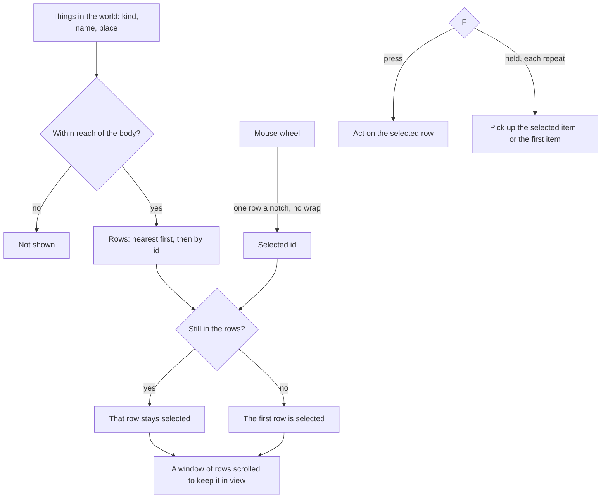

# Interaction

This page builds on the [character controller](/docs/proposals/genshin/character-controller), whose body is where reach is measured from. In the game, whatever the character can act on shows as a row of prompts beside it: an item's name to pick up, a chest to open, a character to talk to, a notice to read, a waypoint to activate. One row is selected, and F acts on it. With several things in reach, the mouse wheel moves the selection through the rows.

## Decisions

- **Five kinds of interaction.** Pick up takes an item lying in the world into the [inventory](/docs/proposals/genshin/inventory). Open opens a chest, Talk starts a character's dialogue and Read shows a book, a notice or a sign. Activate unlocks a waypoint, which the map can teleport to from then on. The kind decides a row's icon, and the row's words are the thing's own name, which is game text like every word the game shows.
- **In reach is a distance from the body.** A thing is in reach while its distance from the character's body is within the reach. Until a recording measures the game's reach, every kind takes one provisional reach.
- **Nearest first.** The rows run from the nearest thing to the farthest, two at the same distance in a fixed order by id, so the list never flickers between frames. The wiki documents no order, so the passes' recording of a pile of drops confirms this one or replaces it.
- **The selection follows its thing, not its row.** The selected row is kept by its thing's id, so it stays on the same chest as the list reorders around it. When that thing leaves reach, the selection falls to the first row.
- **The mouse wheel moves the selection.** Each notch moves it one row, and it stops at either end without wrapping. The list shows a window of rows, which scrolls just far enough to keep the selection in view. Until the recording measures it, the window's height is provisional.
- **F acts on the selected row; a held F keeps picking up.** A press acts once. A held F repeats at an interval, and each repeat picks up the selected row when it is an item, or else the first item in the list. A held repeat never opens, talks, reads or activates, since those leave the world for a screen. The wiki documents no held F, so the recording decides whether the game repeats and at what interval.
- **F is the screens' binding.** F is the game's default for Pick Up and Interact, and X or Square on a controller. The key goes in the screens' shortcut map beside every other one, never in a listener of the prompts' own.

## How it works



## Scope and order

**Today:** nothing in the world can be acted on.

**This adds, in order:**

1. **The selector.** A pure function over the things near the body that returns the rows, the selection and the window, with the wheel's step and the held F's choice beside it, each tested.
2. **The prompt list's structure.** A `genshin-interface` component drawing the window's rows, the selected one marked, its words handed in.
3. **The binding.** F in the screens' shortcut map.
4. **The world's things.** Each kind is wired when the page that places it lands: drops with enemies, characters with quests, and waypoints with [exploring](/docs/proposals/genshin/exploring).

## What this does not propose

- **The prompt list's look.** Its sizes, colours and icons are measured and traced in the [recreation passes](/docs/proposals/genshin/recreation-passes).
- **What each interaction opens.** A chest's loot, a dialogue and a book's pages each belong to the page that adds that content.

## Key files

| File                                                           | Role after the change                                  |
| :------------------------------------------------------------- | :----------------------------------------------------- |
| `packages/genshin-world/src/components/World/Screen/Index.vue` | Mounts the prompt list once the world places something |
| `packages/genshin-text/src/models/GameTextKey.ts`              | Gains the words the prompts show                       |

New files:

```text
packages/genshin-world/src/models/interaction/InteractionKind.ts
packages/genshin-world/src/models/interaction/Interactable.ts
packages/genshin-world/src/services/interaction/constants.ts
packages/genshin-world/src/services/interaction/computeInteractionPrompts.ts
packages/genshin-interface/src/components/InteractionPrompts/Index.vue
```

## Sources

- [Controls](https://genshin-impact.fandom.com/wiki/Controls), Genshin Impact Wiki: Pick Up and Interact on F, X on an Xbox controller and Square on a PlayStation one.
- [Faster item pick up](https://gamestegy.com/post/genshin-impact/322/faster-item-pick-up), GameStegy: a player's tip that the scroll wheel and F work together on the prompts.
