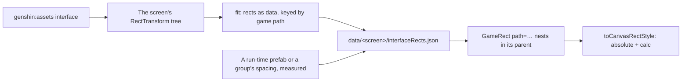

# Interface layout

A screen's interface today places each piece on its own: a few of the game's rects are copied by hand into a map (`LoginInterfaceRectMap`), and the rest are measured from the screen's middle. Pieces the game hangs under one parent then move independently. On the login screen, the loading row, the prompt and the build string were each fixed separately when a window narrower than 16:9 moved them, although the game keeps all of them in one foot, `Bottom`, anchored to the screen's bottom. With every screen of the game to come, positioning by hand grows with the number of pieces, and so does every fix.

## Decisions

- **The game's tree is the layout.** A fit writes each screen's RectTransforms as data beside the screen: every node's path, anchors, pivot, anchored position, size delta and layout group. A screen's markup follows the same tree, so a piece sits inside its game parent and inherits its anchoring. A fix to a parent reaches everything in it.
- **The browser is the layout engine.** Unity's RectTransform is anchors as shares of the parent, a pivot, and `offsetMin = anchoredPosition − sizeDelta × pivot`. That maps exactly onto absolute positioning with `calc()` (`toCanvasRectStyle`), at no cost per node. A flexbox engine such as Yoga or Taffy lays out a different model, and would need Unity's semantics rebuilt on top of it.
- **Layout groups are CSS grid.** A `GridLayoutGroup` exports without its fields, so its children's rects read zero; its cell size and spacing are measured once from a recording and expressed as a grid on the group's node.
- **Only what the tree cannot hold is measured.** A prefab the page loads at run time (the login's `BtnPressStart`) has no rect in the page's block. It is found in its own block or measured, and recorded against its parent's path in the screen's reference.

## How it works



`GameRect` takes a node's path and renders a box placed by its rect inside the nearest `GameRect` above it; the root spans the canvas with its inset. A screen's pieces are its slots, so the markup reads as the game's tree: `Bottom` holds `LoadingDesc`, `CurrentAccount/TxtVersion` and both button columns.

## Scope

```text
scripts/src/services/genshinAssets/
  fitInterfaceRects.ts           ← the screen's tree as rects keyed by path, layout groups flagged
packages/genshin-ui/src/components/GameRect/
  Index.vue                      ← a node placed by its rect inside its parent's
packages/genshin-ui/src/services/
  toCanvasRectStyle.ts           ← unchanged: Unity's semantics, tested on stretched and point anchors
```

The login interface moves first, replacing `LoginInterfaceRectMap` and every middle-relative position that sits under `Bottom` or `Center` in the tree.

## Key files

| File                                                                           | Role after the change                                    |
| :----------------------------------------------------------------------------- | :------------------------------------------------------- |
| `packages/genshin-ui/src/services/toCanvasRectStyle.ts`                        | Unity's RectTransform as CSS, the one layout computation |
| `packages/genshin-world/src/services/login/interface/LoginInterfaceRectMap.ts` | Replaced by the fitted tree                              |
| `packages/genshin-world/src/components/Login/Interface/Index.vue`              | The first screen laid out as the game's tree             |
| `scripts/src/services/genshinAssets/extractComponentInterface.ts`              | The tree's export the fit reads                          |

## Notes

- **A generated tree still needs its measured leaves.** Text is laid out by the game's own text component at run time, so a line's place inside its rect (its alignment and its face's metrics) is still measured on a recording.
